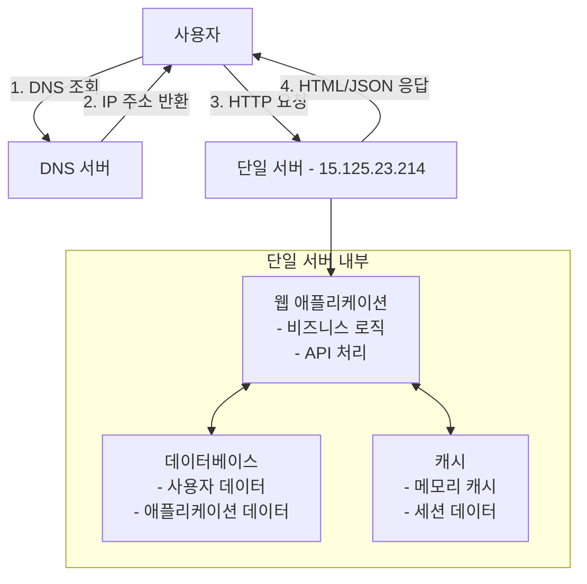
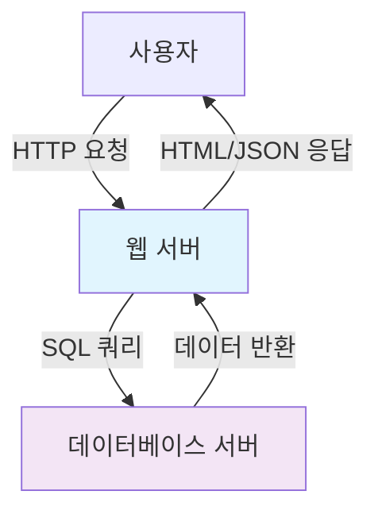
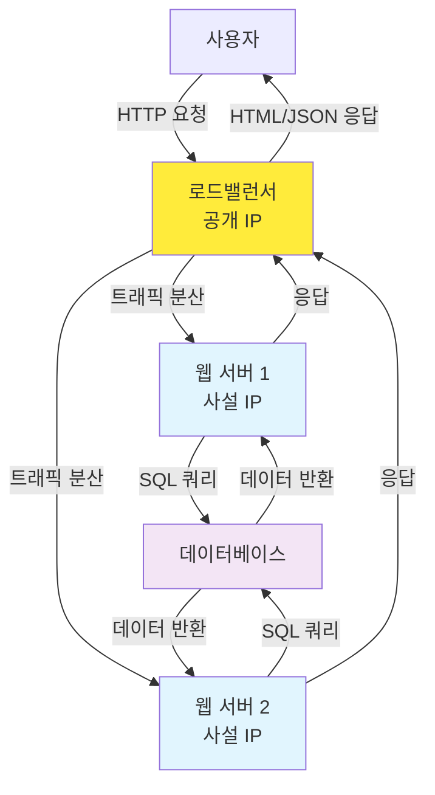
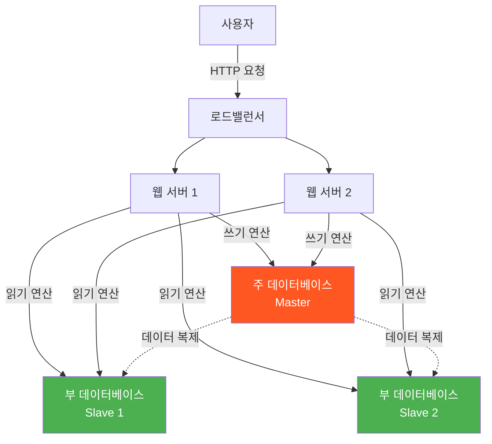
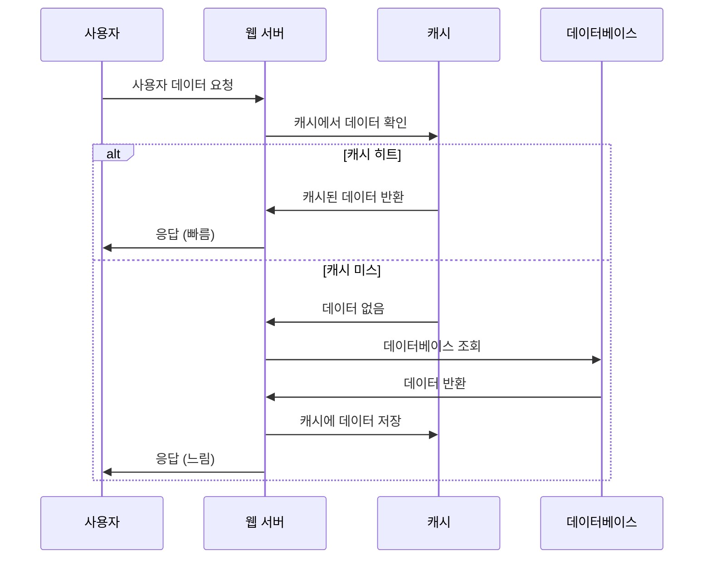
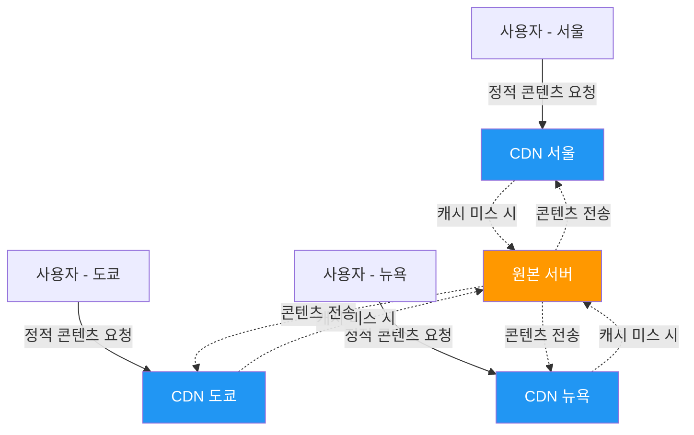
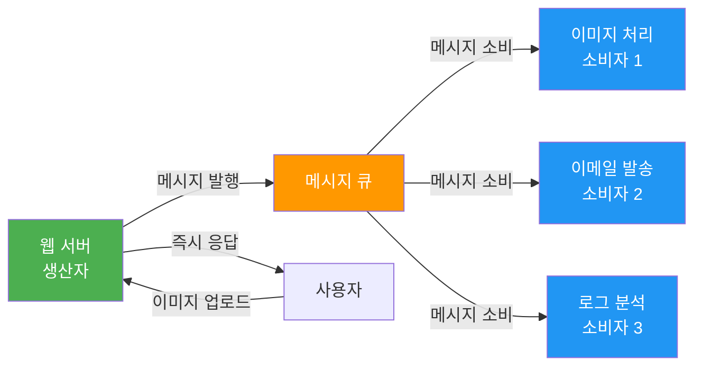
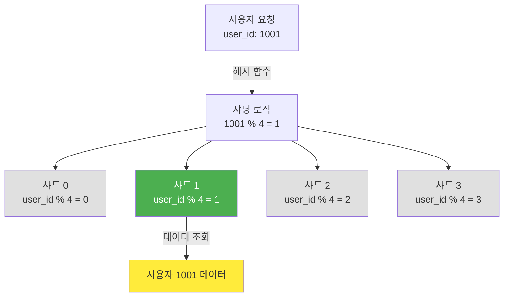

# [가면사배 시리즈 #1] 사용자 수에 따른 규모 확장성

## 📖 책 소개

**제목**: 가상 면접 사례로 배우는 대규모 시스템 설계 기초  
**1장**: 사용자 수에 따른 규모 확장성  
**핵심 주제**: 단일 서버에서 수백만 사용자 지원 시스템까지의 진화 과정

## 🎯 학습 목표

- 시스템이 사용자 증가에 따라 어떻게 진화하는지 이해
- 각 확장 단계에서 발생하는 병목 지점과 해결 방안 학습
- 대규모 시스템 설계의 핵심 원칙과 패턴 습득
- 실제 면접에서 활용할 수 있는 시스템 설계 사고 과정 연습

## 📊 시스템 확장 단계별 분석

### 1단계: 단일 서버 (Single Server)



**구성**:

- 하나의 물리적 서버에 모든 컴포넌트가 함께 실행
- 웹 애플리케이션, 데이터베이스, 캐시가 같은 서버 내부에 위치
- DNS를 통한 도메인 이름 해석
- HTTP 요청/응답 처리

**특징**:

- 구현이 간단하고 비용이 저렴
- 소규모 트래픽에 적합
- 개발과 배포가 단순함
- 네트워크 지연이 없음

**한계**:

- 단일 장애 지점(SPOF)
- 확장성 제한 (하드웨어 한계)
- 성능 병목 (모든 요청이 하나의 서버로)
- 컴포넌트 간 리소스 경합

### 2단계: 데이터베이스 분리



**구성**:

- 웹 서버와 데이터베이스 서버 분리
- 각각 독립적으로 확장 가능

**장점**:

- 웹 계층과 데이터 계층의 독립적 확장
- 리소스 할당 최적화

**데이터베이스 선택 기준**:

| 관계형 데이터베이스    | 비관계형 데이터베이스 |
| ---------------------- | --------------------- |
| 복잡한 쿼리와 트랜잭션 | 낮은 응답 지연시간    |
| ACID 속성 필요         | 비정형 데이터         |
| 성숙한 생태계          | 대용량 데이터         |

### 3단계: 로드밸런서 도입



**구성**:

- 로드밸런서가 여러 웹 서버로 트래픽 분산
- 공개 IP는 로드밸런서만 보유
- 웹 서버들은 사설 IP로 통신

**장점**:

- 가용성 향상 (장애 복구)
- 트래픽 분산으로 성능 개선
- 수평적 확장 가능

**고려사항**:

- 로드밸런서 자체의 SPOF 가능성
- 세션 관리 복잡성

### 4단계: 데이터베이스 다중화



**구성**:

- 주(Master) 데이터베이스: 쓰기 연산
- 부(Slave) 데이터베이스: 읽기 연산
- 데이터 복제를 통한 동기화

**장점**:

- 성능 향상: 읽기 연산 분산
- 안정성: 데이터 복제를 통한 백업
- 가용성: 장애 시 다른 서버로 전환

**장애 시나리오**:

- 부 서버 장애: 읽기 트래픽을 주 서버나 다른 부 서버로 전환
- 주 서버 장애: 부 서버를 주 서버로 승격, 복구 스크립트 실행

### 5단계: 캐시 계층



**캐시 전략**:

- **캐시 우선 읽기(Cache-Aside)**: 캐시 확인 → 캐시 미스 시 DB 조회 → 캐시 저장

**구현 예시**:

```javascript
async function getUser(userId) {
  // 1. 캐시에서 확인
  const user = await cache.get(`user:${userId}`);
  if (user) {
    return JSON.parse(user);
  }

  // 2. 캐시 미스 시 DB 조회
  const userData = await database.query("SELECT * FROM users WHERE id = ?", [
    userId,
  ]);

  // 3. 캐시에 저장 (1시간 TTL)
  await cache.setex(`user:${userId}`, 3600, JSON.stringify(userData));
  return userData;
}
```

**고려사항**:

- 캐시 적용 시점: 읽기가 빈번하고 쓰기가 적은 데이터
- 데이터 일관성: 원본과 캐시 간 동기화
- 만료 정책: TTL 설정
- 장애 대응: 캐시 서버 다중화
- 메모리 관리: 적절한 크기 설정
- 데이터 방출 정책: LRU, LFU, FIFO

### 6단계: CDN (콘텐츠 전송 네트워크)



**동작 과정**:

1. 사용자가 정적 콘텐츠 요청
2. CDN에 캐시된 콘텐츠가 있으면 반환
3. 없으면 원본 서버에서 가져와 캐시 후 반환

**장점**:

- 지리적으로 가까운 서버에서 콘텐츠 제공
- 원본 서버 부하 감소
- 사용자 경험 개선

**고려사항**:

- 비용: 데이터 전송량에 따른 과금
- 적절한 TTL 설정
- CDN 장애 대응 방안
- 콘텐츠 무효화 방법

### 7단계: 무상태(Stateless) 웹 계층

**상태 정보 의존적 vs 무상태**:

| 상태 정보 의존적             | 무상태                         |
| ---------------------------- | ------------------------------ |
| 서버가 클라이언트 상태 보관  | 상태 정보를 외부 저장소에 보관 |
| 특정 서버로만 요청 전달 필요 | 어떤 서버로든 요청 전달 가능   |
| 확장성 제한                  | 자동 확장 가능                 |

**구현 방법**:

- 세션 데이터를 Redis, Memcached 등 외부 저장소로 이동
- 데이터베이스에 사용자 상태 저장
- NoSQL 활용

### 8단계: 데이터 센터

**지리적 라우팅(GeoDNS)**:

- 사용자 위치에 따라 가장 가까운 데이터 센터로 라우팅
- 장애 시 다른 데이터 센터로 트래픽 우회

**기술적 과제**:

- 트래픽 우회: GeoDNS를 통한 효과적인 라우팅
- 데이터 동기화: 데이터 센터 간 데이터 일관성
- 테스트와 배포: 여러 지역에서의 테스트 및 배포 자동화

### 9단계: 메시지 큐



**구성 요소**:

- 생산자(Producer): 메시지 발행
- 메시지 큐: 메시지 버퍼 역할
- 소비자(Consumer): 메시지 처리

**장점**:

- 느슨한 결합: 생산자와 소비자 독립적 운영
- 안정성: 메시지 지속성 보장
- 확장성: 각 컴포넌트 독립적 확장

**사용 사례**:

- 이미지 처리: 업로드 → 큐 → 비동기 처리
- 이메일 발송: 요청 → 큐 → 배치 처리
- 로그 처리: 수집 → 큐 → 분석

### 10단계: 로그, 메트릭, 자동화

**로그**:

- 에러 로그 모니터링
- 중앙화된 로그 수집 시스템
- 검색 및 분석 도구

**메트릭**:

- 호스트 단위: CPU, 메모리, 디스크 I/O
- 종합 메트릭: 데이터베이스 성능, 캐시 성능
- 비즈니스 메트릭: DAU, 수익, 재방문율

**자동화**:

- 지속적 통합(CI)
- 자동 빌드, 테스트, 배포
- 인프라 자동화

### 11단계: 데이터베이스 샤딩



**샤딩 전략**:

- 샤딩 키 선택: 데이터 분산의 기준
- 해시 기반 샤딩: `user_id % 4`로 샤드 결정

**고려사항**:

- 데이터 재샤딩: 샤드 추가 시 데이터 재분배
- 유명인사 문제: 특정 샤드에 트래픽 집중
- 조인과 비정규화: 여러 샤드 간 조인의 어려움

**대안**:

- 일관성 해싱(Consistent Hashing)
- 디렉토리 기반 샤딩
- 수직적 샤딩

## 🏗️ 주요 아키텍처 패턴

### 수직적 확장 vs 수평적 확장

| 수직적 확장 (Scale Up) | 수평적 확장 (Scale Out) |
| ---------------------- | ----------------------- |
| 서버 성능 향상         | 서버 수량 증가          |
| 구현 단순              | 복잡성 증가             |
| 하드웨어 한계 존재     | 이론적 무제한 확장      |
| SPOF 위험              | 장애 내성               |
| 고비용                 | 상대적 저비용           |

### 로드밸런싱 전략

**라운드 로빈**: 순차적으로 서버 선택  
**가중 라운드 로빈**: 서버 성능에 따른 가중치 적용  
**최소 연결**: 연결 수가 가장 적은 서버 선택  
**IP 해시**: 클라이언트 IP 기반 서버 선택

### 캐시 패턴

**Cache-Aside**: 애플리케이션이 캐시 관리  
**Write-Through**: 쓰기 시 캐시와 DB 동시 업데이트  
**Write-Behind**: 캐시 먼저 쓰고 나중에 DB 업데이트  
**Refresh-Ahead**: 만료 전 미리 캐시 갱신

## ⚖️ 트레이드오프 분석

### 성능 vs 일관성

- **강한 일관성**: 모든 노드에서 동일한 데이터, 성능 저하
- **최종 일관성**: 일시적 불일치 허용, 성능 향상

### 가용성 vs 일관성 (CAP 정리)

- **일관성(Consistency)**: 모든 노드가 동일한 데이터
- **가용성(Availability)**: 시스템이 항상 응답
- **분할 내성(Partition Tolerance)**: 네트워크 분할 시에도 동작

### 비용 vs 성능

- **고성능 하드웨어**: 높은 비용, 뛰어난 성능
- **분산 시스템**: 상대적 저비용, 복잡성 증가

## 💡 실무 적용 인사이트

### 1. 점진적 확장의 중요성

- 처음부터 복잡한 아키텍처 구축보다는 필요에 따른 점진적 확장
- 각 단계에서 병목 지점을 파악하고 해결
- 과도한 엔지니어링(Over-engineering) 방지

### 2. 모니터링의 필수성

- 시스템 확장 전 현재 상태 정확한 파악 필요
- 메트릭 기반 의사결정
- 장애 예방을 위한 사전 모니터링

### 3. 데이터 중심 설계

- 데이터의 특성(읽기/쓰기 비율, 크기, 접근 패턴)에 따른 저장소 선택
- 데이터 일관성 요구사항 분석
- 백업 및 복구 전략 수립

### 4. 장애 대응 설계

- 단일 장애 지점 제거
- 장애 시 자동 복구 메커니즘
- 우아한 성능 저하(Graceful Degradation)

## 🤔 토론 주제

### 기술적 토론

1. **캐시 전략**: 게임 서비스에서 어떤 데이터를 캐시해야 할까?
2. **데이터베이스 선택**: 게임 데이터 특성상 관계형 vs 비관계형 데이터베이스 선택 기준은?
3. **샤딩 키**: 사용자 데이터를 샤딩할 때 최적의 샤딩 키는 무엇일까?
4. **메시지 큐**: 실시간 게임 매칭에서 메시지 큐를 어떻게 활용할 수 있을까?

### 비즈니스 관점

1. **비용 최적화**: 성능과 비용의 균형점을 어떻게 찾을 것인가?
2. **사용자 경험**: 시스템 확장이 사용자 경험에 미치는 영향은?
3. **글로벌 서비스**: 다국가 서비스 시 고려해야 할 추가 요소들은?

### 운영 관점

1. **배포 전략**: 무중단 배포를 위한 아키텍처 고려사항은?
2. **모니터링**: 어떤 메트릭을 우선적으로 모니터링해야 할까?
3. **장애 대응**: 각 계층별 장애 시나리오와 대응 방안은?

## 📚 추가 학습 자료

### 관련 개념

- **CAP 정리**: 분산 시스템의 일관성, 가용성, 분할 내성
- **ACID vs BASE**: 데이터베이스 트랜잭션 모델
- **마이크로서비스 아키텍처**: 서비스 분해 전략
- **이벤트 기반 아키텍처**: 비동기 통신 패턴

### 실습 과제

1. **단계별 구현**: 각 확장 단계를 실제로 구현해보기
2. **성능 테스트**: 부하 테스트를 통한 병목 지점 파악
3. **장애 시뮬레이션**: 각 컴포넌트 장애 시 시스템 동작 확인
4. **모니터링 대시보드**: 주요 메트릭 시각화

## 🎯 핵심 메시지

> "수백만 사용자를 지원하는 시스템을 설계하는 것은 도전적인 과제이며, 지속적인 계량과 끝없는 개선이 요구되는 여정이다."

이 장에서 배운 핵심 원칙들:

1. **점진적 확장**: 필요에 따른 단계적 시스템 진화
2. **병목 지점 파악**: 각 단계에서의 성능 제약 요소 식별
3. **트레이드오프 이해**: 성능, 일관성, 비용 간의 균형
4. **장애 대응**: 안정적인 서비스를 위한 다중화와 모니터링
5. **데이터 중심 설계**: 데이터 특성에 맞는 아키텍처 선택
