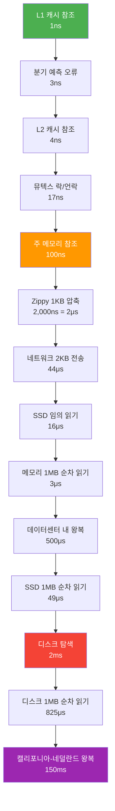
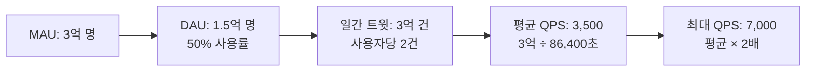
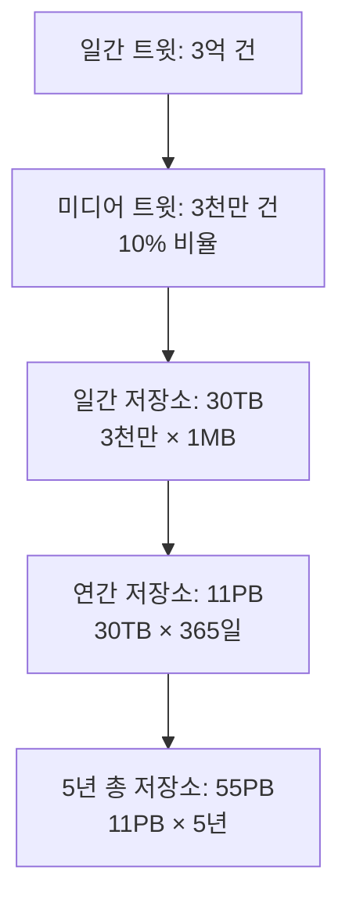
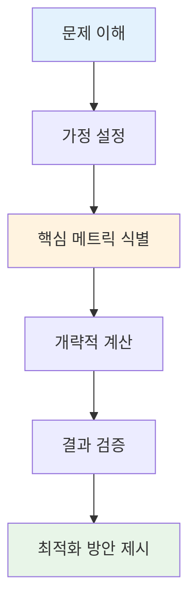

# [가면사배 시리즈 #2] 개략적인 규모 추정

## 📖 책 소개

**제목**: 가상 면접 사례로 배우는 대규모 시스템 설계 기초  
**2장**: 개략적인 규모 추정  
**핵심 주제**: 시스템 용량과 성능 요구사항을 개략적으로 추정하는 방법론

## 🎯 학습 목표

- 개략적 규모 추정(Back-of-the-envelope estimation)의 개념과 중요성 이해
- 2의 제곱수와 데이터 볼륨 단위 체계 습득
- 컴퓨터 연산의 응답지연(Latency) 값과 성능 특성 파악
- 시스템 가용성(Availability) 지표와 SLA 개념 학습
- 실제 서비스 사례를 통한 QPS와 저장소 요구량 추정 연습

## 🔢 개략적 규모 추정의 기본 개념

### 정의와 목적

**개략적 규모 추정(Back-of-the-envelope estimation)**은 보편적으로 통용되는 성능 수치를 바탕으로 한 사고 실험(thought experiments)을 통해 추정치를 계산하는 행위입니다.

**목적**:

- 어떤 설계가 요구사항에 부합할 것인지 판단
- 시스템 설계 면접에서 문제 해결 능력 입증
- 실무에서 빠른 의사결정을 위한 근거 제공

### 핵심 원칙

1. **근사치 활용**: 정확한 계산보다는 적절한 근사치로 시간 절약
2. **가정 명시**: 모든 가정을 명확히 기록하고 공유
3. **단위 표기**: 모호함 방지를 위한 명확한 단위 표기
4. **절차 중시**: 결과보다는 문제 해결 과정이 중요

## 📊 2의 제곱수와 데이터 볼륨

### 기본 데이터 단위

분산 시스템에서 다루는 데이터 양은 엄청나게 클 수 있지만, 계산법은 기본을 크게 벗어나지 않습니다.

| 2의 제곱 | 근사값                        | 이름                  | 축약형 |
| -------- | ----------------------------- | --------------------- | ------ |
| 2^10     | 1천(1,000)                    | 1킬로바이트(Kilobyte) | 1KB    |
| 2^20     | 1백만(1,000,000)              | 1메가바이트(Megabyte) | 1MB    |
| 2^30     | 10억(1,000,000,000)           | 1기가바이트(Gigabyte) | 1GB    |
| 2^40     | 1조(1,000,000,000,000)        | 1테라바이트(Terabyte) | 1TB    |
| 2^50     | 1000조(1,000,000,000,000,000) | 1페타바이트(Petabyte) | 1PB    |

### 실무 활용 예시

**사용자 프로필 데이터 크기 추정**:

| 데이터 항목   | 크기                   | 설명                |
| ------------- | ---------------------- | ------------------- |
| 사용자 ID     | 8바이트                | 64비트 정수         |
| 사용자명      | 20바이트               | 평균 길이 기준      |
| 이메일        | 30바이트               | 평균 이메일 주소    |
| 프로필 이미지 | 1MB                    | 압축된 이미지       |
| 메타데이터    | 200바이트              | 기타 정보           |
| **총합**      | **약 1MB + 258바이트** | **사용자당 저장소** |

**계산 과정**:

- 기본 정보: 8 + 20 + 30 + 200 = 258바이트
- 이미지 포함: 258바이트 + 1MB ≈ 1MB
- 1백만 사용자: 1MB × 1,000,000 = 1TB

## ⚡ 응답지연(Latency) 값 이해

### 제프 딘의 응답지연 수치 (2020년 기준)



### 핵심 인사이트

**메모리 vs 디스크**:

- 메모리는 빠르지만 디스크는 여전히 느림
- SSD는 기존 HDD보다 빠르지만 메모리보다는 느림

**네트워크 지연**:

- 같은 데이터센터 내: 500μs (0.5ms)
- 대륙 간 통신: 150ms (300배 차이)

**압축의 효과**:

- 단순한 압축 알고리즘은 빠름
- 네트워크 전송 전 압축하면 전체 시간 단축 가능

## 📈 가용성(Availability) 지표

### 가용성의 정의

가용성은 시스템이 오랜 시간 동안 지속적으로 중단 없이 운영될 수 있는 능력을 의미합니다. 고가용성(High Availability)을 보장하는 시스템은 100%에 가까운 가용성을 갖습니다.

### SLA (Service Level Agreement)

서비스 사업자와 고객 사이에 맺어진 합의로, 서비스의 가용시간이 공식적으로 기술되어 있습니다.

| 가용성   | 연간 장애시간 | 월간 장애시간 | 주간 장애시간 | 일간 장애시간 |
| -------- | ------------- | ------------- | ------------- | ------------- |
| 99%      | 3.65일        | 7.31시간      | 1.68시간      | 14.40분       |
| 99.9%    | 8.77시간      | 43.83분       | 10.08분       | 1.44분        |
| 99.99%   | 52.60분       | 4.38분        | 1.01분        | 8.64초        |
| 99.999%  | 5.26분        | 26.30초       | 6.05초        | 864.00밀리초  |
| 99.9999% | 31.56초       | 2.63초        | 604.80밀리초  | 86.40밀리초   |

### 가용성 계산 공식

**기본 공식**:

```
가용성(%) = (총 시간 - 장애 시간) / 총 시간 × 100
```

**계산 예시 (99.99% 가용성)**:

- 연간 총 시간: 365 × 24 × 60 = 525,600분
- 허용 장애시간: 525,600 × (1 - 0.9999) = 52.6분
- 실제 가용성: (525,600 - 52.6) / 525,600 × 100 = 99.99%

**허용 장애시간 계산**:

```
허용 장애시간 = 총 시간 × (1 - 목표 가용성/100)
```

## 🐦 실제 사례: 트위터 QPS와 저장소 추정

### 가정 설정

- **월간 능동 사용자(MAU)**: 3억 명
- **일간 사용률**: 50% (MAU의 50%가 매일 사용)
- **사용자당 일간 트윗**: 평균 2건
- **미디어 포함 트윗**: 10%
- **데이터 보관 기간**: 5년

### QPS (Query Per Second) 추정

**계산 단계**:



**상세 계산**:

| 단계         | 계산식          | 결과    |
| ------------ | --------------- | ------- |
| 1. DAU 계산  | 300M × 50%      | 150M 명 |
| 2. 일간 트윗 | 150M × 2건      | 300M 건 |
| 3. 평균 QPS  | 300M ÷ 86,400초 | 3,500   |
| 4. 최대 QPS  | 3,500 × 2       | 7,000   |

**QPS 추정 공식**:

```
QPS = (MAU × 사용률 × 일간 액션 수) ÷ 86,400초
최대 QPS = 평균 QPS × 2~3배 (피크 시간 고려)
```

### 저장소 요구량 추정

**트윗 구성 요소별 크기**:

| 구성 요소 | 크기      | 설명                       |
| --------- | --------- | -------------------------- |
| 트윗 ID   | 64바이트  | 고유 식별자                |
| 텍스트    | 140바이트 | 평균 텍스트 길이           |
| 미디어    | 1MB       | 이미지/비디오 (10%만 포함) |

**저장소 계산 과정**:



**상세 계산**:

| 단계               | 계산식       | 결과      |
| ------------------ | ------------ | --------- |
| 미디어 트윗 수     | 300M × 10%   | 30M 건/일 |
| 일간 미디어 저장소 | 30M × 1MB    | 30TB/일   |
| 연간 저장소        | 30TB × 365일 | 11PB/년   |
| 5년 총 저장소      | 11PB × 5년   | 55PB      |

**저장소 추정 공식**:

```
일간 저장소 = 일간 트윗 수 × 미디어 비율 × 평균 미디어 크기
총 저장소 = 일간 저장소 × 365일 × 보관 년수
```

## 🛠️ 추정 방법론과 모범 사례

### 단계별 접근법



### 1단계: 문제 이해

- 요구사항 명확화
- 범위 정의
- 제약 조건 파악

### 2단계: 가정 설정

- 사용자 수, 사용 패턴
- 데이터 크기, 보관 기간
- 성능 요구사항

### 3단계: 핵심 메트릭 식별

- QPS (읽기/쓰기)
- 저장소 요구량
- 대역폭 요구량
- 메모리 요구량

### 4단계: 개략적 계산

- 근사치 활용
- 단위 변환
- 피크 시간 고려

### 5단계: 결과 검증

- 상식적 판단
- 기존 서비스와 비교
- 병목 지점 식별

### 6단계: 최적화 방안 제시

- 캐싱 전략
- 샤딩 방안
- CDN 활용

## 💡 실무 적용 팁

### 계산 단순화 기법

**근사치 활용 원칙**:

- 복잡한 계산을 10의 배수로 반올림
- 예: 99,987 ÷ 9.1 ≈ 100,000 ÷ 10 = 10,000

**단위 변환 참고표**:

| 단위 | 바이트 환산 | 근사값 |
| ---- | ----------- | ------ |
| 1KB  | 1,024바이트 | ~1천   |
| 1MB  | 1,024KB     | ~1백만 |
| 1GB  | 1,024MB     | ~10억  |
| 1TB  | 1,024GB     | ~1조   |

**80/20 법칙 적용**:

- 20%의 데이터가 80%의 트래픽 처리
- 핫 데이터 식별 및 캐시 전략 수립에 활용
- 예: 전체 사용자 중 20%가 80%의 요청 생성

**일반적인 근사치**:

- π ≈ 3
- e ≈ 3
- log₂(1000) ≈ 10
- 1년 ≈ 3 × 10⁷초 (정확히는 31,536,000초)

### 일반적인 추정 패턴

**읽기 중심 서비스** (소셜 미디어, 뉴스):

- 읽기:쓰기 = 100:1 또는 1000:1
- 캐시 적중률 80-90%
- CDN 활용 필수

**쓰기 중심 서비스** (로그, 분석):

- 쓰기:읽기 = 10:1 또는 100:1
- 배치 처리 고려
- 압축 및 아카이빙 전략

**실시간 서비스** (채팅, 게임):

- 낮은 지연시간 요구 (< 100ms)
- 웹소켓 연결 수 고려
- 지리적 분산 필요

## 🎯 면접 대응 전략

### 자주 출제되는 문제 유형

1. **QPS 추정**: "YouTube는 초당 몇 개의 비디오를 업로드할까?"
2. **저장소 추정**: "Google Drive는 얼마나 많은 저장 공간이 필요할까?"
3. **대역폭 추정**: "Netflix는 얼마나 많은 네트워크 대역폭을 사용할까?"
4. **서버 수 추정**: "WhatsApp을 지원하려면 몇 대의 서버가 필요할까?"

### 답변 구조화 방법

```markdown
## 문제: [서비스명] QPS 추정

### 1. 가정 설정

- 사용자 수: X명
- 사용 패턴: Y%가 매일 사용
- 기능별 사용 빈도: Z회/일

### 2. 계산 과정

- DAU = 사용자 수 × 사용률
- 총 요청 수 = DAU × 사용 빈도
- 평균 QPS = 총 요청 수 ÷ 86,400초
- 최대 QPS = 평균 QPS × 2-3배

### 3. 결과 및 검증

- 계산된 QPS: [결과]
- 상식적 판단: [검증]
- 최적화 방안: [제안]
```

## 🔍 심화 학습 주제

### 고급 추정 기법

**확률적 추정**:

- 몬테카를로 시뮬레이션
- 베이지안 추정
- 신뢰구간 계산

**시계열 분석**:

- 트래픽 패턴 분석
- 계절성 고려
- 성장률 예측

**비용 최적화**:

- 클라우드 비용 모델
- 성능 대비 비용 분석
- ROI 계산

### 실제 서비스 벤치마크

| 서비스      | QPS             | 저장소  | 특징            |
| ----------- | --------------- | ------- | --------------- |
| Google 검색 | 40,000+         | 수십 PB | 읽기 중심       |
| Facebook    | 2,000,000+      | 수백 PB | 소셜 네트워크   |
| YouTube     | 1,000+ (업로드) | 수천 PB | 비디오 스트리밍 |
| WhatsApp    | 10,000,000+     | 수 TB   | 메시징          |

## 🤔 토론 주제

### 기술적 관점

1. **정확도 vs 속도**: 추정의 정확도를 높이기 위해 얼마나 많은 시간을 투자해야 할까?
2. **캐시 전략**: 추정된 QPS를 바탕으로 어떤 캐시 전략을 수립할 것인가?
3. **확장성**: 추정치가 10배, 100배 증가한다면 아키텍처를 어떻게 변경해야 할까?

### 비즈니스 관점

1. **비용 효율성**: 성능 요구사항과 비용 사이의 최적 균형점은?
2. **사용자 경험**: 99.9%와 99.99% 가용성의 비즈니스 가치 차이는?
3. **성장 계획**: 사용자 증가에 따른 인프라 투자 계획은?

### 운영 관점

1. **모니터링**: 추정치와 실제 값의 차이를 어떻게 추적하고 개선할 것인가?
2. **장애 대응**: 추정된 가용성 목표를 달성하기 위한 운영 전략은?
3. **용량 계획**: 언제, 얼마나 확장해야 하는지 어떻게 판단할 것인가?

## 📚 추가 학습 자료

### 관련 도구 및 서비스

**계산 도구**:

- [Interactive Latency](https://colin-scott.github.io/personal_website/research/interactive_latency.html)
- AWS Calculator, GCP Pricing Calculator
- Apache Bench, JMeter (성능 테스트)

**모니터링 도구**:

- Prometheus + Grafana
- DataDog, New Relic
- CloudWatch, Stackdriver

### 실습 과제

1. **개인 프로젝트 추정**: 본인의 프로젝트에 대한 QPS와 저장소 요구량 추정
2. **경쟁사 분석**: 유명 서비스들의 추정치 계산 및 비교
3. **비용 분석**: 클라우드 서비스 비용을 바탕으로 한 TCO 계산
4. **성능 테스트**: 실제 부하 테스트를 통한 추정치 검증

## 🎯 핵심 메시지

> "개략적 규모 추정은 정확한 숫자를 맞추는 것이 아니라, 체계적이고 논리적인 사고 과정을 보여주는 것이다."

이 장에서 배운 핵심 원칙들:

1. **체계적 접근**: 가정 설정 → 계산 → 검증의 단계적 진행
2. **근사치 활용**: 복잡한 계산보다는 빠른 추정과 의사결정
3. **단위 관리**: 명확한 단위 표기로 오해 방지
4. **상식적 검증**: 계산 결과의 합리성 판단
5. **최적화 고려**: 추정 결과를 바탕으로 한 시스템 개선 방안 제시

개략적 규모 추정은 시스템 설계의 출발점이며, 이를 통해 더 나은 아키텍처 결정을 내릴 수 있습니다.
