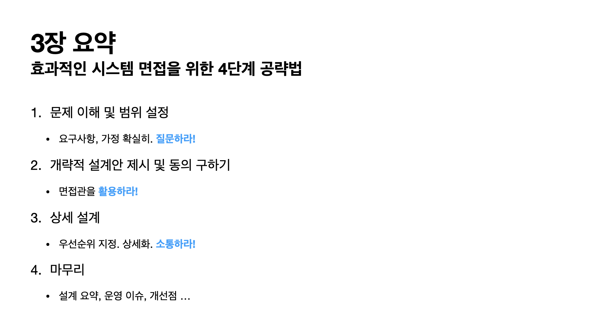

> 발표자:  최예지

## 요약
- 4단계 접근법으로 면접을 진행하는 내내 면접관과 꾸준히 소통 하라! 면접관을 팀원으로 여겨라!

## 핵심 개념
### 1단계: 문제 이해 및 설계 범위 확정

- 요구사항, 가정 확실히.
- **질문하라!**

### 2단계: 개략적인 설계안 제시 및 동의 구하기

- **면접관을 활용하라!**

### 3단계: 상세 설계

- 우선순위를 지정하고, 상세화하라.
- **소통하라!**

### 4단계: 마무리

- 설계요약
- 면접관이 운영 이슈, 개선점에 대해서 요구하면 **소통하라!**

### TIP

- 해야할 것
    - 요구사항을 이해하고 질문을 통해 확인하라.
    - 정답이나 최선의 답안은 없다.
    - **면접관과 소통하라.** 면접관의 아이디어를 이끌어내라. 팀원으로 활용하라.
    - 가능하면 여러 해법을 함께 제시하라.
    - 개략적 설계에 면접관이 동의하고나서 → 각 컴포넌트의 세부사항을 우선순위가 높은 것부터 설명하기 시작하라.
    - 포기하지 말라(ㅜㅜ)
- 하지 말아야 할 것
    - 전형적인 면접 문제들에도 대비하지 않고 들어가지 마라. (연습 많이해라)
    - 요구사항이나 가정을 분명히 하지 않은 상태에서 설계를 시작하지 마라.
    - 특정 컴포넌트의 세부사항을 너무 깊이 설명하지 마라. (개략적→ 세부로 나가라)
    - 막혔을 때, 힌트 요청을 주저하지 말라.
    - **침묵 속에 설계를 진행하지 말라.**
    - 설계안을 끝낸 순간 면접이 끝난 게 아니다. 의견을 일찍, 그리고 자주 구하라

### 시간 배분
- 책 본문 참고

## 발표자료 이미지
*(경로가 한글이라서 깨진다면 이미지를 직접 확인해주세요...)*
- 
- 
- 
- 
- 
- 
- 
- 
- 
- 
- 
- 
- 

## 회고
- 항해 때 개발하면서도 어려웠는데 각잡고 설계하려니 어렵네요.. 구멍숭숭 설계도에 면접관-팀원 여러분의 도움이 필요합니다.
