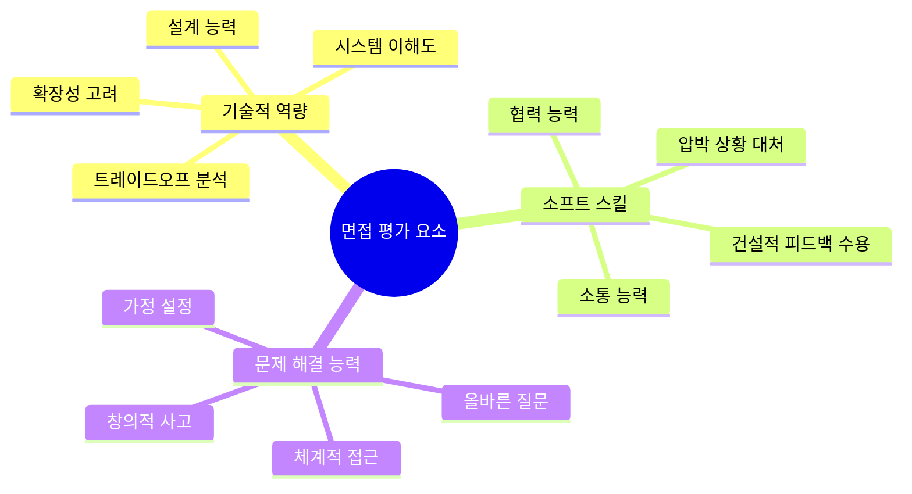
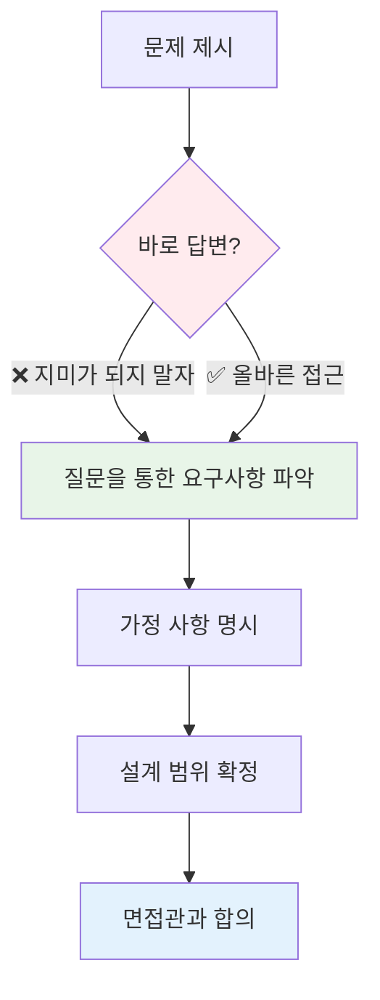
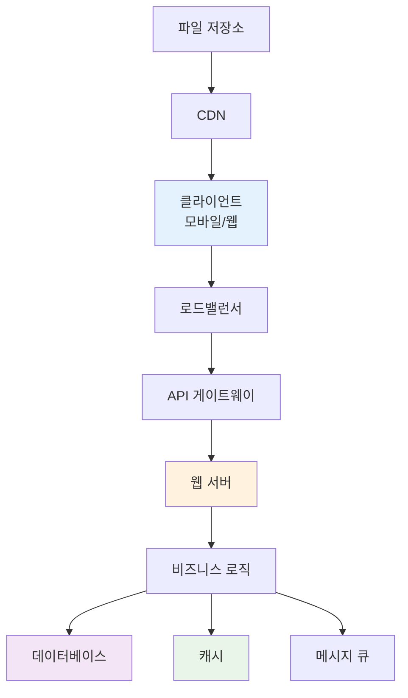
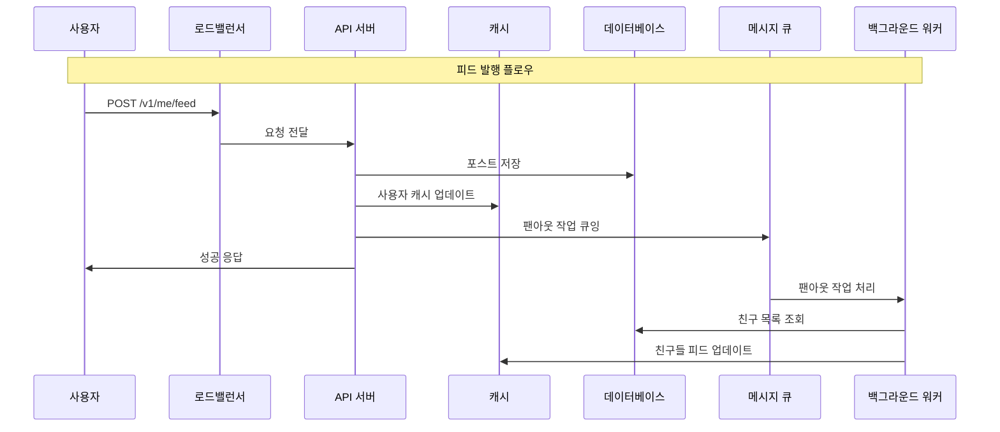
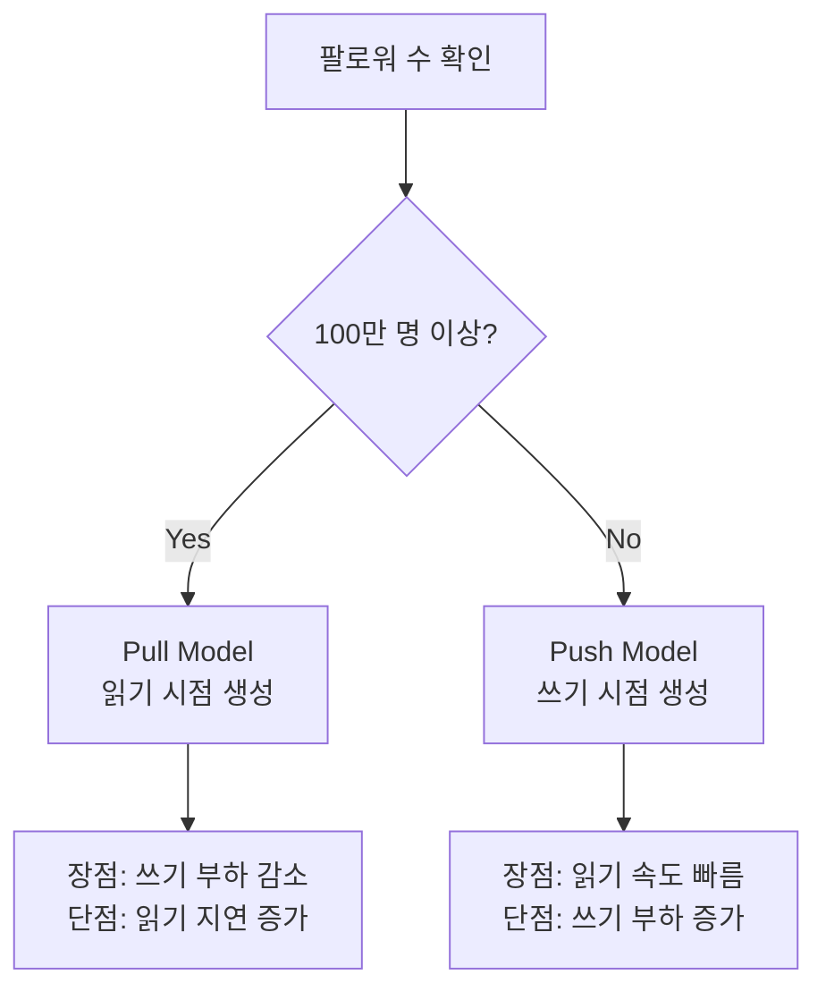
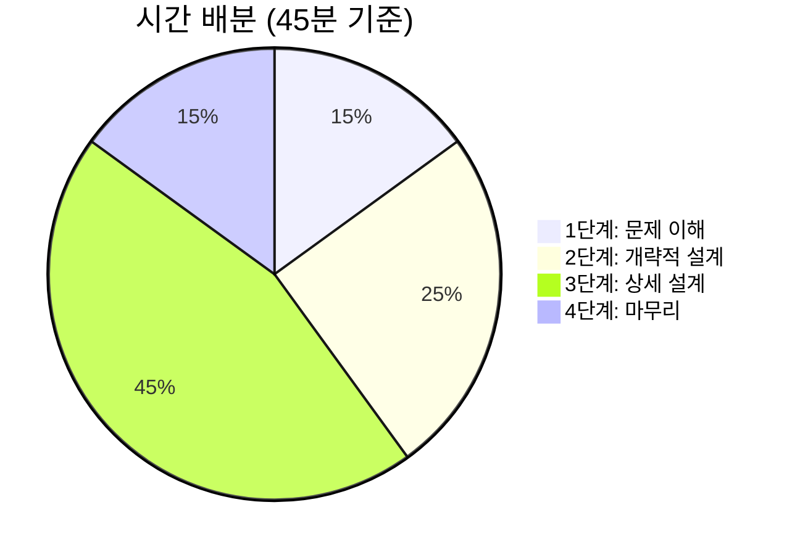
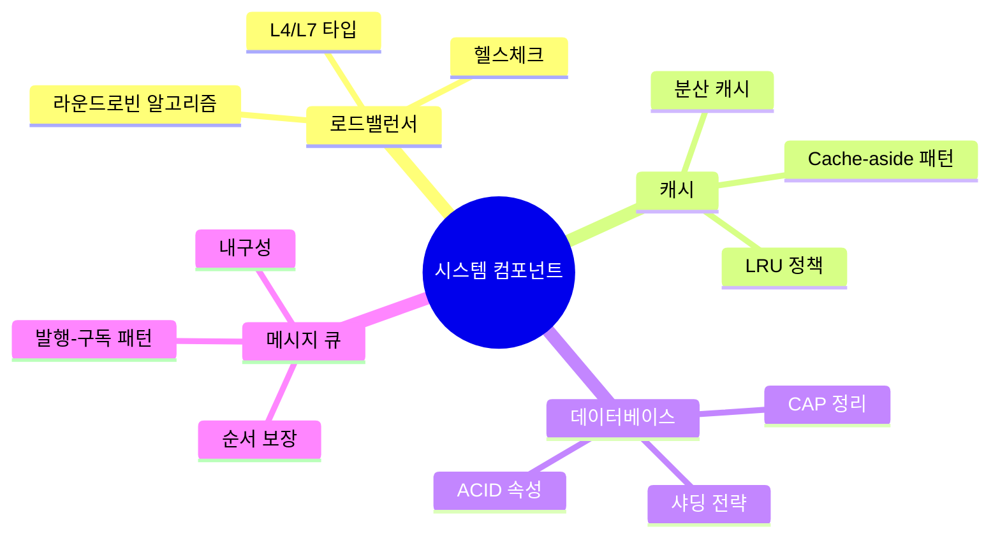
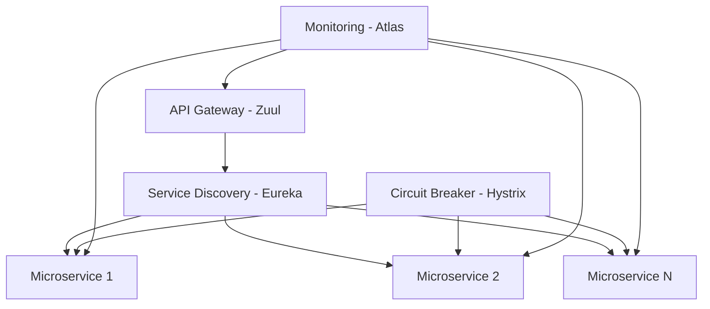

# [가면사배 시리즈 #3] 시스템 설계 면접 공략법

## 📖 책 소개

**제목**: 가상 면접 사례로 배우는 대규모 시스템 설계 기초  
**3장**: 시스템 설계 면접 공략법  
**핵심 주제**: 효과적인 시스템 설계 면접을 위한 4단계 접근법과 실전 전략

## 🎯 학습 목표

- 시스템 설계 면접의 본질과 목적 이해
- 면접관이 평가하는 핵심 역량과 신호(Signal) 파악
- 효과적인 4단계 접근법 습득
- 실제 면접 상황에서의 시간 관리와 소통 전략 학습
- 긍정적/부정적 신호를 구분하고 대응하는 방법 연습

## 🤝 시스템 설계 면접의 본질

### 면접의 진짜 목적

시스템 설계 면접은 **두 명의 동료가 모호한 문제를 풀기 위해 협력하여 해결책을 찾아내는 과정에 대한 시뮬레이션**입니다.

**중요한 특징**:

- 정해진 결말이 없음
- 정답이 없음
- 설계 과정이 결과보다 중요
- 협력적 문제 해결 능력 평가

### 면접관이 평가하는 요소



### 긍정적 신호 vs 부정적 신호

| 긍정적 신호 (Green Flag)    | 부정적 신호 (Red Flag)  |
| --------------------------- | ----------------------- |
| 요구사항 명확화를 위한 질문 | 바로 답부터 제시        |
| 가정 사항 명시 및 기록      | 가정 없이 진행          |
| 여러 해결책 제시            | 단일 해결책만 고집      |
| 트레이드오프 분석           | 과도한 엔지니어링       |
| 면접관과의 협력적 소통      | 완고함, 편협함          |
| 피드백 수용 및 개선         | 비판에 대한 방어적 태도 |

## 🚀 효과적 면접을 위한 4단계 접근법

### 1단계: 문제 이해 및 설계 범위 확정 (3-10분)



#### 핵심 질문 유형

**기능적 요구사항**:

- 구체적으로 어떤 기능들을 만들어야 하나?
- 모바일 앱, 웹 앱 중 어느 것을 지원해야 하나?
- 가장 중요한 기능은 무엇인가?

**비기능적 요구사항**:

- 제품 사용자 수는 얼마나 되나?
- 회사의 규모는 얼마나 빨리 커질 것으로 예상하나?
- 사이트로 오는 트래픽 규모는 어느 정도인가?

**기술적 제약사항**:

- 회사가 주로 사용하는 기술 스택은 무엇인가?
- 활용할 수 있는 기존 서비스는 어떤 것들이 있는가?

#### 실제 대화 예시: 뉴스 피드 시스템

**면접 대화 시뮬레이션**:

| 지원자 질문                                           | 면접관 답변                                                        |
| ----------------------------------------------------- | ------------------------------------------------------------------ |
| "모바일 앱과 웹 앱 가운데 어느 것을 지원해야 하나요?" | "둘 다 지원해야 합니다."                                           |
| "가장 중요한 기능은 무엇인가요?"                      | "새로운 포스트를 올리고 친구의 뉴스 피드를 볼 수 있는 기능입니다." |
| "뉴스 피드는 시간 역순으로 정렬되나요?"               | "문제를 단순하게 만들기 위해 시간 역순으로 정렬된다고 가정합시다." |
| "한 사용자는 최대 몇 명과 친구를 맺을 수 있나요?"     | "5000명입니다."                                                    |
| "일간 능동 사용자(DAU)는 얼마나 되나요?"              | "천만 명입니다."                                                   |
| "피드에 이미지나 비디오도 올라올 수 있나요?"          | "네, 미디어 파일도 포스트할 수 있어야 합니다."                     |

**요구사항 정리**:

- 플랫폼: 모바일 + 웹
- 핵심 기능: 포스트 작성, 피드 조회
- 정렬 방식: 시간 역순
- 친구 수 제한: 5,000명
- DAU: 1,000만 명
- 미디어: 이미지/비디오 지원

### 2단계: 개략적인 설계안 제시 및 동의 구하기 (10-15분)



#### 이 단계에서 해야 할 일

**설계안 제시**:

- 핵심 컴포넌트를 포함한 다이어그램 작성
- 클라이언트, API, 웹 서버, 데이터 저장소, 캐시, CDN, 메시지 큐 등
- 면접관을 팀원처럼 대하며 협력적으로 진행

**개략적 계산**:

- 시스템 규모 제약사항 만족 여부 확인
- 계산 과정을 소리 내어 설명
- 면접관에게 계산이 필요한지 미리 확인

**사용 사례 검토**:

- 구체적인 사용 사례 몇 가지 살펴보기
- 에지 케이스나 예외 상황 발견
- 전체적인 플로우 검증

#### 뉴스 피드 시스템 예시

**두 가지 주요 플로우**:

```mermaid
graph TD
    subgraph "피드 발행 (Feed Publishing)"
        A1[사용자가 포스트 작성] --> A2[API 서버로 요청 전송]
        A2 --> A3[데이터베이스에 포스트 저장]
        A3 --> A4[캐시에 포스트 정보 업데이트]
        A4 --> A5[친구들의 뉴스 피드에 반영]
        A5 --> A6[미디어 파일 CDN에 업로드]
    end

    subgraph "피드 생성 (Feed Generation)"
        B1[사용자의 친구 목록 조회] --> B2[친구들의 최근 포스트 수집]
        B2 --> B3[시간 역순으로 정렬]
        B3 --> B4[페이지네이션 적용]
        B4 --> B5[캐시에서 추가 정보 조회]
        B5 --> B6[최종 피드 반환]
    end
```



**플로우별 특징**:

- **피드 발행**: 쓰기 중심, 비동기 처리 가능
- **피드 생성**: 읽기 중심, 실시간 응답 필요

### 3단계: 상세 설계 (10-25분)

이 단계에서는 면접관과 함께 **설계 대상 컴포넌트의 우선순위를 정하고** 핵심 영역을 깊이 있게 다룹니다.

#### 우선순위 결정 요소

**면접 레벨별 포커스**:

- **주니어**: 기본적인 컴포넌트 구조와 데이터 플로우
- **시니어**: 성능 특성, 병목 구간, 자원 요구량 추정
- **시니어+**: 확장성, 가용성, 일관성 트레이드오프

**시스템 유형별 포커스**:

- **URL 단축기**: 해시 함수 설계, 충돌 처리
- **채팅 시스템**: 지연시간 최소화, 온/오프라인 상태 관리
- **검색 엔진**: 인덱싱 전략, 랭킹 알고리즘
- **소셜 미디어**: 타임라인 생성, 팬아웃 전략

#### 상세 설계 예시: 뉴스 피드 시스템



**피드 발행 상세 구현**:

| 단계 | 작업          | 설명                              |
| ---- | ------------- | --------------------------------- |
| 1    | 데이터 검증   | 포스트 내용, 크기, 형식 검증      |
| 2    | DB 저장       | 포스트를 데이터베이스에 영구 저장 |
| 3    | 캐시 업데이트 | 사용자 캐시에 새 포스트 반영      |
| 4    | 팬아웃 큐잉   | 비동기로 친구들 피드에 전파       |
| 5    | 응답 반환     | 클라이언트에 즉시 성공 응답       |

**팬아웃 전략 선택**:



**피드 생성 최적화 과정**:

1. **캐시 확인**: 기존 피드가 캐시에 있는지 확인
2. **캐시 미스 처리**: DB에서 친구 목록과 최근 포스트 조회
3. **정렬 및 개인화**: 시간순 정렬 후 사용자 선호도 적용
4. **캐시 저장**: 생성된 피드를 캐시에 저장하여 재사용

### 4단계: 마무리 (3-5분)

마지막 단계에서는 **설계를 정리하고 개선점을 논의**합니다.

#### 마무리 체크리스트

**시스템 개선점 논의**:

- 병목 구간 식별 및 해결 방안
- 확장성 개선 방안
- 성능 최적화 포인트

**운영 관점 논의**:

- 모니터링 및 메트릭 수집
- 장애 대응 시나리오
- 배포 및 롤아웃 전략

**미래 확장성**:

- 사용자 수 증가 시 대응 방안
- 새로운 기능 추가 시 고려사항
- 글로벌 확장 시 필요한 변경사항

**시스템 개선점 체크리스트**:

| 영역         | 병목 지점       | 해결 방안               |
| ------------ | --------------- | ----------------------- |
| 데이터베이스 | 읽기 부하 집중  | 읽기 전용 복제본 추가   |
| 캐시         | 메모리 부족     | 분산 캐시 클러스터 구성 |
| API 서버     | CPU 사용률 높음 | 수평적 확장             |

**확장성 로드맵**:

- **현재**: 1천만 DAU 지원
- **단기**: 5천만 DAU (캐시 확장, DB 샤딩)
- **장기**: 1억 DAU (지역별 데이터센터, 마이크로서비스)

**모니터링 메트릭**:

- **성능**: QPS, 응답시간, 에러율
- **리소스**: 캐시 히트율, DB 성능, 메모리 사용률
- **사용자 경험**: 피드 로딩 시간, 포스트 업로드 시간

**장애 시나리오 대응**:

| 장애 유형         | 대응 방안                                |
| ----------------- | ---------------------------------------- |
| 데이터베이스 장애 | 읽기 전용 복제본으로 자동 페일오버       |
| 캐시 장애         | 캐시 우회하여 데이터베이스 직접 조회     |
| API 서버 장애     | 로드밸런서가 건강한 서버로 트래픽 라우팅 |
| 네트워크 분할     | 각 지역별 독립적 서비스 제공             |

## ⏰ 시간 배분 전략

### 45분 면접 기준 시간 배분



| 단계  | 시간    | 주요 활동                 | 핵심 포인트                  |
| ----- | ------- | ------------------------- | ---------------------------- |
| 1단계 | 3-10분  | 요구사항 파악, 가정 설정  | 충분한 질문, 범위 명확화     |
| 2단계 | 10-15분 | 개략적 설계, 합의 도출    | 전체 구조, 주요 컴포넌트     |
| 3단계 | 10-25분 | 상세 설계, 깊이 있는 논의 | 핵심 영역 집중, 트레이드오프 |
| 4단계 | 3-5분   | 정리, 개선점 논의         | 요약, 확장성, 운영 관점      |

### 시간 관리 팁

**시간 추적 방법**:

- 면접 시작 시 시계 확인
- 각 단계별 목표 시간 설정
- 20% 초과 시 다음 단계로 전환 고려

**단계별 시간 할당 (45분 기준)**:

| 단계        | 할당 시간 | 실제 시간 | 진행 상태        |
| ----------- | --------- | --------- | ---------------- |
| 문제 이해   | 7분       | -         | 진행률 체크      |
| 개략적 설계 | 12분      | -         | 20% 초과 시 경고 |
| 상세 설계   | 22분      | -         | 핵심 영역 집중   |
| 마무리      | 4분       | -         | 반드시 확보      |

**단계 전환 멘트**:

- "요구사항이 명확해졌으니 개략적 설계로 넘어가겠습니다"
- "전체 구조에 동의해주셨으니 [핵심 컴포넌트]를 자세히 살펴보겠습니다"
- "시간 관계상 설계를 정리하고 개선점을 논의해보겠습니다"

**시간 관리 체크포인트**:

- ✅ 10분: 1단계 완료 여부 확인
- ✅ 25분: 2단계 완료 여부 확인
- ✅ 40분: 3단계 마무리 및 4단계 시작

## 💡 실전 면접 전략

### 해야 할 것 (Do's)

**소통과 협력**:

- 질문을 통해 요구사항 확인
- 가정 사항을 명시하고 기록
- 면접관과 지속적으로 소통
- 사고 과정을 소리 내어 설명

**설계 접근법**:

- 여러 해결책 제시 및 비교
- 트레이드오프 분석
- 개략적 설계 → 상세 설계 순서
- 가장 중요한 컴포넌트부터 설명

**마인드셋**:

- 면접관을 팀원으로 대하기
- 피드백을 건설적으로 수용
- 막혔을 때 도움 요청
- 끝까지 포기하지 않기

### 하지 말아야 할 것 (Don'ts)

**잘못된 접근법**:

- 바로 답부터 제시
- 요구사항 확인 없이 설계 시작
- 처음부터 세부사항에 집중
- 침묵 속에서 혼자 설계

**부정적 태도**:

- 완고함이나 편협함 보이기
- 비판에 방어적으로 반응
- 설계가 완벽하다고 주장
- 면접관의 의견 무시

**시간 관리 실수**:

- 한 영역에 너무 많은 시간 소모
- 불필요한 세부사항 설명
- 시간 배분 무시
- 마무리 시간 확보 실패

## 🎯 면접 성공을 위한 실무 팁

### 자주 출제되는 문제 유형별 대비

**시스템 유형별 준비 전략**:

| 시스템 유형         | 대표 예시                          | 핵심 포인트                                | 집중 영역                        |
| ------------------- | ---------------------------------- | ------------------------------------------ | -------------------------------- |
| **소셜 미디어**     | 뉴스 피드, 인스타그램, 트위터      | 팬아웃 전략, 타임라인 생성, 미디어 처리    | 읽기 최적화, 캐싱 전략, 확장성   |
| **메시징 시스템**   | WhatsApp, Slack, Discord           | 실시간 통신, 메시지 전달 보장, 온라인 상태 | WebSocket, 메시지 큐, 푸시 알림  |
| **검색 시스템**     | Google 검색, 자동완성, 추천 시스템 | 인덱싱, 랭킹, 개인화                       | 분산 검색, 캐싱, 머신러닝        |
| **스트리밍 서비스** | YouTube, Netflix, Twitch           | 비디오 인코딩, CDN, 적응형 스트리밍        | 대역폭 최적화, 지역별 배포, 캐싱 |

**핵심 시스템 컴포넌트 준비**:



**컴포넌트별 상세 준비사항**:

| 컴포넌트         | 유형/패턴                         | 고려사항                                |
| ---------------- | --------------------------------- | --------------------------------------- |
| **로드밸런서**   | L4, L7, DNS 기반                  | 헬스체크, 세션 유지, SSL 종료           |
| **캐시**         | 브라우저, CDN, 애플리케이션, DB   | Cache-aside, Write-through, LRU/LFU     |
| **데이터베이스** | MySQL, PostgreSQL, MongoDB, Redis | ACID, CAP 정리, 샤딩                    |
| **메시지 큐**    | Kafka, RabbitMQ, SQS              | 발행-구독, 최소/정확히 한 번, 순서 보장 |

### 기술적 깊이 vs 폭의 균형

**레벨별 기대 수준**:

| 레벨     | 기술적 깊이        | 시스템 설계 폭         | 주요 평가 포인트     |
| -------- | ------------------ | ---------------------- | -------------------- |
| 주니어   | 기본 컴포넌트 이해 | 단순한 3-tier 구조     | 기본 개념, 학습 의지 |
| 미드레벨 | 성능 최적화 고려   | 마이크로서비스 구조    | 트레이드오프, 확장성 |
| 시니어   | 분산 시스템 전문성 | 복잡한 시스템 아키텍처 | 리더십, 기술 전략    |

### 실제 면접 시뮬레이션

**면접 시뮬레이션 체크리스트**:

**1단계 준비사항**:

- 문제: "채팅 시스템 설계"
- 시간 제한: 45분
- 현재 단계: 문제 이해 및 설계 범위 확정

**좋은 질문 예시**:

- "사용자 규모는 어느 정도인가요?"
- "가장 중요한 기능은 무엇인가요?"
- "성능 요구사항이 있나요?"
- "기존에 활용할 수 있는 시스템이 있나요?"

**접근법 평가 기준**:

| 평가 항목 | 체크 포인트             | 점수 |
| --------- | ----------------------- | ---- |
| 명확화    | 충분한 질문을 했는가?   | 10점 |
| 가정 설정 | 가정을 명시했는가?      | 10점 |
| 범위 정의 | 설계 범위를 확정했는가? | 10점 |
| 협력      | 면접관과 소통했는가?    | 10점 |

**피드백 기준**:

- 30점 이상: ✅ 체계적인 접근법
- 30점 미만: ⚠️ 더 많은 질문과 명확화 필요

## 🔍 심화 학습 주제

### 고급 시스템 설계 패턴

**분산 시스템 패턴**:

- Circuit Breaker: 장애 전파 방지
- Bulkhead: 리소스 격리
- Saga: 분산 트랜잭션 관리
- CQRS: 명령과 조회 분리

**확장성 패턴**:

- 수평적 확장 vs 수직적 확장
- 샤딩 전략 (해시, 범위, 디렉토리)
- 파티셔닝 (수평, 수직, 기능별)
- 연합(Federation) 아키텍처

**가용성 패턴**:

- 액티브-패시브 vs 액티브-액티브
- 멀티 리전 배포
- 재해 복구 전략
- 우아한 성능 저하

### 실제 기업 아키텍처 사례 연구

**주요 기업 아키텍처 패턴**:

| 기업        | 아키텍처 특징          | 핵심 기술             | 확장 전략               |
| ----------- | ---------------------- | --------------------- | ----------------------- |
| **Netflix** | 수백 개 마이크로서비스 | Eureka, Zuul, Hystrix | 글로벌 CDN, 리전별 배포 |
| **Uber**    | 이벤트 소싱 + MSA      | Kafka, Cassandra      | 지역별 독립 확장        |
| **Airbnb**  | 모놀리스 → MSA 전환    | MySQL, Redis, ES      | 점진적 서비스 분리      |

**Netflix 아키텍처 패턴**:



**아키텍처 진화 패턴**:

1. **모놀리스**: 초기 빠른 개발
2. **서비스 분리**: 팀 확장에 따른 분리
3. **마이크로서비스**: 독립적 배포와 확장
4. **서버리스**: 운영 부담 최소화

## 🤔 토론 주제

### 기술적 관점

1. **트레이드오프 분석**: 일관성 vs 가용성 vs 분할 내성 중 어떤 것을 우선시해야 할까?
2. **아키텍처 진화**: 모놀리식에서 마이크로서비스로 전환하는 최적의 시점은?
3. **기술 선택**: 새로운 기술 도입 시 고려해야 할 요소들은?

### 면접 전략 관점

1. **깊이 vs 폭**: 한 영역을 깊게 파는 것 vs 여러 영역을 넓게 다루는 것?
2. **시간 관리**: 예상보다 복잡한 문제가 나왔을 때의 대응 전략은?
3. **소통 스타일**: 면접관의 성향에 따른 소통 방식 조정 방법은?

### 실무 연결 관점

1. **이론 vs 실무**: 면접에서 배운 내용을 실제 업무에 어떻게 적용할 것인가?
2. **팀워크**: 실제 팀에서 시스템 설계 시 고려해야 할 추가 요소들은?
3. **기술 부채**: 빠른 개발 vs 완벽한 설계 사이의 균형점은?

## 📚 추가 학습 자료

### 필수 도서 및 자료

**시스템 설계 도서**:

- "Designing Data-Intensive Applications" - Martin Kleppmann
- "Building Microservices" - Sam Newman
- "System Design Interview" - Alex Xu

**온라인 리소스**:

- High Scalability 블로그
- AWS Architecture Center
- Google Cloud Architecture Framework
- Microsoft Azure Well-Architected Framework

### 실습 프로젝트 아이디어

1. **미니 소셜 미디어**: 기본적인 뉴스 피드 시스템 구현
2. **실시간 채팅**: WebSocket 기반 메시징 시스템
3. **URL 단축기**: 해시 기반 단축 URL 서비스
4. **분산 캐시**: Redis 클러스터 구성 및 성능 테스트

### 면접 준비 체크리스트

```markdown
## 면접 전 준비사항

### 기술적 준비

- [ ] 주요 시스템 컴포넌트 이해
- [ ] CAP 정리, ACID 속성 숙지
- [ ] 일반적인 확장성 패턴 학습
- [ ] 실제 기업 아키텍처 사례 연구

### 소통 준비

- [ ] 질문 리스트 준비
- [ ] 가정 설정 연습
- [ ] 다이어그램 그리기 연습
- [ ] 시간 관리 전략 수립

### 실전 연습

- [ ] 모의 면접 진행
- [ ] 다양한 문제 유형 연습
- [ ] 피드백 수집 및 개선
- [ ] 스트레스 상황 대응 연습
```

## 🎯 핵심 메시지

> "시스템 설계 면접은 정답을 맞추는 퀴즈가 아니라, 동료와 함께 문제를 해결하는 협력적 과정이다."

이 장에서 배운 핵심 원칙들:

1. **체계적 접근**: 4단계 방법론을 통한 구조화된 문제 해결
2. **협력적 소통**: 면접관과의 지속적인 대화와 피드백 수용
3. **적절한 추상화**: 개략적 설계에서 상세 설계로의 점진적 발전
4. **시간 관리**: 각 단계별 적절한 시간 배분과 우선순위 설정
5. **실무 연결**: 이론적 지식을 실제 시스템 설계에 적용하는 능력

시스템 설계 면접은 단순히 기술적 지식을 평가하는 것이 아니라, **엔지니어로서의 종합적인 역량**을 확인하는 과정입니다. 체계적인 준비와 지속적인 연습을 통해 자신감 있게 면접에 임할 수 있습니다.
