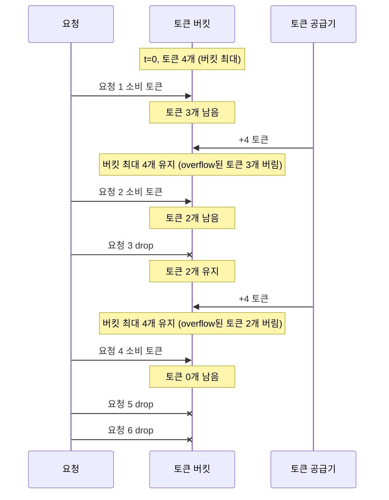
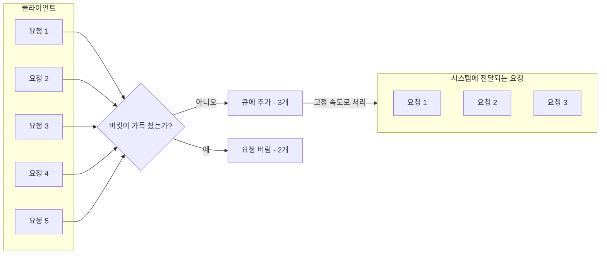
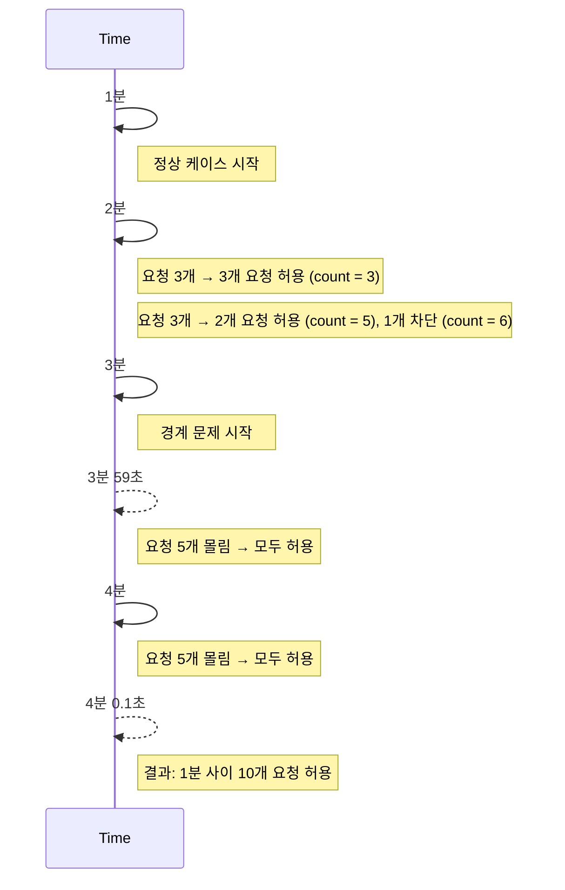
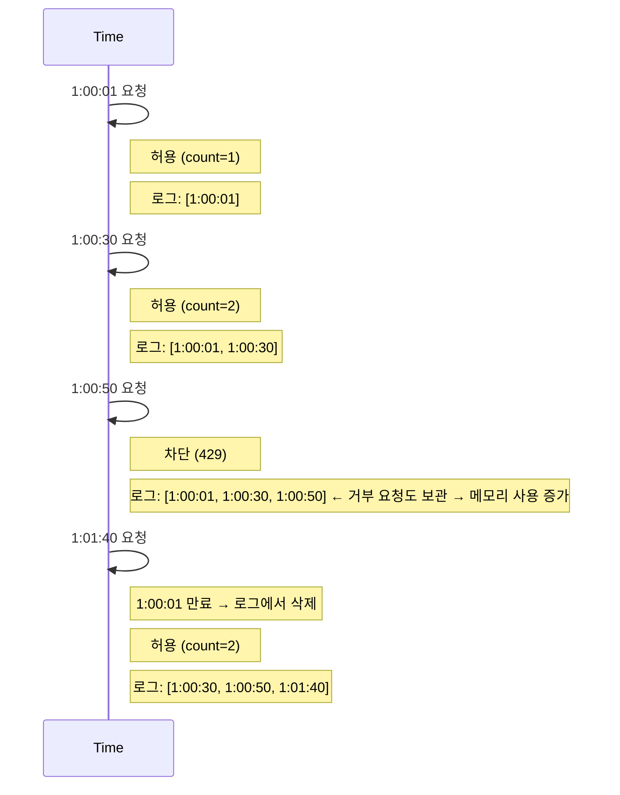
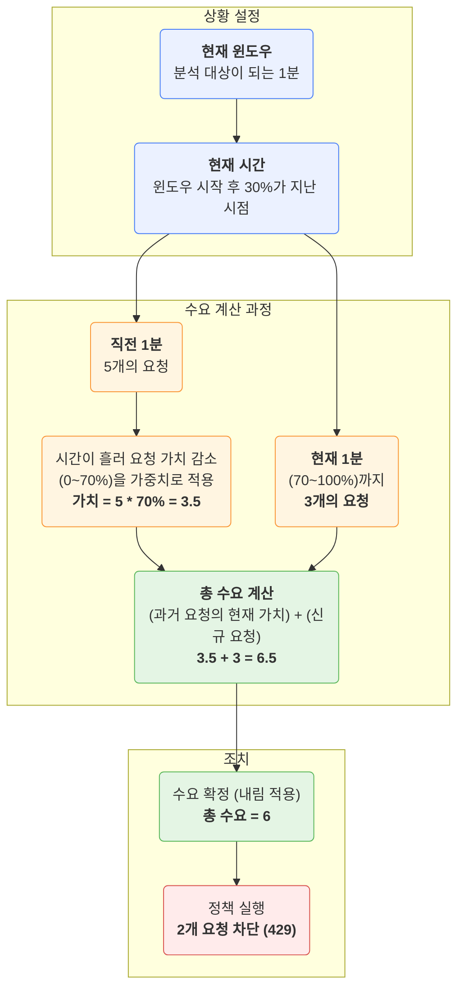
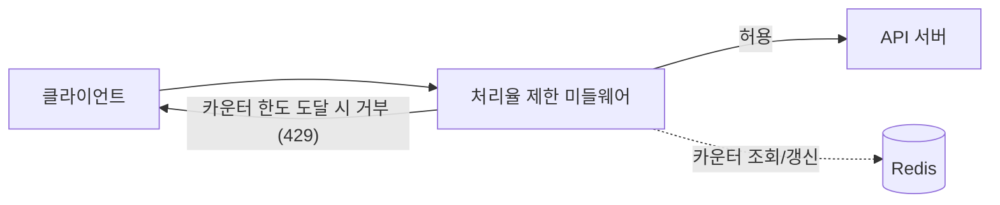
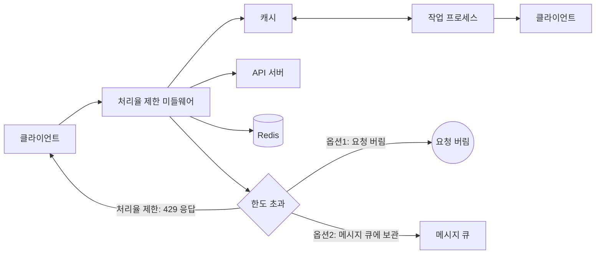
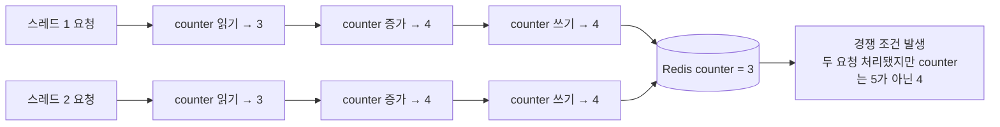
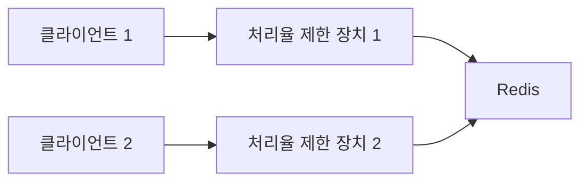

설계에 앞서, API에 처리율 제한 장치를 두면 좋은 점을 살펴보자.
* DoS 공격에 의한 자원 고갈을 방지할 수 있다.
* 비용을 절감한다.
  * 서버를 많이 두지 않아도 된다.
  * 우선순위가 높은 API에 더 많은 자원을 할당할 수 있다.
* 서버 과부하를 막는다. (트래픽 제어)

# 1단계 문제 이해 및 설계 범위 확정
면접관과 소통하여 어떤 제한 장치를 구현해야 하는지 정하자.

# 2단계 개략적 설계안 제시 및 동의 구하기
복잡함을 피하고, 기본적인 클라이언트-서버 통신 모델을 사용하도록 하자.

## 처리율 제한 장치는 어디에 둘 것인가?
* 클라이언트 측에 두기
  * 클라이언트의 요청은 쉽게 위변조가 가능해 안정적이지 못하다.
* API 서버 측에 두기
  ```mermaid
  flowchart LR
      Client[클라이언트] -->|HTTP 요청| APIServer[API 서버 / 처리율 제한 장치]
  ```
* 미들웨어로 두기
  * API 서버로 가는 요청을 통제함
  ```mermaid
  flowchart LR
    %% 클라이언트 → 미들웨어
    Client[클라이언트] --> Middleware[미들웨어 / 처리율 제한 장치]
    Client -->|X| Middleware
    Middleware -->|429: Too many requests| Client

    %% 미들웨어 → API 서버
    Middleware --> APIServer[API 서버]
    Middleware --> APIServer
  ```
  > 폭넓게 채택된 기술인 클라우드 마이크로서비스의 경우, 처리율 제한 장치는 보통 API 게이트웨이라 불리는 컴포넌트에 구현되며, 이를 API 게이트웨이 패턴이라고 부른다.

처리율 제한 서비스를 직접 만드는 데에 시간이 들기 때문에 구현할 인력이 충분치 않으면 상용 API 게이트웨이를 쓰는 것은 어떨까?

## 처리율 제한 알고리즘
널리 알려진 인기 처리율 제한 알고리즘은 아래와 같은 것들이 있다.
* 토큰 버킷
* 누출 버킷
* 고정 윈도 카운터
* 이동 윈도 로그
* 이동 윈도 카운터

### 토큰 버킷 (token bucket)
토큰 버킷은 지정된 용량을 갖는 컨테이너다.   
이 버킷에는 사전 설정된 양의 토큰이 주기적으로 채워진다.   
토큰이 꽉 찬 버킷에는 더 이상의 토큰은 추가되지 않는다.

용량이 4인 버킷에 토큰 공급기(refiller)는 매초 2개의 토큰을 추가한다.   
버킷이 가득 차면 추가로 공급된 토큰은 버려진다(overflow).

각 요청은 처리될 때마다 하나의 토큰을 사용한다.   
요청이 도착하면 버킷에 충분한 토큰이 있는지 검사하여, 충분한 경우에는 버킷에서 토큰 하나를 꺼낸 후 요청을 시스템에 전달하고, 없는 경우에는 해당 요청은 버려진다(dropped).

예시로 토큰 버킷의 크기는 4, 토큰 공급률은 분당 4인 토큰 버킷 알고리즘을 보자.

토큰 버킷 알고리즘은 2개의 파라미터를 받는다.
* 버킷 크기: 버킷에 담을 수 있는 토큰의 최대 개수
* 토큰 공급률: 초당 몇 개의 토큰이 버킷에 공급되는가

버킷은 몇 개나 사용해야 하나? 공급 제한 규칙에 따라 달라진다.
* 통상적으로, API endpoint마다 별도의 버킷을 둔다.
* IP 주소별로 처리율 제한을 적용해야 한다면 IP 주소마다 버킷을 하나씩 할당해야 한다.

장점과 단점은 아래와 같다.
* 장점
    * 구현이 쉽다.
    * 메모리 사용 측면에서도 효율적이다.
    * 짧은 시간에 집중되는 트래픽도 처리 가능하다.
* 단점
    * 버킷 크기와 토큰 공급률이라는 2개의 파라미터를 가지고 있는데, 이 값을 적절하게 튜닝하는 것은 까다로운 일이 될 것이다.

### 누출 버킷 알고리즘 (leaky bucket)
누출 버킷 알고리즘은 토큰 버킷 알고리즘과 비슷하지만, 요청 처리율이 고정되어 있다는 점이 다르다.

누출 버킷 알고리즘은 보통 FIFO 큐로 구현된다.
* 요청이 도착하면 큐가 가득 차 있는지 보고, 빈자리가 있는 경우에는 큐가 요청을 추가한다.
* **큐가 가득 차 있는 경우에는 새 요청은 버린다.**
* 지정된 시간마다 큐에서 요청을 꺼내어 처리한다.


누출 버킷 알고리즘은 2개의 파라미터를 사용한다.
* 버킷 크기: 큐 사이즈와 같은 값으로, 큐에는 처리될 항목들이 보관된다.
* 처리율: 지정된 시간당 몇 개의 항목을 처리할지 지정하는 값으로, 보통 초 단위로 표현된다.

장점과 단점은 아래와 같다.
* 장점
    * 큐의 크기가 제한되어 있어 메모리 사용량 측명에서 효율적이다.
    * 고정된 처리율을 갖고 있기 때문에 안정적 출력이 필요한 경우 적합하다.
* 단점
* **큐가 가득 차 있는 경우에는 새 요청은 버린다.**
* 2개의 인자를 올바르게 튜닝하기 까다로울 수 있다.

### 고정 윈도 카운터 (fixed window counter)
고정 윈도 카운터는 아래와 같이 동작한다.
* timeline을 고정된 간격의 window로 나누고, 각 윈도마다 counter를 붙인다.
* 요청이 접수될 때마다 이 counter의 값은 1씩 증가한다.
* 이 counter의 값이 사전에 설정된 임계칭(threshold)에 도달하면 새로운 요청은 새 window가 열릴 때까지 버려진다.

고정 윈도 카운터 알고리즘의 가장 큰 문제는 window의 경계 부근에 순간적으로 많은 트래픽이 집중될 경우 window에 할당된 양보다 더 많은 요청이 처리될 수 있다는 것이다.

타임라인의 시간 단위는 1분으로, 1분당 5개의 요청만을 허용하는 예시를 보자.


장점과 단점은 아래와 같다.
* 장점
    * 메모리 효율이 좋다.
    * 이해하기 쉽다.
    * 윈도가 닫히는 시점에 카운터를 초기화하는 방식은 특정한 트래픽 패턴을 처리하기에 적합하다.
* 단점
    * 윈도 경계 부근에서 일시적으로 많은 트래픽이 몰려드는 경우, 기대했던 시스템의 **처리 한도보다 많은 양의 요청을 처리**하게 된다.

### 이동 윈도 로깅 (sliding window log)
이동 윈도 로깅 알고리즘은 윈도 카운터 알고리즘에서 윈도 경계 부근에 트래픽이 집중되는 경우 시스템에 설정된 한도보다 많은 요청을 처리하게 되는 문제를 해결한다.
* 요청의 timestamp를 추적한다.
    * timestamp 데이터는 보통 Redis의 sorted set 같은 캐시에 보관한다.
* 새 요청이 오면 만료된 timestamp는 제거한다.
    * 만료된 timestamp는 그 값이 현재 window의 시작 시점보다 오래된 timestamp를 말한다.
* 새 요청의 timestamp를 log에 추가한다.
* log의 크기가 허용치보다 같거나 작으면 요청을 시스템에 전달한다. 그렇지 않은 경우에는 처리를 거부한다.



장점과 단점은 아래와 같다.
* 장점
    * 아주 정교하다.
        * 어느 순간의 window를 보더라도, 허용되는 요청의 개수는 시스템의 처리율 한도를 넘지 않는다.
* 단점
    * 거부된 요청의 timestamp도 보관하기 때문에 다량의 메모리를 사용한다.

### 이동 윈도 카운터 (sliding window counter)
이동 윈도 카운터 = 고정 윈도 카운터 + 이동 윈도 로깅



장점과 단점은 아래와 같다.
* 장점
    * 이전 시간대의 평균 처리율에 따라 현재 window의 상태를 계산하므로 ㅉ랍은 시간에 몰리는 트래픽에도 잘 대응한다.
    * 메모리 효율이 좋다.
* 단점
    * 직전 시간대에 도착한 요청이 균등하게 분포되어 이다고 가정한 상태에서 추정치를 계산하기 때문에 **다소 느슨**하다.
        * 생각만큼 심각하게 overflow되지는 않는다.

## 개략적인 아키텍처
counter는 메모리상에서 동작하는 캐시에 보관하는 것이 바람직한데, 빠른데다 시간에 기반한 **만료 정책**을 지원하기 때문이다.

Redis로 처리율 제한 장치 구현
* INCR: 메모리에 저장된 counter의 값을 1만큼 증가시킨다.
* EXPIRE: counter에 timeout 값을 설정하고, 설정된 시간이 지나면 counter는 자동으로 삭제된다.

아래는 처리율 제한 장치의 개략적인 아키텍처이다.


# 3단계 상세 설계
개략적 설계로는 아래와 같은 사항은 알 수 없다.
* 처리율 제한 규칙은 어떻게 만들어지고, 어디에 저장되는가?
* 처리가 제한된 요청들은 어떻게 처리되는가?

## 처리율 제한 규칙
보통 설정 파일 형태로 디스크에 저장된다.

## 처리율 한도 초과 트래픽의 처리
어떤 요청이 한도 제한에 걸리면 API는 HTTP 429 응답(too many requests)을 클라이언트에게 보낸다.

클라이언트가 처리율 제한에 걸리고 있는지, 처리율 제한에 걸리기까지 얼마나 많은 요청을 보낼 수 있는지 등에 대해 알 수 있도록 HTTP X 헤더를 클라이언트에게 보낸다.

## 상세 설계


## 분산 환경에서의 처리율 제한 장치의 구현
여러 대의 서버와 병렬 스레드를 지원하도록 시스템을 확장하는 것은 두 가지 어려운 문제를 풀어야 한다.
* 경쟁 조건(race condition)
* 동기화(synchronization)

### 경쟁 조건 (race condition)
병행성이 심한 환경에서는 아래와 같은 경쟁 조건 이슈가 발생할 수 있다.


경쟁 조건 문제를 해결하는 가장 널리 알려진 해결책은 lock이다.   
하지만 lock은 시스템의 성능을 떨어뜨린다는 문제가 있다.

위 설계의 경우, lock 대신 쓸 수 있는 해결책은 Lua script 또는 Redis 자료구조 sorted set이다.

### 동기화 이슈
웹 계층은 무상태(stateless)이므로 클라이언트는 요청을 각기 다른 처리율 제한 장치로 보내게 될 수 있다.   
따라서 동기화를 하지 않는다면 처리율 제한을 올바르게 수행할 수 없을 것이다.

해결책으로 Redis와 같은 중앙 집중형 데이터 저장소를 써보자.



### 성능 최적화
* 여러 데이터 센터를 지원하는 문제인 경우, 사용자의 트래픽을 가장 가까운 edge server로 전달하여 latency를 줄인다.
* 제한 장치 간에 데이터를 동기화할 때 최종 일관성 모델을 사용한다. (이후 6장 참고)

### 모니터링
처리율 제한 장치를 설치한 이후에는 효과적으로 동작하고 있는지 보기 위해 데이터를 모을 필요가 있다.

모니터링을 통해 확인하려는 것
* 채택된 처리율 제한 알고리즘이 효과적이다.
* 정의한 처리율 제한 규칙이 효과적이다.

> 트래픽이 급증할 때 처리율 제한 장치가 비효율적으로 동작한다면, 트래픽 패턴을 잘 처리할 수 있도록 알고리즘을 바꿔보자.

# 4단계 마무리
다뤘던 알고리즘
* 토큰 버킷
* 누출 버킷
* 고정 윈도 카운터
* 이동 윈도 로그
* 이동 윈도 카운터

추가로 언급해볼 내용
* 경성(hard) 또는 연성(soft) 처리율 제한
    * 경성 처리율 제한: 요청 개수는 임계치를 절대 넘어설 수 없다.
    * 연성 처리율 제한: 요청 개수는 잠시 동안은 임계치를 넘어설 수 있다.
* 다양한 계층에서의 처리율 제한
    * OSI 7계층
* 처리율 제한을 회피하는 방법 (클라이언트를 어떻게 설계하는 것이 최선인가?)
    * 클라이언트 측 캐시를 사용하여 API 호출 횟수를 줄인다.
    * 처리율 제한의 임계치를 이해하고, 짧은 시간 동안 너무 많은 메시지를 보내지 않도록 한다.
    * 예외나 에러를 처리하는 코드를 도입하여 클라이언트가 예외적 상황으로부터 우아하게 복구될 수 있도록 한다.
    * 재시도 로직을 구현할 때는 충분한 백오프 시간을 둔다.
