# [가면사배 시리즈 #4] 처리율 제한 장치의 설계

## 📖 책 소개

**제목**: 가상 면접 사례로 배우는 대규모 시스템 설계 기초  
**4장**: 처리율 제한 장치의 설계  
**핵심 주제**: 트래픽 제어를 위한 처리율 제한 장치(Rate Limiter) 설계와 구현

## 🎯 학습 목표

- 처리율 제한 장치의 개념과 필요성 이해
- 5가지 주요 처리율 제한 알고리즘의 동작 원리와 특성 학습
- 시스템 아키텍처에서 처리율 제한 장치의 위치와 역할 파악
- 분산 환경에서의 구현 과제와 해결 방안 습득
- 실무에서 활용할 수 있는 모니터링과 최적화 전략 연습

## 🚦 처리율 제한 장치의 개념과 필요성

### 정의

**처리율 제한 장치(Rate Limiter)**는 클라이언트 또는 서비스가 보내는 트래픽의 처리율(Rate)을 제어하기 위한 장치입니다.

### 주요 사용 사례

**API 호출 제한**:

- 사용자는 초당 2회 이상 새 글을 올릴 수 없다
- 같은 IP에서 하루에 10개 이상의 계정을 생성할 수 없다
- 같은 디바이스로는 주당 5회 이상 리워드를 요청할 수 없다

### 처리율 제한의 이점

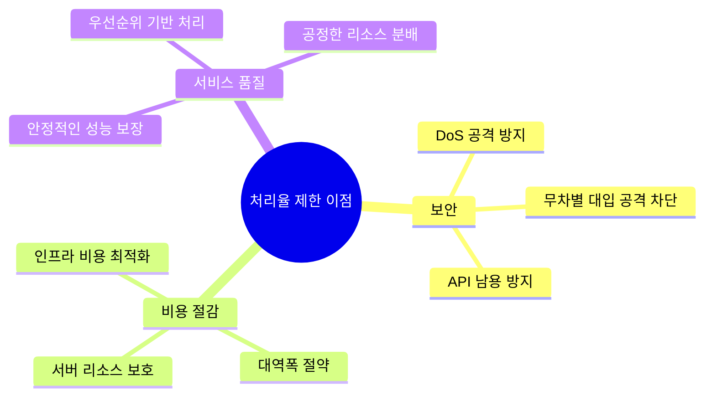

**실제 기업 사례**:

- **트위터**: 3시간 동안 300개 트윗 제한
- **구글 독스**: 분당 300회 읽기 요청 제한
- **스트라이프**: 초당 100회 API 호출 제한

## 🏗️ 처리율 제한 장치의 위치 선택

### 배치 옵션 분석

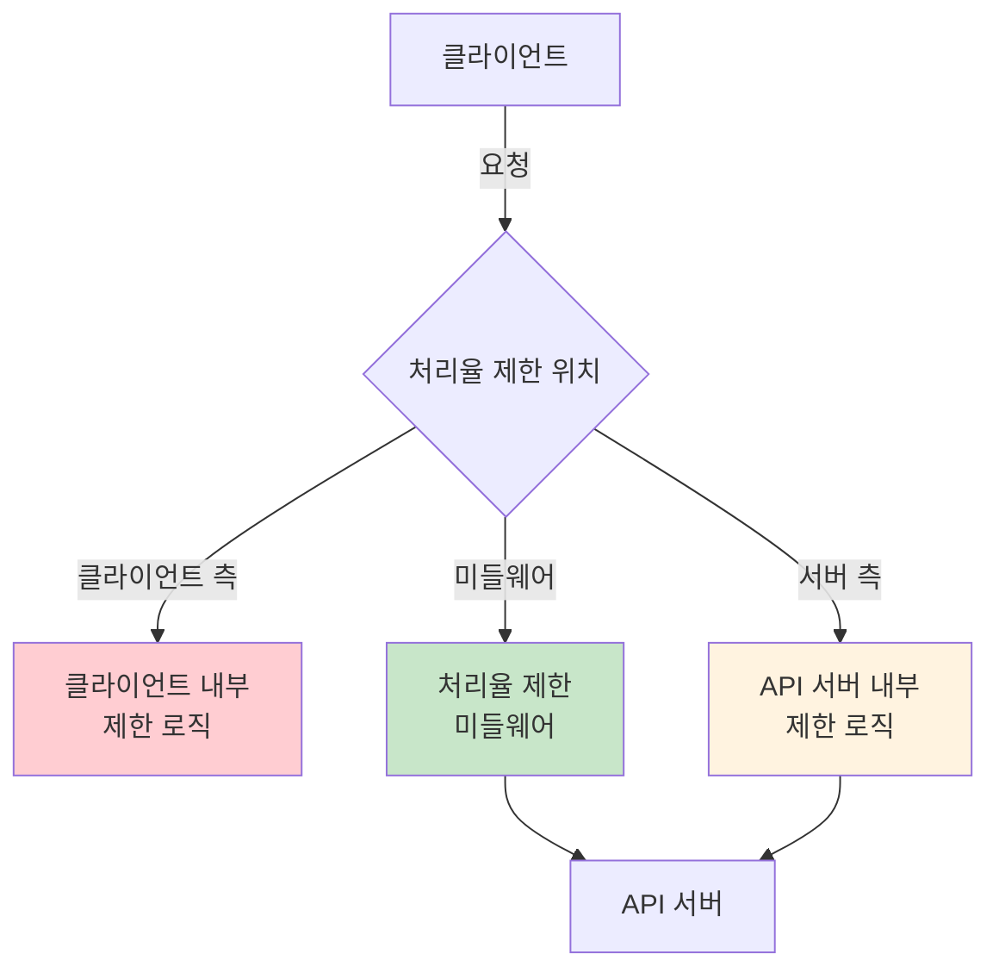

### 위치별 특징 비교

| 위치           | 장점                     | 단점                        | 적용 사례              |
| -------------- | ------------------------ | --------------------------- | ---------------------- |
| **클라이언트** | 네트워크 비용 절약       | 쉽게 우회 가능, 신뢰성 낮음 | 모바일 앱 배터리 절약  |
| **미들웨어**   | 독립적 확장, 유연한 정책 | 추가 네트워크 홉            | API 게이트웨이, 프록시 |
| **서버 측**    | 정확한 제어, 높은 신뢰성 | 서버 부하 증가              | 내부 서비스 보호       |

### 선택 기준

**기술 스택 고려사항**:

- 현재 사용 중인 프로그래밍 언어의 효율성
- 캐시 서비스 인프라 현황
- 기존 API 게이트웨이 존재 여부

**비즈니스 요구사항**:

- 처리율 제한 정책의 복잡성
- 실시간 정책 변경 필요성
- 다양한 클라이언트 지원 범위

**운영 관점**:

- 개발 및 유지보수 리소스
- 모니터링 및 디버깅 용이성
- 장애 격리 및 복구 전략

## 🔧 처리율 제한 알고리즘

### 1. 토큰 버킷(Token Bucket) 알고리즘

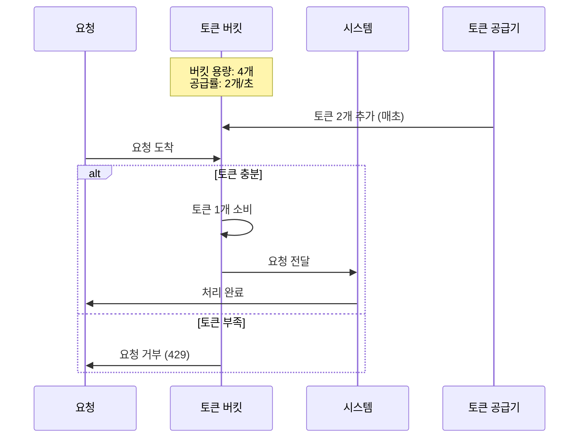

**동작 원리**:

1. 지정된 용량의 버킷에 토큰을 주기적으로 채움
2. 요청이 올 때마다 토큰 하나를 소비
3. 토큰이 없으면 요청을 거부

**핵심 매개변수**:

- **버킷 크기**: 버킷에 담을 수 있는 토큰의 최대 개수
- **토큰 공급률**: 초당 몇 개의 토큰이 버킷에 공급되는가

**장점**:

- 구현이 간단하고 메모리 효율적
- 짧은 시간의 버스트 트래픽 처리 가능
- 유연한 정책 설정 (버킷 크기, 공급률 조정)

**단점**:

- 매개변수 튜닝의 복잡성
- 버스트 허용으로 인한 예측 어려움

**적용 사례**:

- **Amazon API Gateway**: 버스트 트래픽 허용이 필요한 경우
- **Stripe**: 결제 API의 유연한 처리율 제한

### 2. 누출 버킷(Leaky Bucket) 알고리즘

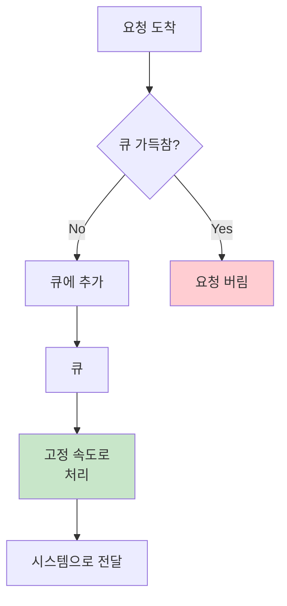

**동작 원리**:

1. 요청이 도착하면 큐에 저장
2. 큐가 가득 차면 새 요청 버림
3. 지정된 고정 속도로 큐에서 요청을 꺼내어 처리

**핵심 매개변수**:

- **버킷 크기**: 큐 사이즈와 같은 값
- **처리율**: 지정된 시간당 몇 개의 항목을 처리할지 지정

**장점**:

- 고정된 처리율로 안정적인 출력
- 메모리 사용량이 제한적 (큐 크기)
- 다운스트림 시스템 보호에 효과적

**단점**:

- 트래픽 급증 시 최신 요청이 버려질 수 있음
- 응답 지연시간 증가 가능성
- 매개변수 튜닝의 복잡성

**적용 사례**:

- **Shopify**: 안정적인 처리율이 중요한 전자상거래 API
- **네트워크 장비**: QoS(Quality of Service) 구현

### 3. 고정 윈도 카운터(Fixed Window Counter) 알고리즘

```mermaid
gantt
    title 고정 윈도 카운터 (분당 5개 제한)
    dateFormat X
    axisFormat %M:%S

    section 윈도 1 (1:00-1:01)
    요청 3개 허용 :done, w1, 0, 60

    section 윈도 2 (1:01-1:02)
    요청 5개 허용 :done, w2, 60, 120

    section 윈도 3 (1:02-1:03)
    요청 2개 허용 :done, w3, 120, 180
```

**동작 원리**:

1. 시간을 고정된 간격의 윈도로 분할
2. 각 윈도마다 카운터 할당
3. 요청 시 카운터 증가, 임계치 초과 시 거부
4. 윈도 종료 시 카운터 초기화

**핵심 특징**:

- 시간을 고정된 간격의 윈도로 분할
- 각 윈도마다 카운터 할당
- 윈도 종료 시 카운터 초기화

**장점**:

- 구현이 간단하고 이해하기 쉬움
- 메모리 효율적
- 특정 시간 패턴에 적합 (예: 시간당 제한)

**단점**:

- 윈도 경계에서 트래픽 집중 시 제한 초과 가능
- 불균등한 트래픽 분산

**경계 문제 예시**:

```mermaid
timeline
    title 윈도 경계 문제 (분당 5개 제한)

    section 2:00:30-2:01:30
        2:00:50 : 5개 요청
        2:01:10 : 5개 요청
        총 10개 : 제한의 2배!
```

### 4. 이동 윈도 로그(Sliding Window Log) 알고리즘

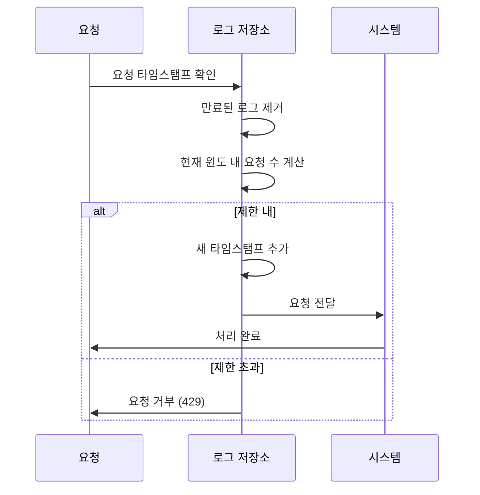

**동작 원리**:

1. 모든 요청의 타임스탬프를 로그에 저장
2. 새 요청 시 만료된 타임스탬프 제거
3. 현재 윈도 내 요청 수가 제한 내인지 확인
4. 제한 내면 새 타임스탬프 추가 후 요청 처리

**핵심 특징**:

- 모든 요청의 타임스탬프를 로그에 저장
- 만료된 타임스탬프 자동 제거
- 정확한 윈도 기반 제한

**장점**:

- 정확한 처리율 제한 (어떤 윈도에서도 제한 준수)
- 유연한 윈도 크기 설정
- 실시간 정확성

**단점**:

- 높은 메모리 사용량 (모든 요청 로그 저장)
- 거부된 요청도 로그에 남을 수 있음
- 복잡한 구현

### 5. 이동 윈도 카운터(Sliding Window Counter) 알고리즘

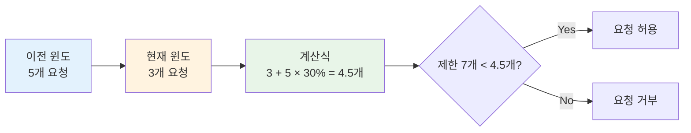

**동작 원리**:

1. 현재 윈도와 이전 윈도의 요청 수를 조합
2. 이전 윈도의 기여도를 시간 비율로 계산
3. 가중 평균으로 현재 윈도의 예상 요청 수 산출

**계산 공식**:

```
현재 윈도 요청 수 = 현재 윈도 요청 + 이전 윈도 요청 × 겹치는 시간 비율
```

**핵심 특징**:

- 현재 윈도와 이전 윈도의 요청 수를 조합
- 시간 비율에 따른 가중 평균 계산
- 메모리 효율적 (카운터만 저장)

**장점**:

- 메모리 효율적 (카운터만 저장)
- 이전 시간대 평균을 반영한 부드러운 제한
- 트래픽 급증에 대한 적절한 대응

**단점**:

- 근사치 기반 계산 (완전히 정확하지 않음)
- 이전 윈도 트래픽이 균등 분포라고 가정
- 구현 복잡도 증가

**정확도 분석**:

- Cloudflare 실험 결과: 40억 요청 중 0.003% 오차
- 실무에서 허용 가능한 수준의 정확도

## 🏛️ 시스템 아키텍처 설계

### 기본 아키텍처

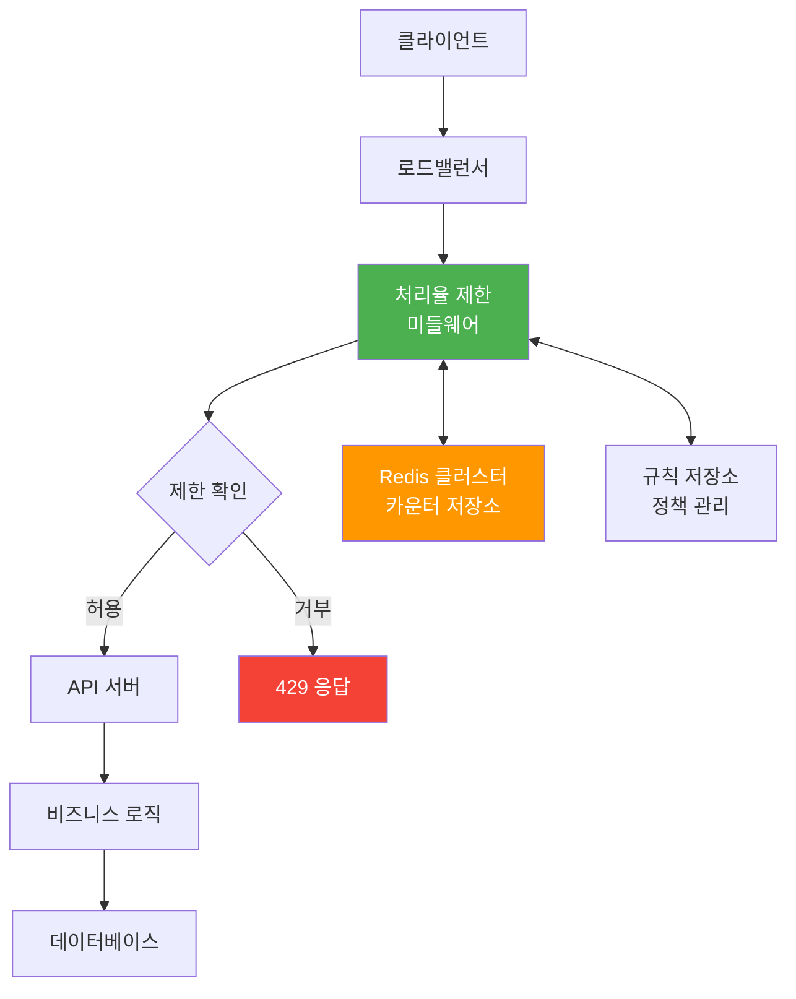

### 핵심 컴포넌트

**처리율 제한 미들웨어**:

- 요청 인터셉트 및 제한 로직 실행
- 다양한 알고리즘 지원
- 설정 가능한 정책 엔진

**Redis 클러스터**:

- 분산 카운터 저장소
- 고성능 메모리 기반 처리
- INCR, EXPIRE 명령어 활용

**규칙 저장소**:

- 처리율 제한 정책 관리
- 실시간 정책 업데이트
- 사용자/API별 차별화된 제한

### 처리율 제한 규칙 정의

**YAML 기반 규칙 예시**:

```yaml
# 메시징 서비스 제한 규칙
domain: messaging
descriptors:
  - key: message_type
    value: marketing
    rate_limit:
      unit: day
      requests_per_unit: 5

---
# 인증 서비스 제한 규칙
domain: auth
descriptors:
  - key: auth_type
    value: login
    rate_limit:
      unit: minute
      requests_per_unit: 5
```

**동적 규칙 관리**:

- 캐시 기반 규칙 조회로 성능 최적화
- Redis를 통한 실시간 정책 업데이트
- 로컬 캐시와 분산 저장소 조합

### HTTP 헤더를 통한 상태 전달

**표준 헤더**:

- `X-RateLimit-Remaining`: 윈도 내 남은 요청 수
- `X-RateLimit-Limit`: 윈도당 허용 요청 수
- `X-RateLimit-Retry-After`: 다음 요청까지 대기 시간(초)

**HTTP 헤더 예시**:

- `X-RateLimit-Remaining`: 윈도 내 남은 요청 수
- `X-RateLimit-Limit`: 윈도당 허용 요청 수
- `X-RateLimit-Retry-After`: 다음 요청까지 대기 시간(초)

## ⚡ 분산 환경에서의 구현 과제

### 1. 경쟁 조건(Race Condition) 문제

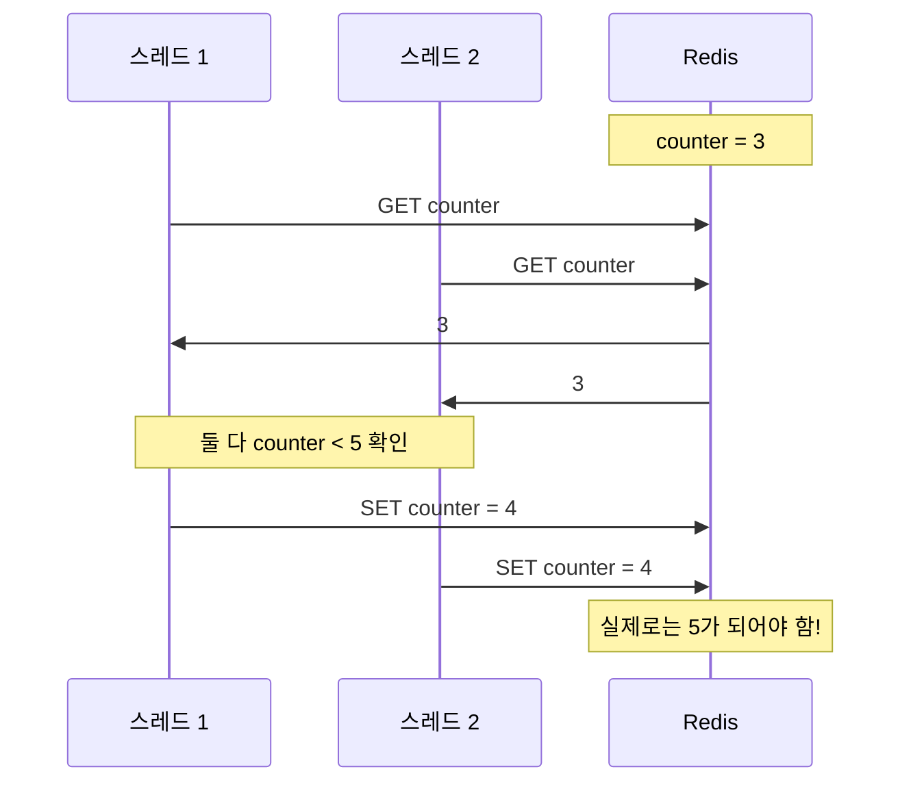

**문제점**:

- 동시 요청 시 카운터 값이 부정확하게 업데이트
- 처리율 제한이 의도한 대로 동작하지 않음

**해결 방안**:

**1) Lua 스크립트 활용**:

```lua
-- Redis Lua 스크립트로 원자적 연산 보장
local key = KEYS[1]
local limit = tonumber(ARGV[1])
local window = tonumber(ARGV[2])
local current_time = tonumber(ARGV[3])

-- 현재 윈도 계산
local current_window = math.floor(current_time / window)
local window_key = key .. ":" .. current_window

-- 현재 카운트 조회
local current_count = redis.call('GET', window_key) or 0
current_count = tonumber(current_count)

if current_count < limit then
    -- 카운터 증가 및 TTL 설정
    redis.call('INCR', window_key)
    redis.call('EXPIRE', window_key, window * 2)
    return {1, current_count + 1, limit - current_count - 1}
else
    return {0, current_count, 0}
end
```

**2) Redis Sorted Set 활용**:

- Lua 스크립트를 통한 원자적 연산 보장
- 만료된 항목 자동 제거
- 정확한 윈도 기반 카운팅

### 2. 동기화(Synchronization) 이슈

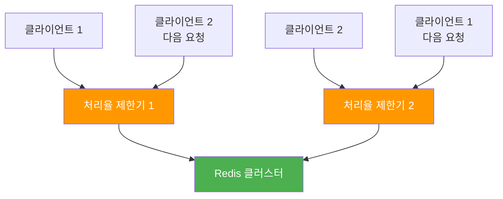

**문제점**:

- 여러 처리율 제한기 인스턴스 간 상태 불일치
- 클라이언트가 다른 인스턴스로 라우팅될 때 제한 우회 가능

**해결 방안**:

**1) 중앙 집중형 저장소**:

- Redis Cluster 또는 분산 캐시 활용
- 모든 인스턴스가 동일한 카운터 공유

**2) 고정 세션(Sticky Session)**:

- 동일 클라이언트를 항상 같은 인스턴스로 라우팅
- 확장성과 유연성 제한으로 권장하지 않음

**3) 분산 합의 알고리즘**:

- Raft, Paxos 등을 활용한 강한 일관성 보장
- 복잡성 증가로 고성능 요구사항에는 부적합

### 성능 최적화 전략

**1) 지리적 분산**:

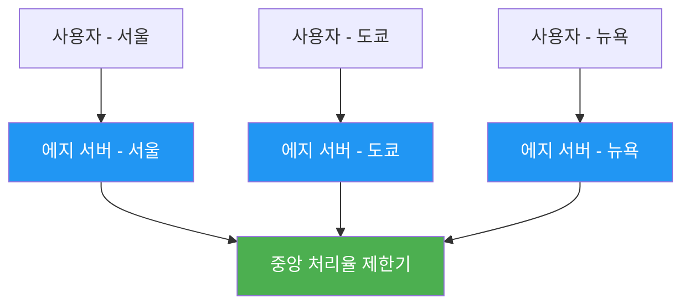

**2) 최종 일관성 모델**:

- 지역별 독립적인 처리율 제한
- 주기적인 동기화로 전역 제한 관리
- 성능과 일관성 사이의 트레이드오프

**최종 일관성 모델**:

- 지역별 독립적인 처리율 제한
- 주기적인 동기화로 전역 제한 관리
- 성능과 일관성 사이의 트레이드오프

## 📊 모니터링 및 운영

### 핵심 메트릭

**성능 메트릭**:

| 메트릭            | 설명                     | 임계값 예시  |
| ----------------- | ------------------------ | ------------ |
| **처리율**        | 초당 처리 요청 수        | > 10,000 QPS |
| **응답 시간**     | 제한 확인 소요 시간      | < 1ms        |
| **거부율**        | 전체 요청 대비 거부 비율 | < 5%         |
| **캐시 히트율**   | 규칙 캐시 적중률         | > 95%        |
| **Redis 연결 수** | 동시 Redis 연결 수       | < 1000개     |

**비즈니스 메트릭**:

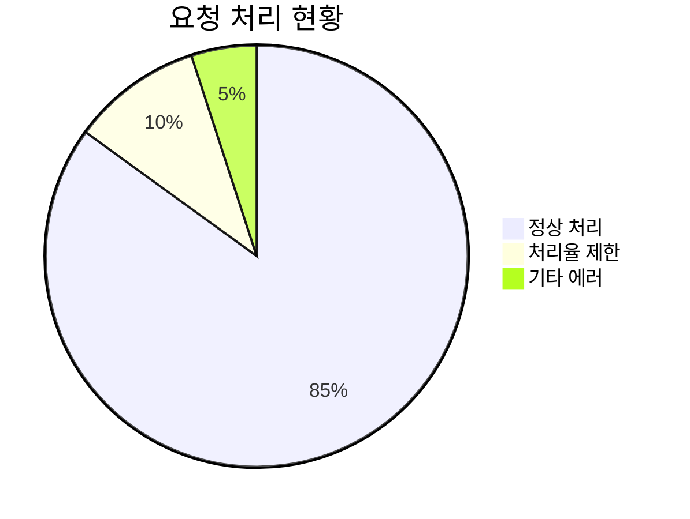

**알림 설정**:

```yaml
alerts:
  - name: high_rejection_rate
    condition: rejection_rate > 0.1
    duration: 5m
    severity: warning

  - name: rate_limiter_down
    condition: rate_limiter_availability < 0.99
    duration: 1m
    severity: critical

  - name: redis_high_latency
    condition: redis_latency > 10ms
    duration: 2m
    severity: warning
```

### 대시보드 구성

**핵심 모니터링 메트릭**:

- 요청 처리 현황 (허용/거부)
- 응답 시간 및 처리율
- 캐시 히트율 및 Redis 성능
- 거부율 및 시스템 가용성

### 장애 대응 시나리오

**장애 대응 전략**:

- **Circuit Breaker 패턴**: 장애 감지 및 자동 복구
- **Fallback 전략**: 허용/거부/로컬 메모리 기반 제한
- **점진적 복구**: 장애 복구 시 단계적 제한 완화

## 💡 실무 적용 인사이트

### 알고리즘 선택 가이드

**사용 사례별 최적 알고리즘**:

| 사용 사례                | 추천 알고리즘    | 이유                               |
| ------------------------ | ---------------- | ---------------------------------- |
| **API 게이트웨이**       | 토큰 버킷        | 버스트 트래픽 허용, 유연한 정책    |
| **결제 시스템**          | 누출 버킷        | 안정적인 처리율, 다운스트림 보호   |
| **로그인 시도 제한**     | 고정 윈도 카운터 | 간단한 구현, 명확한 시간 기반 제한 |
| **실시간 메시징**        | 이동 윈도 로그   | 정확한 제한, 실시간 응답성         |
| **대용량 트래픽 서비스** | 이동 윈도 카운터 | 메모리 효율성, 적절한 정확도       |

### 성능 최적화 패턴

**1) 계층적 제한 구조**:

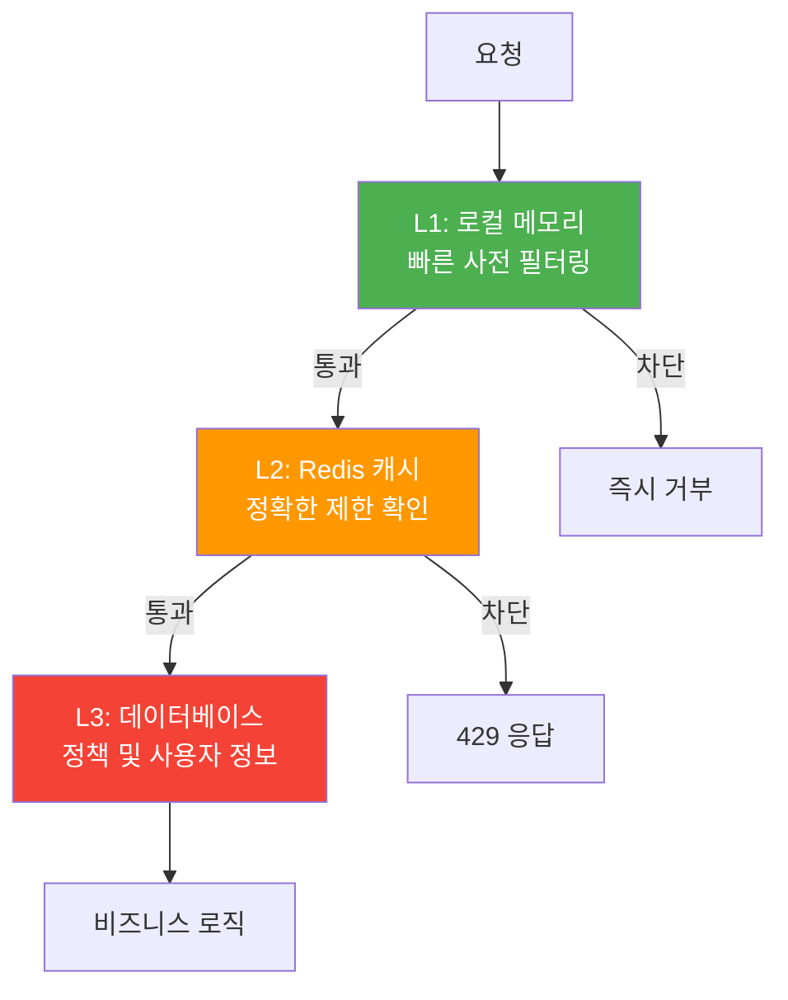

**2) 배치 처리 최적화**:

- 여러 요청을 배치로 처리하여 Redis 호출 최소화
- Lua 스크립트를 통한 원자적 배치 연산
- 네트워크 오버헤드 감소

**3) 캐시 워밍 전략**:

- 자주 사용되는 규칙들을 미리 로드
- 백그라운드에서 주기적 캐시 갱신
- 콜드 스타트 문제 해결

### 비즈니스 로직 통합

**사용자 등급별 차등 제한**:

- Free/Premium/Enterprise 등급별 차등 제한
- 시간당 제한과 버스트 제한 조합
- 비즈니스 모델과 연계된 정책

**지능형 제한 조정**:

- 시스템 부하에 따른 동적 제한 조정
- 높은 부하 시 제한 강화, 낮은 부하 시 완화
- 실시간 시스템 상태 반영

### 보안 고려사항

**다층 보안 제한**:

- **1단계**: IP 기반 제한 (DDoS 방어)
- **2단계**: 사용자 기반 제한 (개별 사용자 제한)
- **3단계**: 글로벌 제한 (전체 시스템 보호)

**악의적 사용자 탐지 및 차단**:

```javascript
class AbuseDetector {
  constructor(redisClient) {
    this.redis = redisClient;
    this.suspiciousPatterns = {
      rapid_requests: { threshold: 100, window: 60 },
      failed_auth: { threshold: 10, window: 300 },
      unusual_endpoints: { threshold: 50, window: 3600 },
    };
  }

  async detectAbuse(userId, requestInfo) {
    // 악의적 패턴 탐지

    for (const [patternName, config] of Object.entries(
      this.suspiciousPatterns
    )) {
      const patternKey = `abuse:${patternName}:${userId}`;

      if (await this.checkPatternViolation(patternKey, config)) {
        // 자동 차단 또는 추가 검증 요구
        await this.applyPenalty(userId, patternName);
        return true;
      }
    }

    return false;
  }

  async applyPenalty(userId, violationType) {
    // 위반 유형에 따른 페널티 적용

    const penalties = {
      rapid_requests: { duration: 3600, limitReduction: 0.1 },
      failed_auth: { duration: 1800, limitReduction: 0.05 },
      unusual_endpoints: { duration: 7200, limitReduction: 0.2 },
    };

    const penalty = penalties[violationType];
    if (penalty) {
      const penaltyKey = `penalty:${userId}`;
      await this.redis.setex(
        penaltyKey,
        penalty.duration,
        penalty.limitReduction
      );
    }
  }
}
```

## 🤔 토론 주제

### 기술적 관점

1. **알고리즘 선택**: 게임 서비스에서 실시간 매칭 요청에 가장 적합한 처리율 제한 알고리즘은?
2. **분산 일관성**: CAP 정리 관점에서 처리율 제한 시스템의 일관성과 가용성 트레이드오프는?
3. **성능 최적화**: Redis 클러스터 vs 로컬 메모리 캐시의 성능 차이와 선택 기준은?
4. **확장성**: 사용자 수가 10배 증가할 때 처리율 제한 시스템의 확장 전략은?

### 비즈니스 관점

1. **사용자 경험**: 처리율 제한으로 인한 사용자 불편과 시스템 보호 사이의 균형점은?
2. **수익 모델**: 처리율 제한을 활용한 차등 서비스 제공 전략은?
3. **경쟁 우위**: 경쟁사 대비 더 나은 처리율 제한 정책을 어떻게 설계할 것인가?
4. **글로벌 서비스**: 지역별 네트워크 특성을 고려한 처리율 제한 정책은?

### 운영 관점

1. **모니터링**: 처리율 제한 시스템의 건강성을 나타내는 핵심 지표는?
2. **장애 대응**: Redis 장애 시 서비스 연속성을 보장하는 최적의 전략은?
3. **정책 관리**: 실시간으로 처리율 제한 정책을 변경할 때의 위험 요소는?
4. **비용 최적화**: 클라우드 환경에서 처리율 제한 시스템의 비용 효율성은?

### 보안 관점

1. **DDoS 방어**: 처리율 제한만으로 충분한 DDoS 방어가 가능한가?
2. **우회 공격**: 처리율 제한을 우회하려는 공격에 대한 대응 방안은?
3. **프라이버시**: 사용자 행동 패턴 분석과 개인정보 보호 사이의 균형은?
4. **규제 준수**: GDPR 등 데이터 보호 규정 하에서의 처리율 제한 로그 관리는?

## 📚 추가 학습 자료

### 관련 기술 및 도구

**오픈소스 솔루션**:

- **Envoy Proxy**: 고성능 L7 프록시의 처리율 제한 기능
- **Kong**: API 게이트웨이의 처리율 제한 플러그인
- **Istio**: 서비스 메시 환경에서의 트래픽 관리
- **Nginx**: rate limiting 모듈을 활용한 웹 서버 레벨 제한

**클라우드 서비스**:

- **AWS API Gateway**: 관리형 API 게이트웨이의 throttling 기능
- **Google Cloud Endpoints**: API 관리 및 처리율 제한
- **Azure API Management**: 엔터프라이즈급 API 관리 솔루션
- **Cloudflare**: CDN 레벨에서의 DDoS 보호 및 처리율 제한

### 심화 학습 주제

**고급 알고리즘**:

- **Hierarchical Token Bucket**: 계층적 토큰 버킷 구조
- **Adaptive Rate Limiting**: 머신러닝 기반 동적 제한 조정
- **Distributed Rate Limiting**: 분산 환경에서의 정확한 제한 구현
- **Circuit Breaker Pattern**: 장애 전파 방지를 위한 회로 차단기 패턴

**성능 최적화**:

- **Memory Pool**: 메모리 할당 최적화를 통한 성능 향상
- **Lock-Free Programming**: 무잠금 프로그래밍을 통한 동시성 개선
- **SIMD Instructions**: 벡터 연산을 활용한 배치 처리 최적화
- **Kernel Bypass**: 사용자 공간에서의 고성능 네트워킹

### 실습 프로젝트

1. **미니 API 게이트웨이**: 다양한 처리율 제한 알고리즘을 지원하는 간단한 게이트웨이 구현
2. **Redis 기반 분산 제한기**: Redis를 활용한 분산 환경 처리율 제한 시스템
3. **성능 벤치마크**: 각 알고리즘의 성능 특성 비교 및 분석
4. **모니터링 대시보드**: Grafana를 활용한 처리율 제한 메트릭 시각화

### 참고 문헌 및 논문

**핵심 논문**:

- "Token Bucket Algorithm" - Network Traffic Shaping
- "Leaky Bucket Algorithm" - ATM Networks and Traffic Control
- "Sliding Window Algorithms" - Real-time Systems and Rate Limiting
- "Distributed Rate Limiting" - Large-scale System Design

**기업 기술 블로그**:

- Stripe: "Scaling your API with rate limiters"
- Cloudflare: "How we built rate limiting capable of scaling to millions of domains"
- Lyft: "Ratelimit service design and implementation"
- Netflix: "Zuul 2 and rate limiting at scale"

## 🎯 핵심 메시지

> "처리율 제한 장치는 단순한 트래픽 제어를 넘어서, 시스템의 안정성과 공정성을 보장하는 핵심 인프라이다."

이 장에서 배운 핵심 원칙들:

1. **알고리즘 선택의 중요성**: 사용 사례에 맞는 적절한 알고리즘 선택이 성능과 정확성을 결정
2. **분산 환경의 복잡성**: 경쟁 조건과 동기화 문제를 해결하는 것이 실제 구현의 핵심
3. **성능과 정확성의 트레이드오프**: 완벽한 정확성보다는 실용적인 근사치가 더 효과적일 수 있음
4. **계층적 설계**: 다층 방어를 통한 robust한 시스템 구축
5. **모니터링의 필수성**: 실시간 메트릭을 통한 지속적인 최적화와 장애 대응

처리율 제한 장치는 현대 분산 시스템에서 필수적인 컴포넌트로, 올바른 설계와 구현을 통해 시스템의 안정성과 사용자 경험을 크게 향상시킬 수 있습니다.
