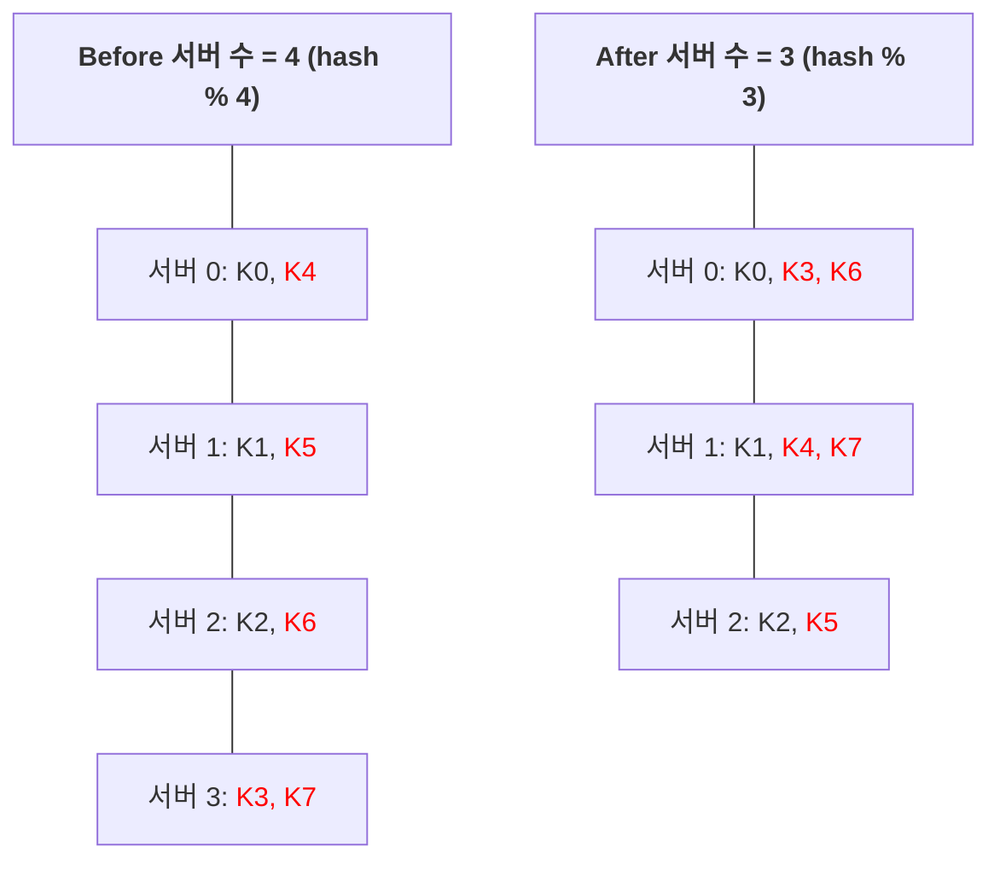
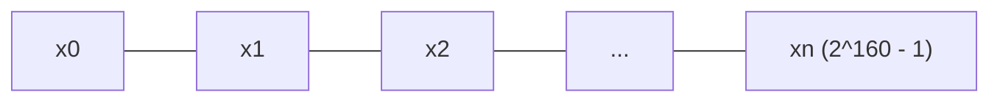
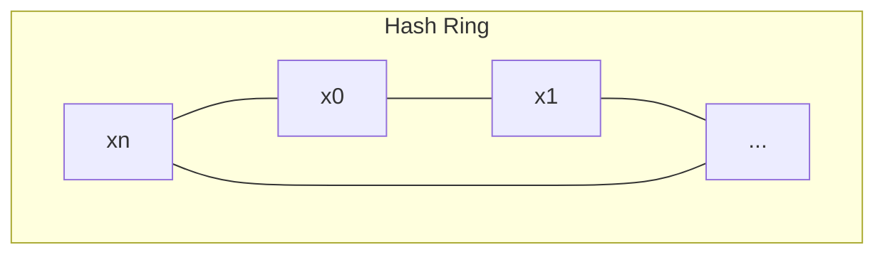
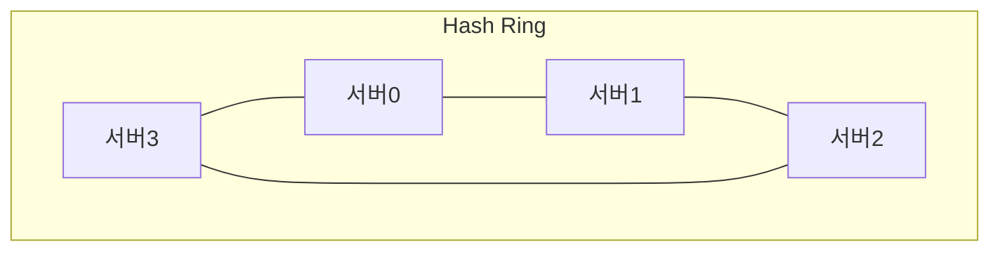
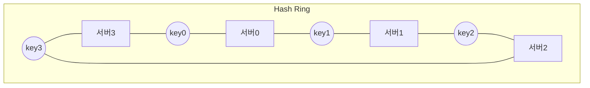
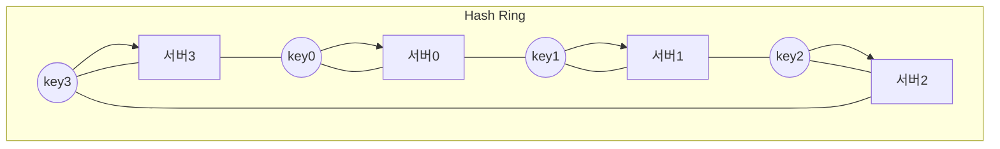
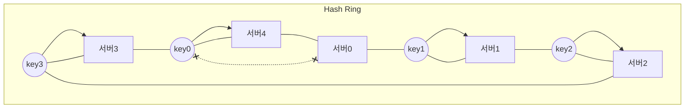
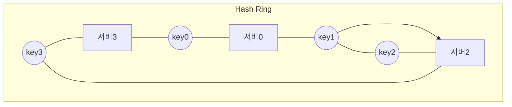
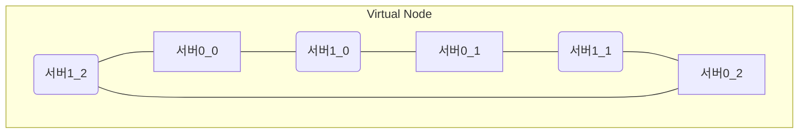

**수평적 규모 확장성**을 달성하기 위해서는 요청 또는 데이터를 **균등**하게 나누는 것이 중요하다.   
안정 해시는 이 목표를 달성하기 위해 보편적으로 사용하는 기술이다.

## 해시 키 재배치(rehash) 문제
서버들에 부하를 균등하게 나누는 보편적 방법은 아래의 해시 함수를 사용하는 것이다.

`serverIndex = hash(key) % N (N은 서버의 개수)`



변화된 키 분포를 보면, 장애가 발생한 3번 서버에 보관되어 있는 키 뿐만 아닌 대부분의 키가 재분배되었다.   
하나의 서버가 죽으면 대부분 캐시 클라이언트가 데이터가 없는 엉뚱한 서버에 접속하게 된다는 뜻이다.

그 결과로 대규모 cache miss가 발생하게 될 것이다.

안정 해시는 이 문제를 효과적으로 해결하는 기술이다.

## 안정 해시 (consistent hash)
안정 해시는 해시 테이블 크기가 조정될 때 평균적으로 오직 `k(key의 개수)/n(slot의 개수)`개의 키만 재배치하는 해시 기술이다.
> 이와 달리, 대부분의 전통적 해시 테이블은 슬롯의 수가 바뀌면 거의 대부분 키를 재배치한다.

### 해시 공간과 해시 링
안정 해시의 정의를 알아보았으니, 그 동작 원리를 살펴보자.

해시 함수 f로는 SHA-1을 사용한다고 하고, 그 함수의 출력 값 범위는 x0~xn과 같다고 하자.   
SHA-1의 해시 공간 범위는 0부터 2^160 - 1까지라고 알려져 있다.


이 해시 공간의 양쪽을 구부려 접으면 해시 링이 만들어진다.


### 해시 서버
이 시 함수 f를 사용하면 서버 IP나 이름을 이 링 위에 대응시킬 수 있다.


### 해시 키
캐시할 키 또한 해시 링 위의 어느 지점에 배치할 수 있다.


### 서버 조회
어떤 키가 저장되는 서버는, 해당 키의 위치로부터 시계 방향으로 링을 탐색해 나가면서 만나는 첫 번째 서버다.


### 서버 추가
서버를 추가하더라도 키 가운데 일부만 재배치하면 된다.

서버4가 추가된 뒤에 key0는 서버 4에 저장된다.   
key0의 위치에서 시계 방향으로 순회했을 때 처음으로 만나게 되는 서버는 서버4이기 때문이다.

### 서버 제거
하나의 서버가 제거되면 키 가운데 일부만 재배치된다.

서버1이 삭제되었을 때 key1만이 서버2로 재배치되었다.

### 기본 구현법의 두 가지 문제
안정 해시 알고리즘의 절차는 아뢔와 같다.
* 서버와 키를 균등 분포 해시 함수를 사용해 해시 링에 배치한다.
* 키의 위치에서 링을 시계 방향으로 탐색하다 만나는 최초의 서버가 키가 저장될 서버다.

이 접근법에는 두 가지 문제가 있다.

1. 서버가 추가되거나 삭제되는 상황을 감안하면 partition의 크기를 균등하게 유지하는 게 불가능하다.
   ```mermaid
   flowchart TB
    subgraph Hash Ring
        direction LR
        xn --- x0
        x0 <--> x2
        x0["서버0"] --- x1["X"]
        x1 --- x2["서버2"]
        x2 --- xn["서버3"]
    end
   ```
   * 만약 서버1이 삭제된다면 서버0~서버2 까지가 다른 partition 대비 거의 두 배로 커지게 된다. 
   * partition: 인접한 서버 사이의 해시 공간
2. 키의 균등 분포를 달성하기 어렵다.
   ```mermaid
   flowchart TB
    subgraph Hash Ring
        direction LR
        s3["서버3"] --- k3((key3)) --- k0((key0))
        k0((key0)) --- s0["서버0"] --- s1["서버1"]
        s1 --- k1((key1)) --- k2((key2))
        k2((key2)) --- s2["서버2"] --- s3
    end
   ```
   * 키가 서버1~서버2, 서버3~서버0 에 분포되어 있다면, 서버0과 서버3은 아무 데이터도 갖지 않을 것이다.

이 문제를 해결하기 위해 제안된 기법이 가상노드(virtual node) 또는 복제(replica) 기법이다.

### 가상 노드 (virtual node)
가상 노드는 실제 노드 또는 서버를 가리키는 노드로서, 하나의 서버는 링 위에 여러 개의 가상 노드를 가질 수 있다.

* 서버0: 서버0_0, 서버0_1, 서버0_2
* 서버1: 서버1_0, 서버1_1, 서버1_2


가상 노드의 개수를 늘리면 키의 분포는 점점 더 균등해진다.   
표준 편자가 작아져서 데이터가 고르게 분포되기 때문이다.

### 재배치할 키 결정
서버가 추가되거나 제거되면 데이터 일부는 재배치해야 한다.

## 마치며
안정 해시가 왜 필요하며, 어떻게 동작하는지를 자세히 살펴보았다.

안정 해시의 이점은 아래와 같다.
* 서버가 추가되거나 삭제될 때 재배치되는 키의 수가 최소화된다.
* 데이터가 보다 균등하게 분포하게 되므로 수평적 규모 확장성을 달성하기 쉽다.
* 데이터를 균등하게 분배하므로 핫스팟 키 문제를 줄인다.
  * 유명인의 데이터가 특정 샤드에 대한 접근이 지나치게 빈번하면 서버 과부하 문제가 생길 수 있다.
