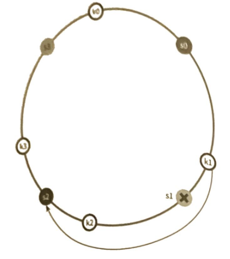

> 발표자: 길현준

---

# [가면사배 시리즈 #5] 안정 해시 설계

## 📖 책 소개

**제목**: 가상 면접 사례로 배우는 대규모 시스템 설계 기초  
**5장**: 안정 해시 설계  
**핵심 주제**: 수평적 확장성을 위한 안정 해시(Consistent Hashing) 알고리즘과 실제 적용 사례

## 🎯 학습 목표

- 해시 키 재배치(Rehash) 문제의 본질과 영향 이해
- 안정 해시(Consistent Hashing)의 동작 원리와 장점 학습
- 해시 링(Hash Ring) 구조와 서버 배치 방법 습득
- 가상 노드(Virtual Node) 기법을 통한 데이터 균등 분포 구현
- 실제 분산 시스템에서의 안정 해시 적용 사례 분석
- 확장성과 가용성을 고려한 시스템 설계 역량 향상

## 🔄 해시 키 재배치 문제

### 전통적인 해시 방식의 한계

분산 시스템에서 데이터를 여러 서버에 균등하게 분산하기 위해 일반적으로 사용하는 방법은 다음과 같습니다:

```
serverIndex = hash(key) % N  (N = 서버의 개수)
```

### 문제 상황 시뮬레이션

**초기 상태 (4대 서버)**:

| 키   | 해시값   | 서버 인덱스 (% 4) | 배치 서버 |
| ---- | -------- | ----------------- | --------- |
| key0 | 18358617 | 1                 | 서버 B    |
| key1 | 26143584 | 0                 | 서버 A    |
| key2 | 18131146 | 2                 | 서버 C    |
| key3 | 35863496 | 0                 | 서버 A    |
| key4 | 77581703 | 3                 | 서버 D    |
| key5 | 38164978 | 2                 | 서버 C    |
| key6 | 22530351 | 3                 | 서버 D    |


**서버 B 장애 발생 후 (3대 서버: A, C, D 사용)**:

| 키   | 해시값   | 서버 인덱스 (% 3) | 새 배치 서버 | 기존 서버 | 변경 여부 |
| ---- | -------- | ----------------- | ------------ | --------- | --------- |
| key0 | 18358617 | 1                 | 서버 C       | 서버 B    | ❌ 변경   |
| key1 | 26143584 | 0                 | 서버 A       | 서버 A    | ✅ 유지   |
| key2 | 18131146 | 2                 | 서버 D       | 서버 C    | ❌ 변경   |
| key3 | 35863496 | 0                 | 서버 A       | 서버 A    | ✅ 유지   |
| key4 | 77581703 | 1                 | 서버 C       | 서버 D    | ❌ 변경   |
| key5 | 38164978 | 2                 | 서버 D       | 서버 C    | ❌ 변경   |
| key6 | 22530351 | 0                 | 서버 A       | 서버 D    | ❌ 변경   |


### 문제점 분석

**대규모 캐시 미스(Cache Miss) 발생**:

- 서버 1대 장애로 인해 **대부분의 키가 재배치**
- 기존 캐시된 데이터를 찾을 수 없어 원본 데이터베이스로 요청 집중
- 시스템 전체 성능 급격한 저하

**재배치 비율 계산**:

```
재배치된 키 수 / 전체 키 수 = 5개 / 7개 ≈ 71%
```

이는 단순히 장애 서버의 데이터(1개, 14%)만 재배치되는 것이 아니라, **전체 시스템의 71%가 영향**을 받는다는 의미입니다. 중간 서버 1개의 장애가 전체 시스템에 미치는 파급효과가 매우 크다는 것을 보여줍니다.

## 🔗 안정 해시(Consistent Hashing)

### 정의와 핵심 개념

**위키피디아 정의**:

> "안정 해시(Consistent Hash): 해시 테이블 크기가 조정될 때 평균적으로 오직 k/n개의 키만 재배치하는 해시 기술이다. 여기서 k는 키의 개수이고, n은 슬롯의 개수다."

**핵심 특징**:

- 서버 추가/제거 시 **최소한의 키만 재배치**
- 전체 시스템에 미치는 영향 최소화
- 수평적 확장성 지원

### 해시 공간과 해시 링

안정 해시는 **해시 링(Hash Ring)** 구조를 사용합니다.


**해시 공간 특성**:

- **범위**: 0부터 2^160-1 (SHA-1은 160비트 해시 함수)
- **구조**: 원형 링 형태로 연결
- **분포**: 균등한 해시 함수 사용
- **크기**: 약 1.46 × 10^48개의 가능한 해시값

### 서버와 키의 배치


> **📝 참고**: 위 다이어그램은 Mermaid의 한계로 인해 반시계방향으로 표시되지만, 실제 안정 해시에서는 **시계방향**으로 탐색합니다. 각 키는 자신의 위치에서 시계방향으로 돌면서 만나는 첫 번째 서버에 저장됩니다.

**배치 규칙**:

1. **서버 배치**: 서버 IP나 이름을 해시하여 링 위에 배치
2. **키 배치**: 데이터 키를 해시하여 링 위에 배치
3. **서버 결정**: 키 위치에서 시계방향으로 만나는 첫 번째 서버에 저장

### 키 조회 과정


**조회 알고리즘**:

```javascript
function findServer(key, servers) {
  /**
   * 키에 해당하는 서버를 찾는 함수
   */
  // 1. 키의 해시값 계산
  const keyHash = hash(key);

  // 2. 해시 링에서 시계방향으로 탐색
  const sortedServers = servers.sort((a, b) => hash(a.name) - hash(b.name));

  for (const server of sortedServers) {
    if (hash(server.name) >= keyHash) {
      return server;
    }
  }

  // 3. 링의 끝에 도달하면 첫 번째 서버 반환
  return servers[0];
}
```

## ⚙️ 서버 추가와 제거

### 서버 추가 시나리오


**영향 분석**:

- **재배치된 키**: key0만 서버 0에서 서버 4로 이동
- **재배치 비율**: 1개/4개 = 25% (이론적 최적값)
- **나머지 키**: 기존 서버에 그대로 유지

### 서버 제거 시나리오


**영향 분석**:

- **재배치된 키**: key1만 서버 1에서 서버 2로 이동
- **재배치 비율**: 1개/4개 = 25%
- **나머지 키**: 영향 없음

## 🎭 가상 노드(Virtual Node)

### 기본 구현법의 문제점

**파티션 크기 불균등**:


**데이터 분포 불균등**:

- 특정 서버에 데이터 집중
- 일부 서버는 유휴 상태
- 전체 시스템 효율성 저하

### 가상 노드 해결책

**가상 노드 개념**:

- 하나의 물리 서버가 **여러 개의 가상 노드**를 가짐
- 각 가상 노드는 링 위의 서로 다른 위치에 배치
- 더 균등한 데이터 분포 달성


### 가상 노드 개수 최적화

**성능 vs 메모리 트레이드오프**:

| 가상 노드 수 | 표준편차 | 메모리 사용량 | 권장 사용 |
| ------------ | -------- | ------------- | --------- |
| 50개         | 10%      | 낮음          | 소규모    |
| 100개        | 7%       | 보통          | 중간규모  |
| 150개        | 5%       | 높음          | 대규모    |
| 200개        | 4%       | 매우 높음     | 초대규모  |

**최적화 가이드라인**:

- **일반적 권장**: 100-200개 가상 노드
- **표준편차 목표**: 평균의 5% 이내
- **메모리 고려**: 시스템 리소스와 균형
- **동적 조정**: 시스템 요구사항에 따라 조정

## 🔄 재배치 키 결정

### 서버 추가 시 재배치 범위


**재배치 원리**:

- 새 서버의 반시계방향 이전 서버부터 새 서버까지의 키들만 재배치
- 나머지 키들은 기존 서버에 그대로 유지
- 전체 키의 1/n (n=서버 수) 비율만 영향받음

### 서버 제거 시 재배치 범위



## 🏢 실제 적용 사례

### Amazon DynamoDB

**안정 해시 활용**:

- **파티셔닝**: 데이터를 여러 노드에 균등 분산
- **복제**: 데이터 가용성을 위한 다중 복제본 관리
- **확장성**: 노드 추가/제거 시 최소한의 데이터 이동

**핵심 특징**:

- **자동 확장**: 트래픽 증가 시 자동 파티션 분할
- **고가용성**: 여러 가용 영역에 복제본 분산
- **일관성**: 최종 일관성 모델 지원

### Apache Cassandra

**클러스터 관리**:

- **토큰 링**: 각 노드가 토큰 범위 담당
- **복제 전략**: 설정 가능한 복제 팩터
- **장애 복구**: 노드 장애 시 자동 복구

**핵심 구현 원리**:

- 각 노드가 토큰 범위를 담당하여 데이터 분산
- 복제 팩터에 따라 다음 N개 노드에 복제본 저장
- 노드 장애 시 복제본을 통한 자동 복구

### Discord 채팅 시스템

**실시간 메시징**:

- **채널 분산**: 채팅 채널을 여러 서버에 분산
- **사용자 라우팅**: 사용자를 적절한 서버로 라우팅
- **확장성**: 동시 사용자 500만 명 지원

### Akamai CDN

**콘텐츠 분산**:

- **엣지 서버**: 전 세계 엣지 서버에 콘텐츠 분산
- **캐시 무효화**: 콘텐츠 업데이트 시 효율적 무효화
- **부하 분산**: 지리적 위치 기반 트래픽 분산

### Google Maglev 로드밸런서

**네트워크 부하 분산**:

- **연결 일관성**: 동일 클라이언트는 동일 백엔드로 라우팅
- **장애 복구**: 백엔드 서버 장애 시 최소한의 연결 재배치
- **고성능**: 하드웨어 가속을 통한 고속 처리

## 🤔 토론 주제

### 기술적 관점

1. **가상 노드 최적화**: 시스템 규모에 따른 가상 노드 수의 최적값은 어떻게 결정해야 할까?
2. **해시 함수 선택**: SHA-1, MD5, CRC32 등 다양한 해시 함수 중 어떤 것을 선택해야 할까?
3. **복제 전략**: 안정 해시와 데이터 복제를 함께 사용할 때 고려해야 할 점은?
4. **핫스팟 문제**: 특정 키에 트래픽이 집중될 때 안정 해시만으로 해결 가능할까?

### 실무 적용 관점

1. **마이그레이션 전략**: 기존 시스템에서 안정 해시로 전환할 때의 단계적 접근법은?
2. **모니터링**: 안정 해시 시스템의 건강성을 확인하기 위한 핵심 메트릭은?
3. **비용 효율성**: 안정 해시 도입으로 인한 복잡성 증가 vs 운영 비용 절감의 균형점은?
4. **장애 복구**: 대규모 장애 시 데이터 일관성을 보장하면서 빠른 복구를 위한 전략은?

### 아키텍처 설계 관점

1. **하이브리드 접근**: 안정 해시와 다른 분산 기법(샤딩, 파티셔닝)의 조합 전략은?
2. **글로벌 확장**: 다중 리전 환경에서 안정 해시를 적용할 때의 고려사항은?
3. **실시간 vs 배치**: 실시간 시스템과 배치 처리 시스템에서의 안정 해시 적용 차이점은?
4. **마이크로서비스**: 마이크로서비스 아키텍처에서 서비스 간 데이터 분산 전략은?

## 📚 추가 학습 자료

### 핵심 논문 및 자료

**필수 논문**:

- "Consistent Hashing and Random Trees" - David Karger et al. (1997)
- "Dynamo: Amazon's Highly Available Key-value Store" - DeCandia et al. (2007)
- "Cassandra - A Decentralized Structured Storage System" - Lakshman & Malik (2010)

**실무 가이드**:

- Netflix Tech Blog: "Consistent Hashing in Practice"
- Discord Engineering: "How Discord Scaled Elixir to 5,000,000 Concurrent Users"
- Akamai Technical Publications: "Consistent Hashing for CDN"

## 🎯 핵심 메시지

> "안정 해시는 단순한 기술이 아니라, 분산 시스템의 확장성과 가용성을 보장하는 핵심 아키텍처 패턴이다."

이 장에서 배운 핵심 원칙들:

1. **최소 재배치**: 서버 변경 시 최소한의 데이터만 이동하여 시스템 안정성 확보
2. **균등 분산**: 가상 노드를 통한 데이터의 균등한 분포로 핫스팟 방지
3. **확장성**: 수평적 확장 시 선형적 성능 향상 달성
4. **장애 내성**: 개별 노드 장애가 전체 시스템에 미치는 영향 최소화
5. **실용성**: 이론적 완벽함보다는 실제 운영 환경에서의 효율성 추구

안정 해시는 현대 분산 시스템의 필수 요소로, **Amazon DynamoDB**, **Apache Cassandra**, **Discord** 등 수많은 대규모 서비스에서 검증된 기술입니다. 단순한 알고리즘이지만 그 영향력은 전체 시스템 아키텍처를 좌우할 만큼 중요합니다.

**실무 적용 시 기억할 점**:

- 시스템 요구사항에 맞는 가상 노드 수 선택
- 데이터 특성을 고려한 해시 함수 선택
- 장애 시나리오에 대한 충분한 테스트
- 점진적 도입을 통한 리스크 최소화

분산 시스템을 설계할 때 안정 해시를 고려한다면, 더 안정적이고 확장 가능한 시스템을 구축할 수 있을 것입니다.
