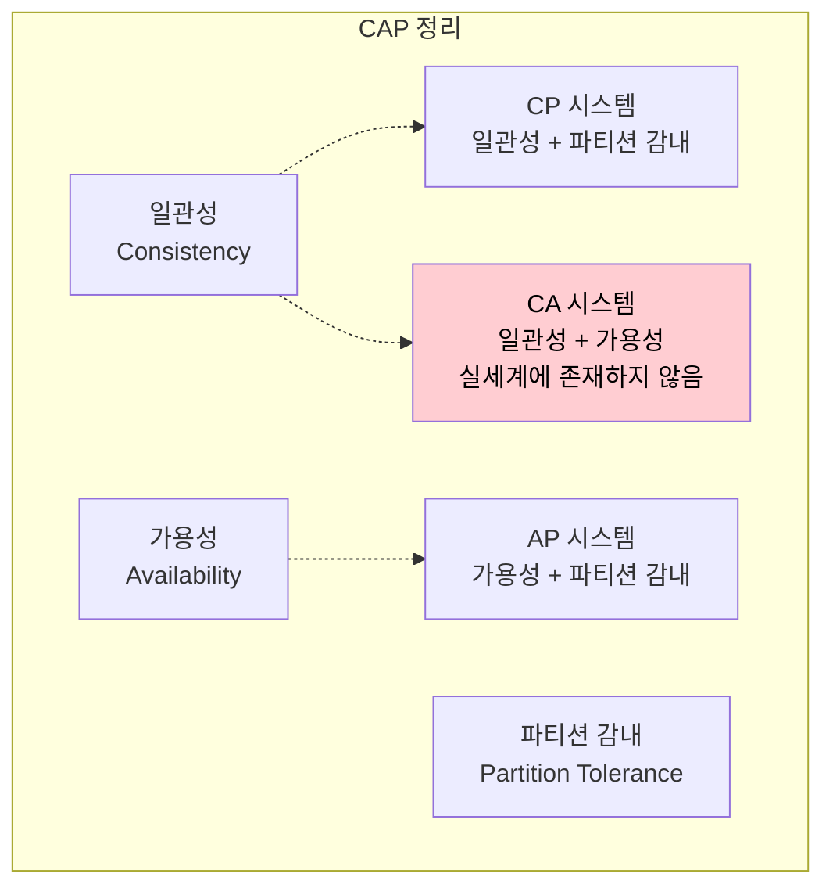
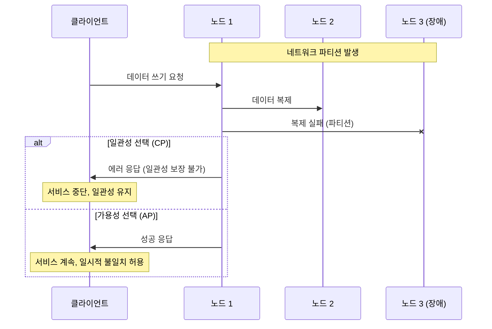
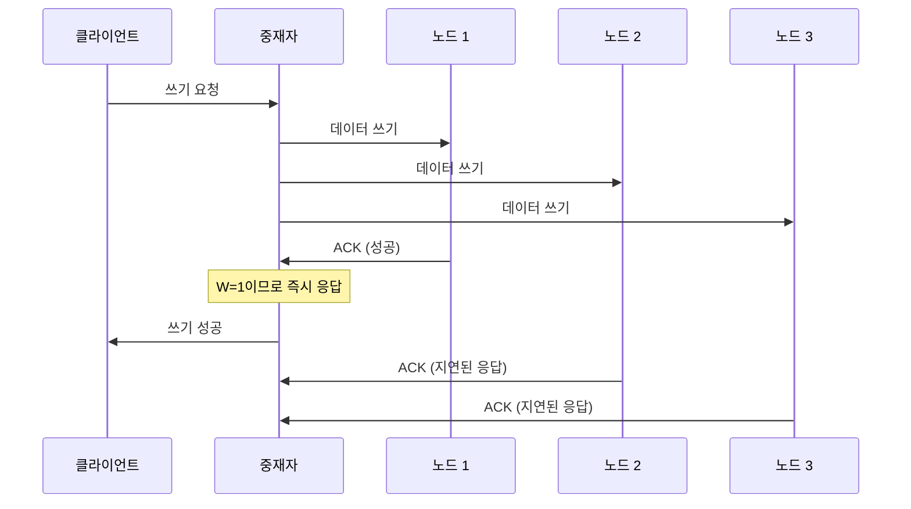
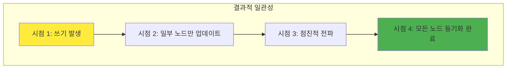
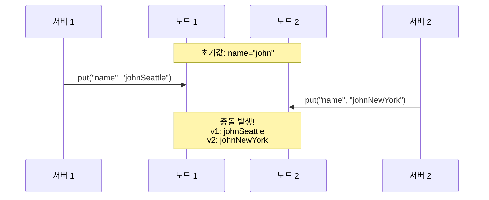
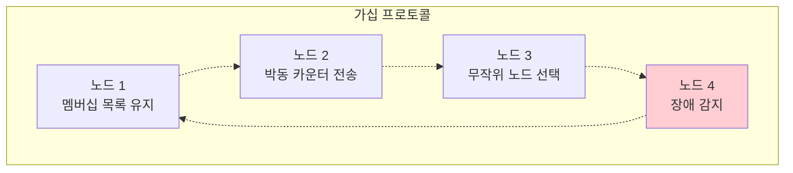
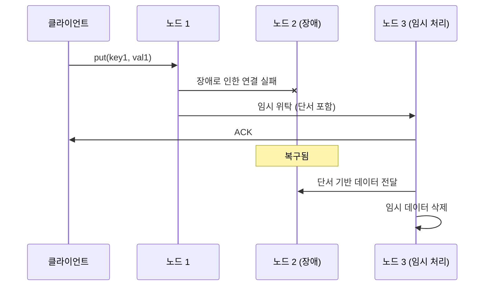
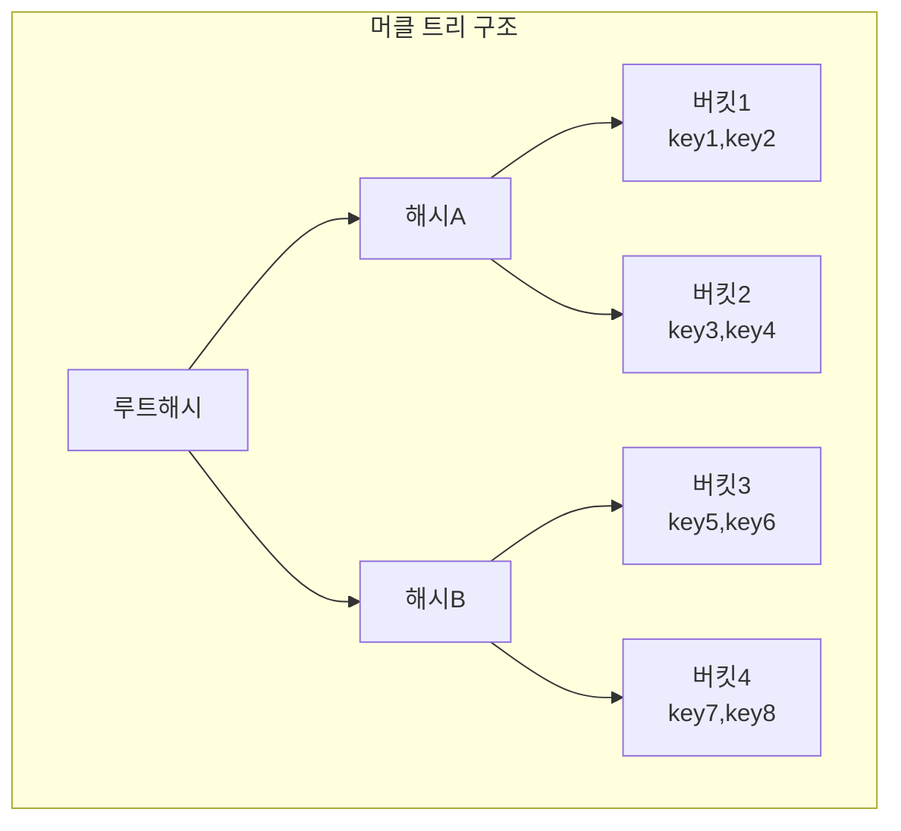
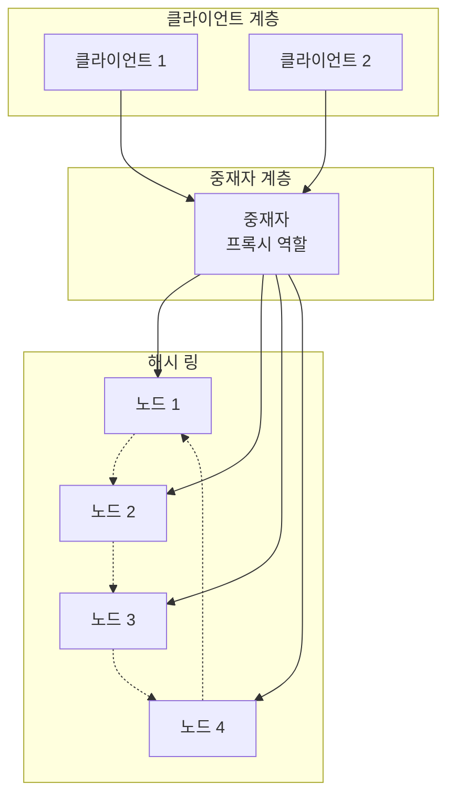

# [가면사배 시리즈 #6] 키-값 저장소 설계

## 📖 책 소개

**제목**: 가상 면접 사례로 배우는 대규모 시스템 설계 기초  
**6장**: 키-값 저장소 설계  
**핵심 주제**: 분산 키-값 저장소의 설계 원리와 CAP 정리, 일관성 모델, 장애 처리 메커니즘

## 🎯 학습 목표

- 키-값 저장소의 기본 개념과 분산 환경에서의 특징 이해
- CAP 정리와 분산 시스템의 근본적 트레이드오프 학습
- 정족수 합의 프로토콜과 다양한 일관성 모델 분석
- 데이터 버저닝과 벡터 시계를 통한 충돌 해소 방법 습득
- 장애 감지 및 처리 메커니즘 (가십 프로토콜, 머클 트리) 이해
- 실제 대규모 분산 저장소 시스템의 설계 원리 파악

## 🔑 키-값 저장소 기본 개념

### 정의와 특징

**키-값 저장소(Key-Value Store)**는 키-값 데이터베이스라고도 불리는 비관계형(non-relational) 데이터베이스입니다.

**기본 구조**:

- **키(Key)**: 고유 식별자, 짧을수록 성능상 유리
- **값(Value)**: 문자열, 리스트, 객체 등 다양한 형태 가능
- **키-값 쌍**: 키와 값 사이의 연결 관계

**키의 예시**:

```
일반 텍스트 키: "last_logged_in_at"
해시 키: 253DDEC4
```

**대표적인 키-값 저장소**:

- **Amazon DynamoDB**: AWS의 완전 관리형 NoSQL 데이터베이스
- **Redis**: 메모리 기반 고성능 데이터 구조 저장소
- **Memcached**: 분산 메모리 캐싱 시스템

### 단일 서버의 한계

한 대 서버만 사용하는 키-값 저장소의 간단한 접근법:

- 키-값 쌍 전부를 메모리에 해시 테이블로 저장
- 빠른 속도 보장하지만 메모리 용량 제한

**개선 방안**:

- 데이터 압축(Data Compression)
- 자주 쓰이는 데이터만 메모리에 두고 나머지는 디스크에 저장

**근본적 한계**:

- 메모리 용량 제한
- 단일 장애점(SPOF)
- 확장성 부족

## 🔺 CAP 정리 (CAP Theorem)

### 정의와 세 가지 요구사항

CAP 정리는 **데이터 일관성(Consistency)**, **가용성(Availability)**, **파티션 감내(Partition Tolerance)** 세 가지 요구사항을 동시에 만족하는 분산 시스템을 설계하는 것은 불가능하다는 정리입니다.



### 각 요구사항의 의미

**1. 데이터 일관성(Consistency)**

- 분산 시스템에 접속하는 모든 클라이언트는 어떤 노드에 접속했느냐에 관계없이 언제나 같은 데이터를 보게 되어야 함
- 모든 노드가 동일한 시점에 동일한 데이터를 가져야 함

**2. 가용성(Availability)**

- 분산 시스템에 접속하는 클라이언트는 일부 노드에 장애가 발생하더라도 항상 응답을 받을 수 있어야 함
- 시스템이 지속적으로 서비스를 제공해야 함

**3. 파티션 감내(Partition Tolerance)**

- 파티션은 두 노드 사이에 통신 장애가 발생하였음을 의미
- 네트워크에 파티션이 생기더라도 시스템은 계속 동작하여야 함

### 시스템 분류

**CP 시스템 (일관성 + 파티션 감내)**:

- 일관성과 파티션 감내를 지원하는 키-값 저장소
- 가용성을 희생함
- 예: 은행 시스템, 금융 거래 시스템

**AP 시스템 (가용성 + 파티션 감내)**:

- 가용성과 파티션 감내를 지원하는 키-값 저장소
- 일관성을 희생함
- 예: 소셜 미디어, 콘텐츠 배포 시스템

**CA 시스템 (일관성 + 가용성)**:

- 파티션 감내를 지원하지 않음
- **실세계에 CA 시스템은 존재하지 않음** (네트워크 장애는 피할 수 없기 때문)

### 실세계 시나리오

**파티션 발생 시 선택**:



## ⚖️ 정족수 합의 (Quorum Consensus)

### 기본 개념

정족수 합의 프로토콜을 사용하면 읽기/쓰기 연산 모두에 일관성을 보장할 수 있습니다.

**핵심 변수**:

- **N**: 사본 개수
- **W**: 쓰기 연산에 대한 정족수 (쓰기 성공으로 간주되려면 최소 W개 서버로부터 성공 응답 필요)
- **R**: 읽기 연산에 대한 정족수 (읽기 성공으로 간주되려면 최소 R개 서버로부터 응답 필요)

### 정족수 설정 전략

| 설정         | 특징                               | 사용 사례              |
| ------------ | ---------------------------------- | ---------------------- |
| **R=1, W=N** | 빠른 읽기 연산에 최적화            | 읽기 중심 워크로드     |
| **W=1, R=N** | 빠른 쓰기 연산에 최적화            | 쓰기 중심 워크로드     |
| **W+R>N**    | 강한 일관성 보장 (보통 N=3, W=R=2) | 일관성이 중요한 시스템 |
| **W+R≤N**    | 강한 일관성 보장되지 않음          | 성능 우선 시스템       |

### 정족수 동작 예시

**N=3, W=1인 경우**:



## 🔄 일관성 모델 (Consistency Models)

### 강한 일관성 (Strong Consistency)

**특징**:

- 모든 읽기 연산은 가장 최근에 갱신된 결과를 반환
- 클라이언트는 절대로 오래된(out-of-date) 데이터를 보지 못함
- 모든 사본에 쓰기 연산 결과가 반영될 때까지 읽기/쓰기 금지

**장점**: 데이터 일관성 완벽 보장  
**단점**: 가용성 저하, 성능 영향

### 약한 일관성 (Weak Consistency)

**특징**:

- 읽기 연산이 가장 최근에 갱신된 결과를 반환하지 못할 수 있음
- 시스템 성능 우선

### 결과적 일관성 (Eventual Consistency)

**특징**:

- 약한 일관성의 한 형태
- 갱신 결과가 결국에는 모든 사본에 반영되는 모델
- **DynamoDB, Cassandra에서 채택**

**동작 원리**:



## 🕐 데이터 버저닝과 벡터 시계

### 데이터 충돌 문제

분산 환경에서 동시 쓰기 연산이 발생하면 데이터 충돌이 발생할 수 있습니다.

**충돌 시나리오**:



### 벡터 시계 (Vector Clock)

**정의**: [서버, 버전]의 순서쌍을 데이터에 매단 것으로, 어떤 버전이 선행/후행 버전인지 또는 충돌하는지 판단하는 데 사용

**표현 형식**: D([s1, v1], [s2, v2], ..., [sn, vn])

- D: 데이터
- si: 서버 번호
- vi: 버전 카운터

### 벡터 시계 JavaScript 구현

```javascript
class VectorClock {
  constructor() {
    this.clock = new Map(); // 서버ID -> 버전 카운터
  }

  // 쓰기 연산 시 벡터 시계 업데이트
  update(serverId) {
    if (this.clock.has(serverId)) {
      // 기존 서버의 카운터 증가
      this.clock.set(serverId, this.clock.get(serverId) + 1);
    } else {
      // 새 서버 추가
      this.clock.set(serverId, 1);
    }
    return this.clone();
  }

  // 두 벡터 시계 비교
  compare(other) {
    const thisKeys = new Set(this.clock.keys());
    const otherKeys = new Set(other.clock.keys());
    const allKeys = new Set([...thisKeys, ...otherKeys]);

    let thisGreater = false;
    let otherGreater = false;

    for (const key of allKeys) {
      const thisValue = this.clock.get(key) || 0;
      const otherValue = other.clock.get(key) || 0;

      if (thisValue > otherValue) {
        thisGreater = true;
      } else if (thisValue < otherValue) {
        otherGreater = true;
      }
    }

    if (thisGreater && !otherGreater) {
      return "AFTER"; // this가 other의 후행 버전
    } else if (!thisGreater && otherGreater) {
      return "BEFORE"; // this가 other의 선행 버전
    } else if (!thisGreater && !otherGreater) {
      return "EQUAL"; // 동일한 버전
    } else {
      return "CONFLICT"; // 충돌 발생
    }
  }

  clone() {
    const newClock = new VectorClock();
    newClock.clock = new Map(this.clock);
    return newClock;
  }

  toString() {
    const pairs = Array.from(this.clock.entries())
      .map(([server, version]) => `[${server}, ${version}]`)
      .join(", ");
    return `D(${pairs})`;
  }
}

// 사용 예시
const clock1 = new VectorClock();
const clock2 = clock1.update("Sx"); // D([Sx, 1])
const clock3 = clock2.update("Sx"); // D([Sx, 2])
const clock4 = clock2.update("Sy"); // D([Sx, 2], [Sy, 1])
const clock5 = clock2.update("Sz"); // D([Sx, 2], [Sz, 1])

console.log(clock3.toString()); // D([Sx, 2])
console.log(clock4.toString()); // D([Sx, 2], [Sy, 1])
console.log(clock5.toString()); // D([Sx, 2], [Sz, 1])

// 충돌 감지
console.log(clock4.compare(clock5)); // 'CONFLICT'
console.log(clock2.compare(clock3)); // 'BEFORE'
```

### 벡터 시계의 한계

**1. 클라이언트 구현 복잡성**:

- 충돌 감지 및 해소 로직이 클라이언트에 구현되어야 함
- 클라이언트가 충돌 해소 방법을 결정해야 함

**2. 크기 증가 문제**:

- [서버: 버전] 순서쌍 개수가 빠르게 증가
- 임계치 설정하여 오래된 순서쌍 제거 필요
- 제거 시 정확한 선후 관계 판단 어려워짐

## 🚨 장애 처리 메커니즘

### 장애 감지: 가십 프로토콜 (Gossip Protocol)

**멀티캐스팅의 한계**:

- 모든 노드 간 직접 통신
- 서버 수 증가 시 비효율적

**가십 프로토콜 동작 원리**:



**프로토콜 단계**:

1. 각 노드는 멤버십 목록(멤버 ID와 박동 카운터 쌍)을 유지
2. 각 노드는 주기적으로 자신의 박동 카운터를 증가
3. 각 노드는 무작위로 선정된 노드들에게 주기적으로 자기 박동 정보를 전송
4. 박동 카운터를 받은 노드는 멤버십 목록을 최신 상태로 갱신
5. 어떤 멤버의 박동 카운터가 지정된 시간 동안 증가하지 않으면 해당 멤버를 장애 상태로 간주

### 일시적 장애 처리: 단서 후 임시 위탁

**느슨한 정족수 (Sloppy Quorum)**:

- 엄격한 정족수 조건을 완화하여 가용성 향상
- 장애 상태인 서버는 무시하고 건강한 서버에서 W개, R개 선택

**단서 후 임시 위탁 (Hinted Handoff)**:



### 영구 장애 처리: 머클 트리

**안티 엔트로피 (Anti-Entropy) 프로토콜**:

- 사본들을 비교하여 최신 버전으로 갱신
- 일관성이 망가진 상태를 탐지하고 전송 데이터양 최소화

**머클 트리 (Merkle Tree) 구조**:



**해시 계산 방식**:

- 루트해시 = hash(해시A + 해시B)
- 해시A = hash(버킷1해시 + 버킷2해시)
- 해시B = hash(버킷3해시 + 버킷4해시)
- 각 버킷해시 = hash(해당 버킷의 모든 키)

**동기화 과정**:

1. 키 공간을 버킷으로 분할
2. 각 버킷의 키들에 해시 함수 적용
3. 해시값을 레이블로 갖는 노드 생성
4. 자식 노드 레이블로부터 상위 해시값 계산하여 이진 트리 구성
5. 루트 노드 해시값 비교로 차이 감지
6. 차이 발견 시 하위 노드로 내려가며 불일치 버킷 식별

## 🏗️ 시스템 아키텍처

### 전체 아키텍처



**주요 특징**:

- **완전 분산**: 모든 노드가 동일한 책임, SPOF 없음
- **안정 해시**: 노드 추가/삭제 시 최소한의 데이터 이동
- **데이터 다중화**: 여러 노드에 사본 저장으로 가용성 확보

### 읽기/쓰기 경로

**쓰기 경로**:

1. 쓰기 요청이 커밋 로그(commit log) 파일에 기록
2. 데이터가 메모리 캐시에 기록
3. 메모리 캐시가 가득 차거나 임계치 도달 시 디스크의 SSTable에 기록

**읽기 경로**:

1. 데이터가 메모리 캐시에 있는지 확인
2. 없으면 블룸 필터(Bloom Filter)로 SSTable 검사
3. SSTable에서 데이터 조회 후 클라이언트에 반환

## 🏢 실제 적용 사례

### Amazon DynamoDB

**핵심 특징**:

- **완전 관리형**: 서버 관리 불필요
- **자동 확장**: 트래픽에 따른 자동 용량 조정
- **결과적 일관성**: 높은 성능과 가용성 제공
- **글로벌 테이블**: 다중 리전 복제 지원

**설계 원칙**:

- AP 시스템 (가용성 + 파티션 감내)
- 벡터 시계 기반 충돌 해소
- 안정 해시를 통한 데이터 분산

### Apache Cassandra

**핵심 특징**:

- **선형 확장성**: 노드 추가로 성능 선형 증가
- **고가용성**: 단일 장애점 없는 분산 아키텍처
- **튜닝 가능한 일관성**: 요구사항에 따른 일관성 수준 조정
- **다중 데이터센터**: 지리적 분산 지원

**일관성 수준**:

- ONE, QUORUM, ALL 등 다양한 옵션
- 읽기/쓰기별 독립적 설정 가능

### Redis

**핵심 특징**:

- **메모리 기반**: 극도로 빠른 읽기/쓰기 성능
- **다양한 데이터 구조**: String, Hash, List, Set, Sorted Set
- **지속성 옵션**: RDB 스냅샷, AOF 로그
- **클러스터링**: 자동 샤딩과 고가용성

**사용 사례**:

- 캐싱 레이어
- 세션 저장소
- 실시간 분석
- 메시지 브로커

### Riak

**핵심 특징**:

- **벡터 시계**: 충돌 감지 및 해소
- **최종 일관성**: 높은 가용성 보장
- **MapReduce**: 분산 데이터 처리
- **다중 백엔드**: 다양한 저장 엔진 지원

## 🤔 토론 주제

### 기술적 관점

1. **CAP 정리 선택**: 비즈니스 요구사항에 따라 CAP 중 어떤 두 가지를 선택해야 할까요? 금융 시스템 vs 소셜 미디어의 차이점은?

2. **정족수 최적화**: N=5인 시스템에서 W=3, R=3 vs W=2, R=4 설정의 트레이드오프는 무엇일까요?

3. **벡터 시계 vs 타임스탬프**: 벡터 시계 대신 논리적 타임스탬프나 물리적 시계를 사용할 때의 장단점은?

### 실무 적용 관점

1. **마이그레이션 전략**: 기존 관계형 데이터베이스에서 분산 키-값 저장소로 전환할 때의 단계적 접근법은?

2. **모니터링 지표**: 분산 키-값 저장소의 건강성을 확인하기 위한 핵심 메트릭은 무엇일까요?

3. **데이터 모델링**: 관계형 데이터를 키-값 구조로 변환할 때 고려해야 할 설계 원칙은?

### 확장성 관점

1. **핫스팟 문제**: 특정 키에 트래픽이 집중될 때 안정 해시만으로 해결 가능할까요?

2. **글로벌 확장**: 다중 리전 환경에서 데이터 일관성과 지연 시간을 모두 최적화하는 방법은?

3. **비용 최적화**: 클라우드 환경에서 분산 저장소의 비용 효율성을 높이는 전략은?

## 📚 추가 학습 자료

### 핵심 논문 및 자료

**필수 논문**:

- "Dynamo: Amazon's Highly Available Key-value Store" - DeCandia et al. (2007)
- "Cassandra - A Decentralized Structured Storage System" - Lakshman & Malik (2010)
- "Bigtable: A Distributed Storage System for Structured Data" - Chang et al. (2008)

**기술 문서**:

- Amazon DynamoDB Developer Guide
- Apache Cassandra Documentation
- Redis Documentation and Best Practices

**심화 학습**:

- "Designing Data-Intensive Applications" - Martin Kleppmann
- "Database Internals" - Alex Petrov
- MIT 6.824 Distributed Systems Course

## 🎯 핵심 메시지

> "분산 키-값 저장소는 CAP 정리의 제약 하에서 비즈니스 요구사항에 맞는 최적의 트레이드오프를 찾는 것이 핵심이다."

### 핵심 설계 원칙

1. **트레이드오프 인식**: CAP 정리를 이해하고 비즈니스 요구사항에 맞는 선택
2. **점진적 일관성**: 강한 일관성보다는 결과적 일관성으로 가용성 확보
3. **장애 내성**: 장애를 전제로 한 설계, 자동 복구 메커니즘 구축
4. **확장성 우선**: 수평적 확장을 고려한 아키텍처 설계
5. **운영 효율성**: 모니터링, 백업, 복구 등 운영 관점 고려

### 실무 적용 가이드

**설계 시 고려사항**:

- 읽기/쓰기 패턴 분석을 통한 정족수 값 최적화
- 데이터 특성에 맞는 일관성 모델 선택
- 장애 시나리오별 복구 전략 수립
- 성능 요구사항과 비용 효율성의 균형
- 미래 확장성을 고려한 유연한 아키텍처

**성공적인 도입을 위한 체크리스트**:

- [ ] 비즈니스 요구사항 명확화 (일관성 vs 가용성)
- [ ] 데이터 액세스 패턴 분석
- [ ] 적절한 N, W, R 값 설정
- [ ] 장애 감지 및 복구 메커니즘 구축
- [ ] 모니터링 및 알림 시스템 구축
- [ ] 백업 및 재해 복구 계획 수립

분산 키-값 저장소는 현대 대규모 시스템의 핵심 구성 요소입니다. CAP 정리의 제약을 이해하고, 비즈니스 요구사항에 맞는 적절한 트레이드오프를 선택한다면, 확장 가능하고 안정적인 분산 시스템을 구축할 수 있을 것입니다.
