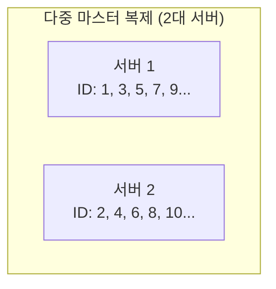
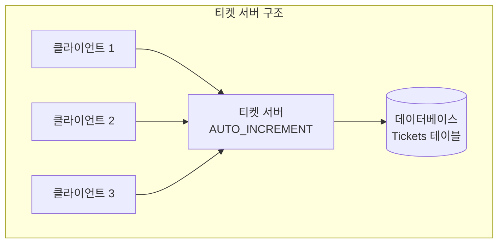

> 발표자: 길현준

---

# [가면사배 시리즈 #7] 분산 시스템을 위한 유일 ID 생성기 설계

## 📖 책 소개

**제목**: 가상 면접 사례로 배우는 대규모 시스템 설계 기초  
**7장**: 분산 시스템을 위한 유일 ID 생성기 설계  
**핵심 주제**: 분산 환경에서 유일성이 보장되는 ID 생성 방법과 각 접근법의 트레이드오프 분석

## 🎯 학습 목표

- 분산 시스템에서 ID 생성의 어려움과 제약사항 이해
- 다양한 ID 생성 방법의 장단점 비교 분석 (다중 마스터 복제, UUID, 티켓 서버, 스노플레이크)
- 트위터 스노플레이크 접근법의 상세 구조와 동작 원리 학습
- 64비트 ID 구조의 각 구성 요소 역할과 최적화 방법 습득
- 실제 대규모 시스템에서의 분산 ID 생성기 적용 사례 분석
- 시계 동기화, 고가용성 등 운영 시 고려사항 파악

## ⚠️ 문제 상황: 분산 환경에서의 ID 생성 문제

### 단일 데이터베이스의 한계

전통적으로 관계형 데이터베이스에서는 `AUTO_INCREMENT` 속성을 사용하여 유일한 ID를 생성합니다:

```sql
CREATE TABLE users (
  id BIGINT AUTO_INCREMENT PRIMARY KEY,
  name VARCHAR(100),
  email VARCHAR(100)
);
```

하지만 분산 환경에서는 이 접근법이 통하지 않습니다:

- **단일 장애점(SPOF)**: 데이터베이스 서버 한 대로는 요구사항을 감당할 수 없음
- **지연 시간**: 여러 데이터베이스 서버를 사용하는 경우 지연 시간을 낮추기 어려움
- **확장성 제약**: 수평적 확장이 어려움

### 요구사항 정의

면접에서 나올 수 있는 질문과 답변을 통해 요구사항을 명확히 해보겠습니다:

**지원자**: "ID는 어떤 특성을 가져야 하나요?"  
**면접관**: "ID는 유일해야 하고, 정렬 가능해야 합니다."

**지원자**: "새로운 레코드에 붙일 ID는 항상 1만큼 큰 값이어야 하나요?"  
**면접관**: "시간 흐름에 따라 커지긴 해야 하지만, 1씩 증가할 필요는 없습니다."

**지원자**: "ID는 숫자로만 구성되나요?"  
**면접관**: "그렇습니다."

**지원자**: "시스템 규모는 어느 정도입니까?"  
**면접관**: "초당 10,000개의 ID를 생성할 수 있어야 합니다."

### 정리된 요구사항

- **유일성**: ID는 유일해야 한다
- **숫자 구성**: ID는 숫자로만 구성되어야 한다
- **64비트**: ID는 64비트로 표현 가능한 값이어야 한다
- **시간 순서**: ID 발급 날짜에 따라 정렬 가능해야 한다
- **성능**: 초당 10,000개의 ID를 만들 수 있어야 한다

## 🔄 해결책 비교 분석

분산 시스템에서 유일성이 보장되는 ID를 만드는 방법은 여러 가지가 있습니다. 각각의 장단점을 살펴보겠습니다.

### 1. 다중 마스터 복제(Multi-master Replication)

데이터베이스의 `auto_increment` 기능을 활용하되, 다음 ID를 구할 때 1만큼 증가시키는 것이 아니라 **k만큼 증가**시킵니다. 여기서 k는 현재 사용 중인 데이터베이스 서버의 수입니다.



**장점**:

- 구현이 간단함
- 데이터베이스 서버를 늘리면 초당 생산 가능한 ID 수도 늘어남

**단점**:

- 여러 데이터 센터에 걸쳐 규모를 늘리기 어려움
- ID의 유일성은 보장되지만 시간 흐름에 맞춰 커지도록 보장할 수 없음
- 서버를 추가하거나 삭제할 때 잘 동작하도록 만들기 어려움

### 2. UUID(Universally Unique Identifier)

UUID는 컴퓨터 시스템에 저장되는 정보를 유일하게 식별하기 위한 **128비트** 수입니다.

**UUID 예시**:

```
550e8400-e29b-41d4-a716-446655440000
```

**장점**:

- UUID 만드는 것은 단순함
- 서버 사이의 조율이 필요 없으므로 동기화 이슈가 없음
- 각 서버가 자기가 쓸 ID를 알아서 만드는 구조이므로 규모 확장이 쉬움

**단점**:

- **ID가 128비트로 길다** (요구사항은 64비트)
- ID를 시간순으로 정렬할 수 없음
- ID에 숫자가 아닌 값이 포함될 수 있음

### 3. 티켓 서버(Ticket Server)

유일성이 보장되는 ID를 만들어내는 데 쓰일 수 있는 **중앙집중형** 방법입니다. Flickr에서 분산 기본 키를 만들어내기 위해 이 기술을 사용했습니다.



**장점**:

- 유일성이 보장되는 오직 숫자로만 구성된 ID를 쉽게 만들 수 있음
- 구현하기 쉽고, 중소 규모 애플리케이션에 적합함

**단점**:

- **티켓 서버가 SPOF(Single Point of Failure)가 됨**
- 이 서버에 장애가 발생하면 해당 서버를 이용하는 모든 시스템이 영향을 받음
- 여러 대 준비하면 데이터 동기화 같은 새로운 문제가 발생

### 4. 트위터 스노플레이크(Twitter Snowflake) 접근법

지금까지 살펴본 방법들은 이번 장의 요구사항을 완전히 만족시키지 못했습니다. 트위터에서 개발한 **스노플레이크(Snowflake)**라는 유일 ID 생성 기법이 우리의 요구사항을 만족시킬 수 있습니다.

스노플레이크는 **분할 정복(divide and conquer)** 접근법을 사용하여 ID를 여러 절로 나누어 구성합니다.

## 🔧 상세 설계: 트위터 스노플레이크

### 64비트 ID 구조

스노플레이크 ID는 다음과 같은 구조를 가집니다:

```
┌─────────┬─────────────────────────────────────────────┬─────────┬─────────┬──────────────┐
│ 사인비트 │              타임스탬프                      │데이터센터│ 서버 ID │  일련번호    │
│ (1비트) │              (41비트)                       │ID(5비트)│ (5비트) │  (12비트)    │
└─────────┴─────────────────────────────────────────────┴─────────┴─────────┴──────────────┘
```

### 각 구성 요소의 역할

**1. 사인(Sign) 비트 (1비트)**

- 1비트를 할당
- 음수와 양수를 구별하는 데 사용
- 일반적으로 0으로 설정

**2. 타임스탬프 (41비트)**

- 41비트를 할당
- 기원 시각(epoch) 이후 몇 밀리초(millisecond)가 경과했는지를 나타냄
- 트위터 스노플레이크에서는 Nov 04, 2010, 01:42:54 UTC를 기원 시각으로 사용
- **41비트로 표현 가능한 기간**: 약 69년 (2^41-1 밀리초 ≈ 69년)

**3. 데이터센터 ID (5비트)**

- 5비트를 할당
- 따라서 **32개(2^5)의 데이터센터**를 지원할 수 있음

**4. 서버 ID (5비트)**

- 5비트를 할당
- 따라서 **데이터센터당 32개(2^5)의 서버**를 둘 수 있음

**5. 일련번호 (12비트)**

- 12비트를 할당
- 각 서버에서는 ID를 생성할 때마다 이 일련번호를 1만큼 증가시킴
- 이 값은 1밀리초가 경과할 때마다 0으로 초기화됨
- **밀리초당 생성 가능한 ID 수**: 4,096개(2^12)

### 핵심 JavaScript 구현

```javascript
class SnowflakeIdGenerator {
  constructor(datacenterId, serverId) {
    // 데이터센터 ID와 서버 ID는 시스템 시작 시 결정되며 운영 중에는 바뀌지 않음
    this.datacenterId = datacenterId & 0x1f; // 5비트 마스크
    this.serverId = serverId & 0x1f; // 5비트 마스크
    this.sequence = 0;
    this.lastTimestamp = 0;

    // 트위터 기원 시각: Nov 04, 2010, 01:42:54 UTC
    this.epoch = 1288834974657;
  }

  generateId() {
    let timestamp = Date.now();

    // 같은 밀리초 내에서 ID 생성 시 일련번호 증가
    if (timestamp === this.lastTimestamp) {
      this.sequence = (this.sequence + 1) & 0xfff; // 12비트 마스크 (4095)

      // 일련번호가 4096에 도달하면 다음 밀리초까지 대기
      if (this.sequence === 0) {
        timestamp = this.waitNextMillis(timestamp);
      }
    } else {
      // 새로운 밀리초가 시작되면 일련번호 초기화
      this.sequence = 0;
    }

    this.lastTimestamp = timestamp;

    // 64비트 ID 조합: 타임스탬프(41) + 데이터센터ID(5) + 서버ID(5) + 일련번호(12)
    return (
      ((timestamp - this.epoch) << 22) |
      (this.datacenterId << 17) |
      (this.serverId << 12) |
      this.sequence
    );
  }

  waitNextMillis(currentTimestamp) {
    // 다음 밀리초까지 대기
    while (currentTimestamp === this.lastTimestamp) {
      currentTimestamp = Date.now();
    }
    return currentTimestamp;
  }

  // ID에서 타임스탬프 추출 (디버깅용)
  extractTimestamp(id) {
    return (id >> 22) + this.epoch;
  }
}

// 사용 예시
const generator = new SnowflakeIdGenerator(1, 1); // 데이터센터 1, 서버 1
const id1 = generator.generateId();
const id2 = generator.generateId();

console.log(`생성된 ID: ${id1}`);
console.log(`생성된 ID: ${id2}`);
console.log(`ID1 생성 시각: ${new Date(generator.extractTimestamp(id1))}`);
```

### 타임스탬프의 중요성

타임스탬프는 ID 구조에서 **가장 중요한 41비트**를 차지합니다. 시간이 흐름에 따라 점점 큰 값을 가지므로, 결국 ID가 시간순으로 정렬 가능하게 됩니다.

**타임스탬프 계산 예시**:

```
이진수: 0-00100010101001011010011011000101101011000-01010-01100-000000000000
십진수 타임스탬프: 297616116568
트위터 기원 시각 더함: 297616116568 + 1288834974657 = 1586451091225
UTC 시각 변환: Apr 09 2020 16:51:31 UTC
```

## 🏢 실제 적용 사례

### Twitter의 스노플레이크

**원조 스노플레이크 시스템**:

- 초당 수십만 개의 트윗 ID 생성
- 전 세계 여러 데이터센터에서 동시 운영
- 실시간 타임라인 정렬을 위한 시간순 ID 보장

**핵심 특징**:

- **고성능**: 밀리초당 4,096개 ID 생성 가능
- **확장성**: 데이터센터와 서버 추가로 선형적 확장
- **정렬성**: 생성 시간 순서대로 ID 정렬 보장

### Instagram의 수정된 스노플레이크

**PostgreSQL 기반 구현**:

- 스노플레이크 개념을 PostgreSQL에 적용
- 사진 ID 생성에 활용하여 시간순 정렬 지원
- 샤딩(Sharding) 전략과 결합하여 확장성 확보

**구조적 차이점**:

- 데이터베이스 샤드 ID를 포함하여 데이터 분산 최적화
- 사진 업로드 시간 기반 정렬로 사용자 경험 향상

### Discord의 분산 ID 시스템

**실시간 메시징 최적화**:

- 메시지 ID 생성에 스노플레이크 변형 사용
- 채널별 메시지 순서 보장
- 동시 사용자 500만 명 지원

**특별한 고려사항**:

- 메시지 전송 순서와 ID 순서의 일치성 보장
- 실시간 동기화를 위한 최적화된 타임스탬프 정밀도

### MongoDB ObjectId

**유사한 접근법**:

- 12바이트(96비트) 구조 사용
- 타임스탬프(4바이트) + 머신ID(3바이트) + 프로세스ID(2바이트) + 카운터(3바이트)
- 분산 환경에서 자동으로 유일한 ID 생성

**스노플레이크와의 차이점**:

- 더 긴 ID 길이 (96비트 vs 64비트)
- 16진수 문자열 표현 (숫자가 아닌 형태)

## ⚙️ 고려사항 및 최적화

### 시계 동기화(Clock Synchronization)

**문제점**:

- 스노플레이크 설계는 모든 서버의 시계가 동기화되어 있다고 가정
- 하나의 서버가 여러 코어에서 실행되거나 물리적으로 독립된 여러 장비에서 실행되는 경우 문제 발생 가능

**해결책**:

- **NTP(Network Time Protocol)** 사용이 가장 보편적
- 정기적인 시계 동기화 모니터링
- 시계 차이 감지 시 알림 시스템 구축

### 각 절(Section)의 길이 최적화

**애플리케이션 특성에 따른 조정**:

| 애플리케이션 특성              | 최적화 방향              | 예시             |
| ------------------------------ | ------------------------ | ---------------- |
| 동시성이 낮고 수명이 긴 시스템 | 일련번호 ↓, 타임스탬프 ↑ | 문서 관리 시스템 |
| 동시성이 높고 단기간 사용      | 일련번호 ↑, 타임스탬프 ↓ | 실시간 게임      |
| 글로벌 서비스                  | 데이터센터 ID ↑          | CDN, 글로벌 SNS  |

**최적화 예시**:

```javascript
// 높은 동시성을 위한 조정 (일련번호 14비트, 타임스탬프 39비트)
const HIGH_CONCURRENCY_CONFIG = {
  timestampBits: 39, // 약 17년 사용 가능
  datacenterBits: 5,
  serverBits: 5,
  sequenceBits: 14, // 밀리초당 16,384개 ID 생성 가능
};
```

### 고가용성(High Availability)

**미션 크리티컬 컴포넌트**:

- ID 생성기는 필수 컴포넌트이므로 매우 높은 가용성 필요
- 단일 장애점 제거를 위한 다중화 전략 필수

**가용성 확보 방안**:

- **다중 인스턴스**: 여러 ID 생성기 인스턴스 운영
- **로드 밸런싱**: 트래픽 분산을 통한 부하 관리
- **장애 복구**: 빠른 장애 감지 및 자동 복구 시스템
- **모니터링**: ID 생성 성능 및 유일성 지속적 모니터링

## 🤔 토론 주제

### 기술적 관점

1. **시계 동기화 실패 대응**: NTP 동기화가 실패하거나 서버 간 시계 차이가 발생했을 때의 대응 방안은 무엇일까요?

2. **ID 충돌 감지**: 극히 드물지만 ID 충돌이 발생할 가능성에 대비한 감지 및 복구 메커니즘은 어떻게 구현해야 할까요?

3. **성능 병목점**: 초당 10,000개 이상의 ID 생성이 필요한 경우 어떤 부분이 병목이 될 수 있을까요?

### 실무 적용 관점

1. **마이그레이션 전략**: 기존 시스템에서 스노플레이크 기반 ID로 전환할 때의 단계적 접근법은 무엇일까요?

2. **백업 및 복구**: ID 생성기 장애 시 서비스 연속성을 보장하기 위한 백업 전략은?

3. **모니터링 지표**: 스노플레이크 ID 생성기의 건강성을 확인하기 위한 핵심 메트릭은 무엇일까요?

### 확장성 관점

1. **데이터센터/서버 ID 부족**: 32개 데이터센터, 데이터센터당 32개 서버 제한을 넘어서야 할 때의 해결 방안은?

2. **글로벌 확장**: 다중 리전 환경에서 지역별 시간대 차이를 고려한 ID 생성 전략은?

3. **하이브리드 접근**: 스노플레이크와 다른 ID 생성 방법을 조합하여 사용하는 시나리오는 언제일까요?

## 📚 추가 학습 자료

### 핵심 기술 문서

**필수 자료**:

- Twitter Engineering Blog: "Announcing Snowflake"
- Instagram Engineering: "Sharding & IDs at Instagram"
- MongoDB Documentation: "ObjectId Specification"
- Flickr Engineering: "Ticket Servers: Distributed Unique Primary Keys on the Cheap"

**심화 학습**:

- "Designing Data-Intensive Applications" - Martin Kleppmann (Chapter 5: Replication)
- Discord Engineering: "How Discord Scaled Elixir to 5,000,000 Concurrent Users"
- Uber Engineering: "Schemaless: Uber Engineering's Scalable Datastore"

### 실무 가이드

**구현 참고 자료**:

- Twitter의 오픈소스 Snowflake 구현체
- 각 언어별 Snowflake 라이브러리 (Node.js, Python, Java, Go)
- 클라우드 서비스의 분산 ID 생성 서비스 (AWS, GCP, Azure)

## 🎯 핵심 메시지

> "분산 ID 생성기는 단순해 보이지만, 확장성, 성능, 유일성을 모두 만족시키는 것은 복잡한 엔지니어링 문제다. 스노플레이크는 이 문제에 대한 우아한 해결책을 제시한다."

### 핵심 설계 원칙

1. **분할 정복**: 복잡한 문제를 여러 작은 부분으로 나누어 해결
2. **시간 기반 정렬**: 타임스탬프를 활용한 자연스러운 순서 보장
3. **분산 친화적**: 중앙 집중식 조정 없이 독립적 ID 생성
4. **확장 가능**: 데이터센터와 서버 추가로 선형적 성능 향상
5. **운영 고려**: 실제 운영 환경에서의 제약사항 반영

### 실무 적용 가이드

**도입 시 고려사항**:

- 시스템 요구사항에 맞는 비트 할당 최적화
- 시계 동기화 인프라 구축 및 모니터링
- 장애 시나리오에 대한 충분한 테스트
- 점진적 도입을 통한 리스크 최소화
- 기존 시스템과의 호환성 검토

**성공적인 적용을 위한 체크리스트**:

- [ ] 요구사항 명확화 (성능, 정렬성, 유일성)
- [ ] 적절한 ID 구조 설계 (각 절의 비트 수 결정)
- [ ] 시계 동기화 방안 수립
- [ ] 고가용성 아키텍처 설계
- [ ] 모니터링 및 알림 시스템 구축
- [ ] 장애 복구 절차 수립

분산 시스템에서 ID 생성은 기초적이면서도 중요한 문제입니다. 스노플레이크 접근법을 이해하고 적절히 적용한다면, 확장 가능하고 안정적인 분산 시스템을 구축하는 데 큰 도움이 될 것입니다.
