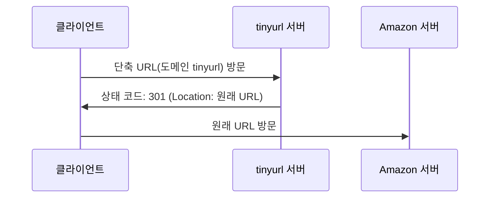
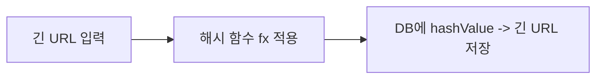
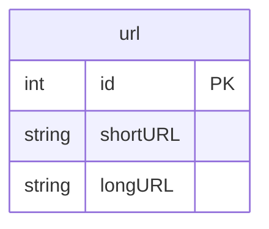
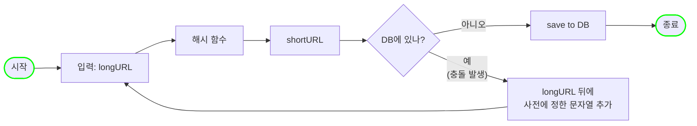
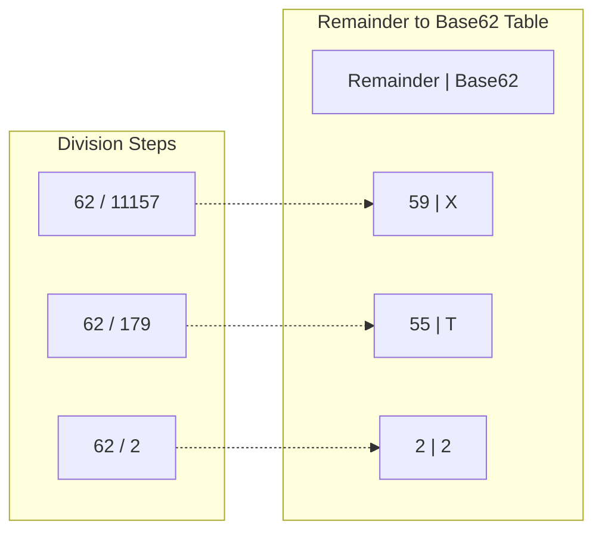
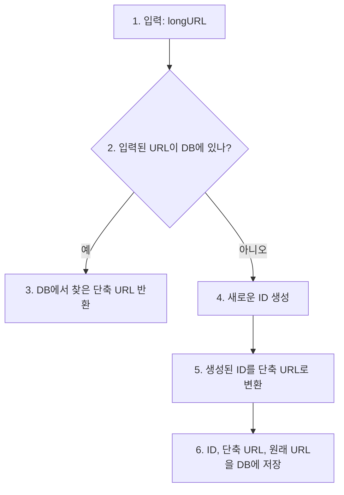
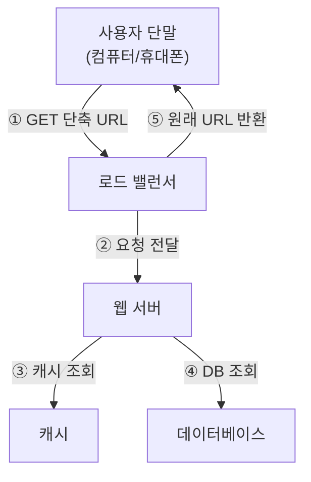

tiny url 같은 URL 단축기를 설계하는 문제를 풀어보자.

# 1단계. 문제 이해 및 설계 범위 확정
1. URL 단축: 주어진 긴 URL을 훨씬 짧게 줄인다.
2. URL redirection: 축약된 URL로 HTTP 요청이 오면 원래 URI로 안내
3. 높은 가용성과 규모 확장성, 장애 감내가 요구됨

* 개략적 추정
  * 쓰기 연산
    * 매일 1억개의 단축 URL 생성
  * 초당 쓰기 연산
    * 1억(100million)/24/3600 = 1160
  * 읽기 연산
    * 읽기 연산과 쓰기 연산 비율은 10:1이라고 하자.
    * 그 경우 읽기 연산은 초당 11,600회 발생한다.(1160*10 = 11,600)
  * URL 단축 서비스를 10년간 운영한다고 가정하면 1억(100million)*365*10 = 3650억(365million) 개의 레코드를 보관해야 한다.
  * 축약 전 URL의 평균 길이는 100이라고 하자.
  * 따라서 10년 동안 필요한 저장 용량은 3650억(365million)*100바이트 = 36.5TB이다.

# 2단계. 개략적 설계안 제시 및 동의 구하기

## API 엔드포인트
1. URL 단축용 엔드포인트
   * 새 단축 URL을 생성하고자 하는 클라이언트는 이 엔드포인트에 단축할 URL을 인자로 실어서 POST 요청을 보내야 한다.
   ```
   POST /api/v1/data/shorten
   - 인자: {longUrl: longURLstring}
   - 반환: 단축 URL
   ```
2. URL redirection용 엔드포인트
   * 단축 URL에 대해서 HTTP 요청이 오면 원래 URL로 보내주기 위한 용도의 엔드포인트
   ```
   GET /api/v1/shortUrl
   - 반환: HTTP redirection 목적지가 될 원래 URL
   ```

## URL redirection
브라우저 단축 URL을 입력하면 무슨 일이 생기는지 보자.   

* Request URL`https://tinyurl.com/qtj5opu`
* Status Code: `301`
* location: `https://www.amazon.com/dp/B017V4NTFA?pLink=63eaef76-979c-4d&ref=adblp13nvvxx_0_2_im`

단축 URL을 받은 서버는 그 URL을 원래 URL로 바꿔서 301 응답의 Location 헤더에 넣어 반환한다.



* 301 Permanently Moved
  * 해당 URL에 대한 HTTP 요청의 처리 책임이 영구적으로 Location 헤더에 반환된 URL로 이전되었다는 응답이다.
  * 영구적으로 이전되었으므로, 브라우저는 이 응답을 cache한다.
  * 서버 부하를 줄이는 것이 중요할 때 채택
* 302 Found
  * 주어진 URL로의 요청이 '일시적으로' Location 헤더가 지정하는 URL에 의해 처리되어야 한다는 응답이다.
  * 따라서 클라이언트의 요청은 언제나 단축 URL 서버에 먼저 보내진 후에 원래 URL로 redirection 되어야 한다.
  * 트래픽 분석이 중요할 때 채택

URL redirection을 구현하는 가장 직관적인 방법은 해시 테이블을 사용하는 것이다.
* 원래 URL = hashTable.get(단축 URL)
* 301 또는 302 응답 Location 헤더에 원래 URL을 넣은 후 전송

## URL 단축 flow
단축 URL이 `https://tinyurl.com/qtj5opu/{hashValue}` 같은 형태일 경우,   
가장 중요한 것은 긴 URL을 이 해시 값으로 대응시킬 해시 함수 **fx**를 찾는 일이다.



이 해시 함수는 아래 요구사항을 만족해야 한다.
* 입력으로 주어지는 긴 URL이 다른 값이면 해시 값도 달라야 한다.
* 계산된 해시 값은 원래 입력으로 주어졌던 긴 URL로 복원될 수 있어야 한다.

# 3단계. 상세 설계
## 데이터 모델
개략적 설계에서는 모든 것을 해시 테이블에 두었다.   
이 접근법은 초기 전략으로는 괜찮지만 실제 시스템에 쓰기에는 메모리가 유한하고 비싸다.

더 나은 방법은 <단축 URL, 원래 URL>의 순서쌍을 RDB에 저장하는 것이다.



## 해시 함수
해시 함수는 원래 URL을 단축 URL로 변환하는 데 쓰인다.

### 해시 값 길이
hashValue는 [0-9, a-z, A-Z]의 문자들로 구성된다.   
따라서 사용할 수 있는 문자의 개수는 10 + 26 + 26 = 62개다.

hashValue의 길이를 정하기 위해서는 `62^n >= 3650억(365billion)`인 n의 최솟값을 찾아야 한다.

예를 들어, n=7이면 3.5조 개의 URL을 만들 수 있다. (요구사항 만족에 충분)

### 해시 함수 구현 기술: 해시 후 충돌 해소
긴 URL을 줄이려면, 원래 URL을 7글자 문자열로 줄이는 해시 함수가 필요하다.   
손 쉬운 방법은 CRC32, MD5, SHA-1같이 잘 알려진 해시 함수를 이용하는 것이다.

CRC32가 계산한 가장 짧은 해시값도 7보다는 길다. 어떻게 하면 줄일 수 있을까?

첫 번째 방법은 계산된 해시 값에서 처음 7개 글자만 이용하는 것이다.   
하지만 해시 결과가 서로 충돌할 확률이 높아진다.   
충돌이 실제로 발생했을 때는, 충돌이 해소될 때까지 사전에 정한 문자열을 해시값에 덧붙인다.



이 방법을 쓰면 충돌은 해소할 수 있지만 단축 URL을 생성할 때 한 번 이상 데이터베이스 질의를 해야 하므로 오버헤드가 크다.

DB 대신 bloom filter를 사용하면 성능을 높일 수 있다.
> Bloom Filter는 어떤 집합에 특정 원소가 있는지 검사할 수 있도록 하는, 확률론에 기초한 공간 효율이 좋은 기술이다.

### 해시 함수 구현 기술: base-62 변환
진법 변환(base conversion)은 URL 단축기를 구현할 때 흔히 사용되는 접근법 중 하나다.   
이 기법은 수의 표현 방식이 다른 두 시스템이 같은 수를 공유해야 하는 경우에 유용하다.



따라서 단축 URL은 `https://tinyurl.com/2TX`

### 두 접근법 비교
* 해시 후 충돌 해소 전략
  1. 단축 URL의 길이가 고정됨
  2. 유일성이 보장되는 ID 생성기가 필요치 않음
  3. 충돌이 가능해서 해소 전략이 필요
  4. ID로부터 단축 URL을 계싼하는 방식이 아니라서 다음에 쓸 수 있는 URL을 알아내는 것이 불가능
* base-62 변환
  1. 단축 URL의 길이가 가변적. ID 값이 커지면 같이 길어짐
  2. 유일성 보장 ID 생성기가 필요
  3. ID의 유일성이 보장된 후에야 적용 가능한 전략이라 충돌은 아예 불가능
  4. ID가 1씩 증가하는 값이라고 가정하면 다음에 쓸 수 있는 단축 URL이 무엇인지 쉽게 알아낼 수 있어서 보안상 문제가 될 소지가 있음

## URL 단축기 상세 설계
URL 단축기는 시스템의 핵심 컴포넌트이므로, 그 처리 흐름이 논리적으로는 단순해야 하고 기능적으로는 언제나 동작하는 상태로 유지되어야 한다.



이 생성기의 주된 용도는 단축 URL을 만들 때 사용할 ID를 만드는 것이고, 고도로 분산된 환경에서도 이 ID는 전역적 유일성이 보장되어야 한다.

## URL redirection 상세 설계


# 4단계. 마무리
아래와 같은 이야기를 더 해볼 수 있다.
* 처리율 제한 장치(rate limiter)
  * 엄청난 양의 URL 단축 요청이 밀려들 경우 무력화될 수 있다는 잠재적 보안 결함을 갖고 있다.
  * 처리율 제한 장치를 두면, IP 주소를 비롯한 필터링 규칙들을 이용해 요청을 걸러낼 수 있을 것이다.
* 웹 서버의 규모 확장
  * 본 설계에 포함된 웹 계층은 stateless 계층이므로, 웹 서버를 자유로이 증설하거나 삭제할 수 있다.
* DB의 규모 확장
  * DB를 다중화하거나 sharding하여 규모 확장성을 달성할 수 있다.
* 데이터 분석 솔루션(analytics)
* 가용성, 데이터 일관성, 안정성
  * 대규모 시스템이 성공적으로 운영되기 위해서는 반드시 갖춰야 할 속성들이다. (1장 참고)
