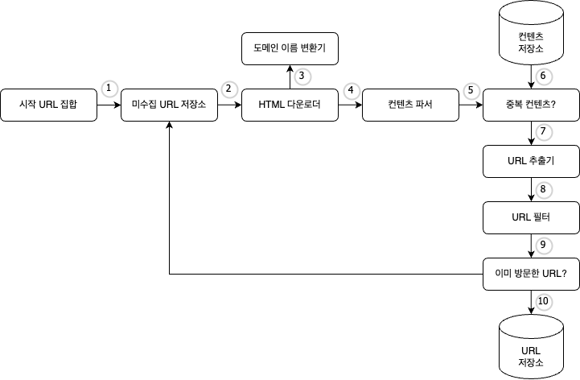
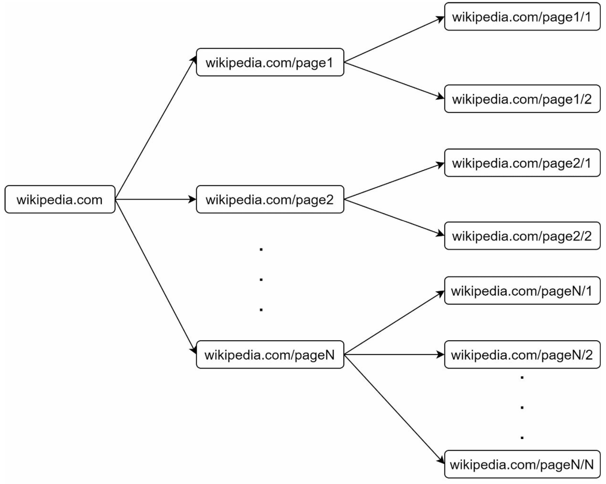
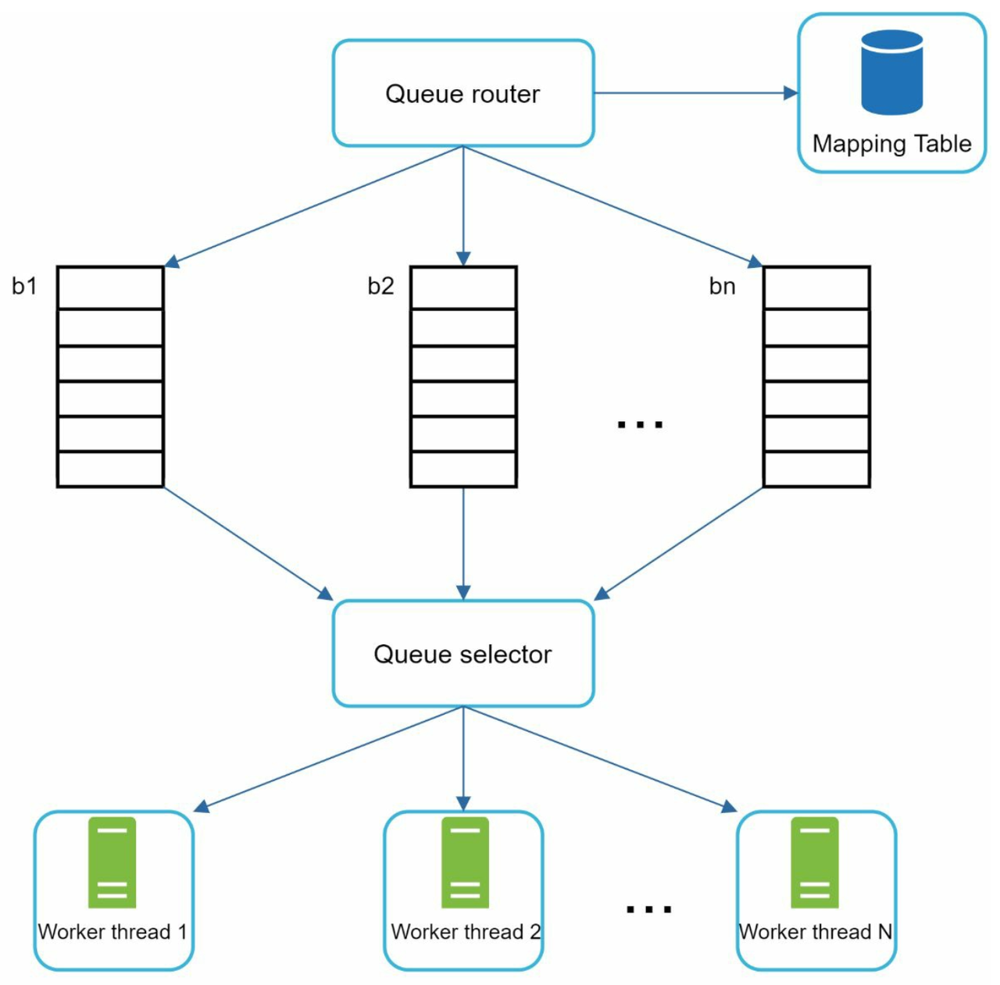
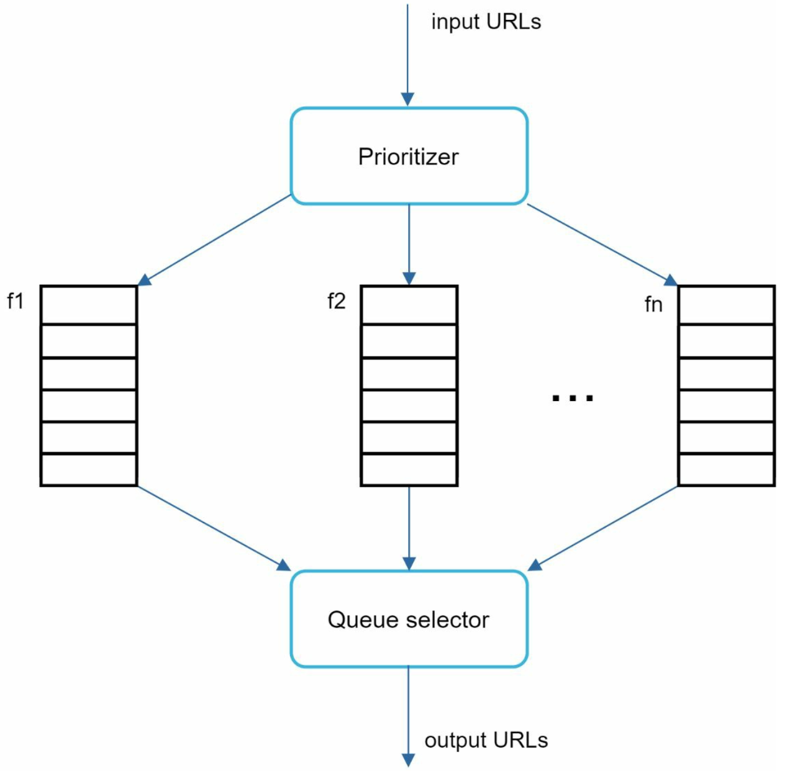
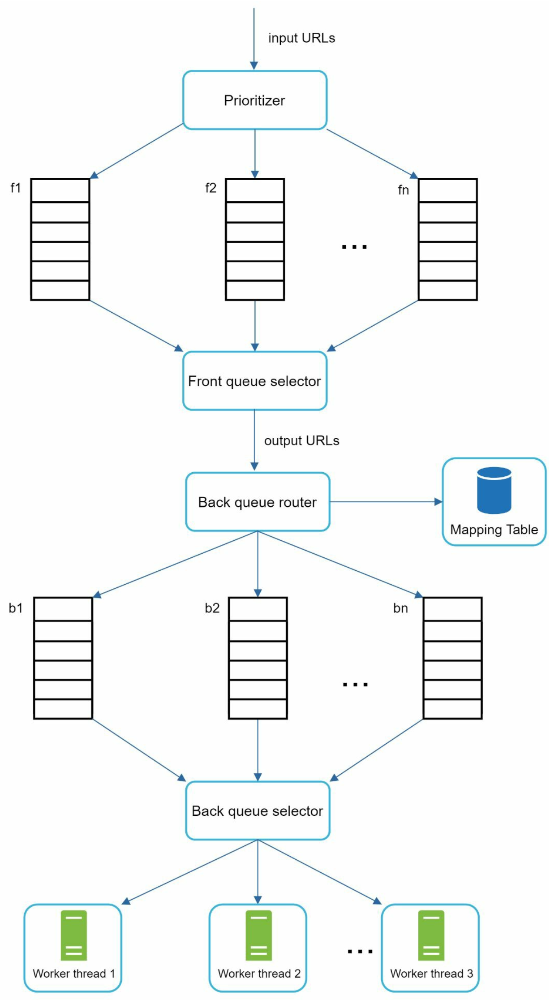
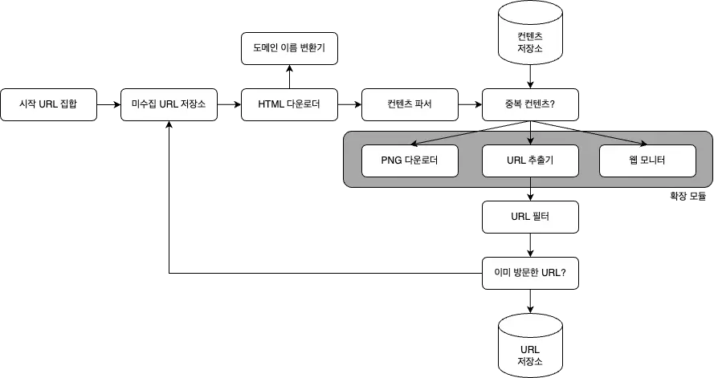

# 웹 크롤러 설계

시작하기전 '웹 크롤러'에 대해 간단히 알아보자!   
웹 크롤러는 검색엔진에 주로 쓰는 기술로, 웹에 새로 올라오거나 갱신된 컨텐츠를 찾아내는것이 주된 목적이다.
 
 
아래는 크롤러가 다양하게 이용되는 에시이다.
* 검색 엔진 인덱싱
    * 가장 보편적인 예시로, 웹 페이지를 모아 검색 엔진을 위한 로컬 인덱스를 만든다.
* 웹 아카이빙
    * 장기보관하기 위해 웹에서 정보를 모으는 절차를 말한다.
    * 많은 국립 도서관이 크롤러를 돌려 웹 사이트를 아카이빙하고 있다.
* 웹 마이닝
    * 웹상에서 유용한 패턴, 정보, 지식을 자동으로 추출하고 분석하는 과정이다.
    * 유명 금융 기업들이 이를 통해 기업의 핵심 사업 방향을 정하기도 한다.
* 웹 모니터링
    * 저작권이나 상표권이 침해되는 사례를 모니터링할 수 있다.

## 1단계 문제 이해 및 설계 범위 확정
웹 크롤러의 기본 알고리즘은 다음과 같다.
> 1. URL 집합이 입력으로 주어지면, 해당 URL들이 가리키는 모든 웹 페이지를 다운로드
> 2. 다운받은 웹 페이지에서 URL들을 추출
> 3. 추출된 URL들을 다운로드할 URL 목록에 추가하고 위의 과정을 처음부터 반복

웹 크롤러는 위 처럼 단순하게 작동하지 않기 때문에 상세한 내용을 살펴봐야 한다.
 
 
중요 속성은 다음과 같다.

* 규모 확장성
    * 웹은 거대하다. 병렬로 돌아갈 수 있다면 보다 더 효과적으로 크롤링 할 수 있을 것이다.
* 안정성
    * 잘못 작성된 HTML, 응답 없는 서버, 장애, 악성 코드 등 비정상적이나 악의적인 요소에 대응할 수 있어야 한다.
* 예절
    * 웹 사이트에 너무 잦은 요청을 보내서는 안된다.
* 확장성
    * 새로운 형태의 콘텐츠를 지원하기가 쉬워야 한다. 이미지 비디오, pdf 등 다양한 컨텐츠에 대응 가능한 크롤러가 설계되야 한다.

먼저, 어떤 용법을 위해 사용되는 크롤러인지 정의되야 한다.
 
 
책에서는, 검색 엔진 인덱싱을 예시로 들고 있다. 요구사항은 다음과 같다.

> 1. 매달 10억 개의 웹 페이지를 다운로드 한다.
> 2. QPS = 10억 / 30일 / 24시간 / 3600초 = 대략 초 당 400페이지
> 3. 최대 QPS = 2 * QPS = 800
> 4. 웹 페이지 크기 평균은 500kb라고 가정
> 5. 10억 페이지 * 500kb = 500TB / month
> 6. 1개월치 데이터를 보관하는 데는 500TB, 5년간 보관한다면 500TB * 12 개월 * 5년 ⇒ 30PB의 용량을 확보해야 한다

## 2단계 개략적 설계안 제시 및 동의 구하기
해당 구조는 책 저자가 웹 크롤러에 관한 선행연구를 참고한 디자인이다.

1. 시작 URL들을 미수집 URL 저장소에 저장
2. HTML 다운로더는 미수집 URL 저장소에서 URL 목록을 가져옴
3. HTML 다운로더는 도메인 이름 변환기를 사용하여 URL의 IP 주소를 알아내고, 해당 IP 주소의 웹페이지를 다운로드
4. 컨텐츠 파서는 다운된 HTML 페이지를 파싱하여 올바른 형식을 갖춘 페이지인지 검증
5. 컨텐츠 파싱과 검증이 끝나면 중복 컨텐츠인지 확인
6. 중복 컨텐츠인지 확인하기 위해서, 해당 페이지가 컨텐츠 저장소에 존재하는지 확인
   이미 저장소에 있는 컨텐츠인 경우에는 처리하지 않고 버린다
   저장소에 없는 컨텐츠인 경우에는 저장소에 저장한 뒤 URL 추출기로 전달한다.
7. URL 추출기는 해당 HTMl 페이지에서 링크를 골라낸다.
8. 골라낸 링크를 URL 필터로 전달한다.(접속시 오류 나는 url인지, 접근 제외 목록인지 등)
9. 필터링이 끝나고 남은 URL만 중복 URL 판별 단계로 전달
10. 이미 처리한 URL인지 확인하기 위하여, URL 저장소에 보관된 URL인지 확인 (중복이면 버림)
11. 저장소에 없는 URL은 URL 저장소에 저장할 뿐 아니라 미수집 URL 저장소에도 전달한다.

## 3단계 상세설계
지금부터는 가장 중요한 컴포넌트와 그 구현 기술을 심도있게 살펴볼 것이다.

아래는 책에서 설명하는 구현기술들이다.

>* DFS를 쓸 것인가, BFS를 쓸 것인가
>* 미수집 URL 저장소
>* HTML 다운로더
>* 안정성 확보 전략
>* 확장성 확보 전략
>* 문제 있는 컨텐츠 감지 및 회피 전략

 
 
 
 

### 1. DFS를 쓸 것인가, BFS를 쓸 것인가
위 흐름도 11번에서 이미 방문한 url은 저장소에 넣고, 나머지 미수집된 url은 미수집 저장소로 들어가는데 
미수집된 url들을 어떤순으로 꺼낼지에 대한 이야기이다.

 

아래 사진을 보자

웹은 페이지가 노드고 하이퍼링크(URL)가 에지인 방향 그래프와같다. 크롤링 프로세스는 이 방향 그래프를 에지를 따라 탐색하는 과정으로 볼 수 있다.

> DFS의 경우 그래프 크기가 커지면 탐색 깊이를 가늠할 수 없어, 크롤러는 보통 BFS이다.

하지만 BFS를 사용했을 때 다음과 두 가지 문제점이 있다.

* 대부분의 웹 페이지에서는, 한 페이지에 나오는 링크의 상당수는 같은 서버로 되돌아간다
    * 링크를 병렬로 처리한다면 서버는 수많은 요청으로 과부하에 걸릴 수 있다.
* 일반적인 BFS 알고리즘은 같은 레벨의 URL 간에 우선순위를 두지 않는다
    * 모든 웹 페이지가 같은 수준의 품질, 같은 수준의 중요성을 갖지는 않는다.

 
 

### 2. 미수집 URL 저장소
위 문제들 특히 같은 페이지로 돌아가는 그런 문제들은 미수집 URL 저장소를 잘 구현하면 해결된다.

1.예의 갖춘 크롤러, 2.우선순위와 3.신선도를 구별하는 크롤러를 구현할 수 있다.
  
저자는 특정 논문을 읽고 이 미수집 URL 저장소 구현에 관한 내용을 요약하여 설명한다.
 
  

**2-1.예의**
- 웹 크롤러는 수집 대상 서버로 짧은 시간 안에 너무 많은 요청을 보내는 것을 삼가야 한다.
- 너무 많은 요청을 보내는 것은 무례한(impolite) 일이며,
- DoS(Denial-of-Service)로 간주되기도 한다.

예의 바른 크롤러를 만드는 데 있어서 지켜야 할 원칙은 다음과 같다.

> 동일 웹사이트에는 한 번만 요청을 보내는 것을 원칙으로 한다.

위 아이디어에 대한 설계는 다음과 같다.

- 큐 라우터: 매핑 테이블을 참조하여, 같은 호스트에 속한 URL을 항상 같은 큐로 보내도록 하는 역할
- 매핑 테이블: 호스트 이름과 큐 사이의 관계를 보장하는 테이블
    - wikipedia.com: b1 appli.com: b2 ... nike.com: bn
- FIFO 큐: 같은 호스트에 속한 URL은 언제나 같은 큐에 보관 (b1~bn)
- 큐 선택기: 큐들을 순회하면서 URL을 꺼내 해당 큐에 지정된 작업 스레드에 전달
- 작업 스레드: 전달된 URL을 다운로드
- 전달된 URL은 순차적으로 처리될 것이며, 작업들 사이에는 일정한 지연시간을 둘 수 있음
       

**2-2.우선순위**

모든 페이지가 같은 중요도를 가지지는 않는다.  
유용성에 따라 URL의 우선순위를 나눌 필요가 있다.  
나눌 때는 페이지랭크(PageRank), 트래픽 양, 갱신 빈도 등 다양한 척도를 사용할 수 있다. 
 
이번에는 URL 우선순위를 결정하는 컴포넌트인 순위결정장치(prioritizer)에 대해 알아볼 것이다.

- 순위결정장치: URL 을 입력으로 받아 우선순위를 계산한다.
- 큐(f1, …fn): 우선순위 별로 큐가 하나씩 할당되며, 우선순위가 높으면 선택될 확률도 올라간다.
- 큐 선택기: 임의 큐에서 처리할 URL을 꺼낸다. 순위가 높은 큐에서 더 자주 꺼내도록 프로그램 되어있다.

순위결정장치를 반영한 전체 설계는 다음과 같을 것이다. 전면 큐와 후면 큐 두 개의 모듈이 존재한다.

- 전면 큐: 우선순위 결정 과정 처리
- 후면 큐: 크롤러가 예의 바르게 동작하도록 보증

**2-3.신선도**

웹페이지는 수시로 추가되고, 삭제되고, 변경되므로 데이터의 신선함(freshness)를 유지하기 위해서 이미 다운받은 페이지라고 해도 재수집할 필요가 있다.  
이 작업을 최적화하기 위한 전략으로는 다음과 같은 것들이 있다.

- 웹 페이지의 변경 이력 활용
- 우선순위가 높은 페이지는 더 자주 재수집

 
 
 
 
 
 

### 3. HTML 다운로더
HTML 다운로더는 HTTP 프로토콜을 통해 웹페이지를 내려 받는다. 
다운로더에 대해 알아보기 전에 먼저 로봇 제외 프로토콜(Robot exclusion Protocol)에 대해 알아보자.

**Robots.txt**
- 로봇 제외 프로토콜로, 웹사이트가 크롤러와 소통하는 표준적인 방법이다. 
- 이 파일에는 크롤러가 수집해도 되는 페이지 목록이 담겨있음 
- 크롤러는 크롤링 전 해당 파일에 나열된 규칙을 먼저 확인 
- 해당 파일을 계속 다운하는 것을 방지하기 위해 주기적으로 다시 다운받아 캐싱

**성능 최적화**
- 분산 크롤링
- 도메인 이름 변환 결과 캐시
- 지역성: 크롤링 작업을 수행하는 서버를 지역별로 분산하는 방법이다.

 
 

### 4. 안정성 확보 전략
* 안정 해시 : 다운로드 서버들에 부하 분산을 적용할 때 사용할 수 있다.
* 크롤링 상태 및 수집 데이터 저장 : 장애가 발생한 경우도 쉽게 복구할 수 있도록 상태와 데이터를 수시로 지속적 저장장치에 기록해두는 것이 바람직하다.
* 예외 처리
* 데이터 검증

 
 

### 5. 확장성 확보 전략
확장성을 위해, PNG 파일을 다운로드 하는 PNG 플러그인 모듈이나, 웹 모니터가 추가 됐다.

 
 

### 6. 문제 있는 콘텐츠 감지 및 회피
* 중복 컨텐츠 : 해시나 체크섬을 통해 탐지할 수 있다.
* 거미 덫 : 크롤러가 무한 루프에 빠지도록 설계된 페이지의 경우 URL의 최대 길이를 제한하면 회피할 수 있다. 이런 사이트가 발견된다면 필터에 제한조건을 걸어두자.
* 데이터 노이즈 : 가치 없는 콘텐츠는 배제

   

## 4단계 마무리 요약
다른 것들은 까먹어도 최소한 크롤러가 갖추어야하는 특성과 크롤러의 동작 순서는 기억하면 좋을 것 같다.
- 규모 확장성(scalability)
- 예의(politeness)
- 확장성(extensibility)
- 안정성
  

---

---
*추가로 논의해보면 좋은 것

서버 측 렌더링 (server-side rendering): 웹 페이지를 그냥 있는 그대로 다운받아서 파싱해보면 그렇게 동적으로 생성되는 링크는 발견할 수 없을 것이다.
이 문제는 페이지를 파싱하기 전에 서버 측 렌더링을 적용하면 해결할 수 있다. 
파이썬 크롤링 도구인 Selenium은 동적인 크롤링이 가능하게끔 한다. 
원치 않는 페이지 필터링: 스팸 방지 컴포넌트를 두어 품질이 조약하거나 스팸성인 페이지를 필터링 
데이터베이스 다중화 및 샤딩: 다중화나 샤딩 적용 시 데이터 계층 가용성, 규모 확장성, 안정성 향상 
수평적 규모 확장성: 대규모 분산 다운로드 서버로 확장하기 위해 무상태 서버로 구성 
데이터 분석 솔루션(analytics)