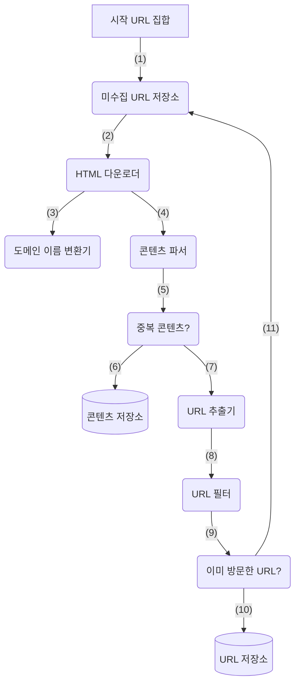
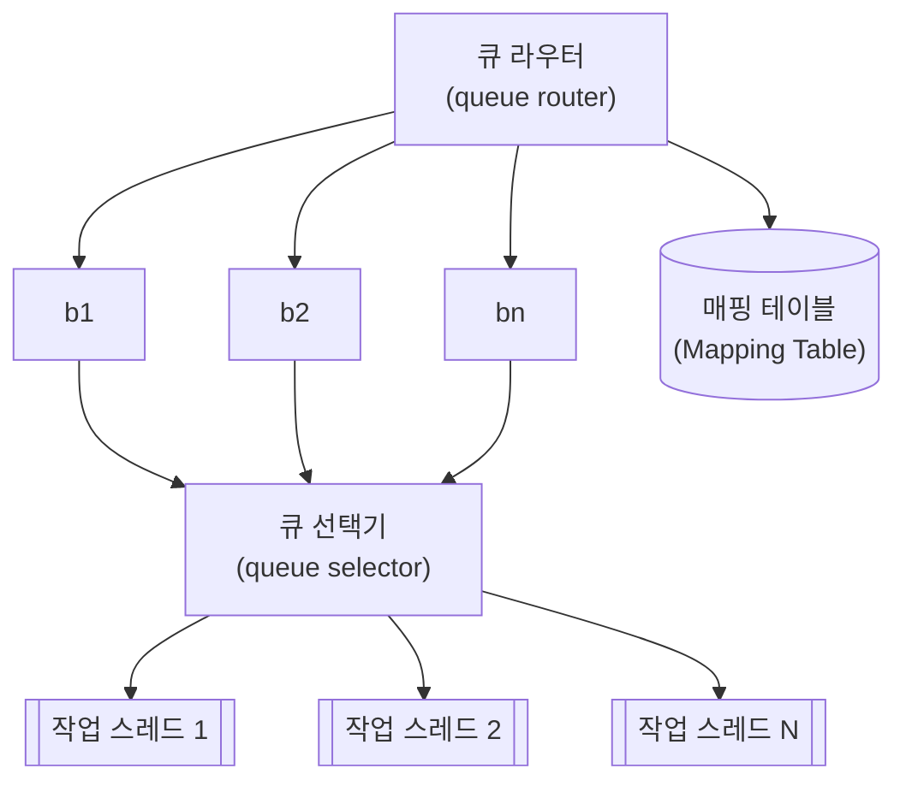
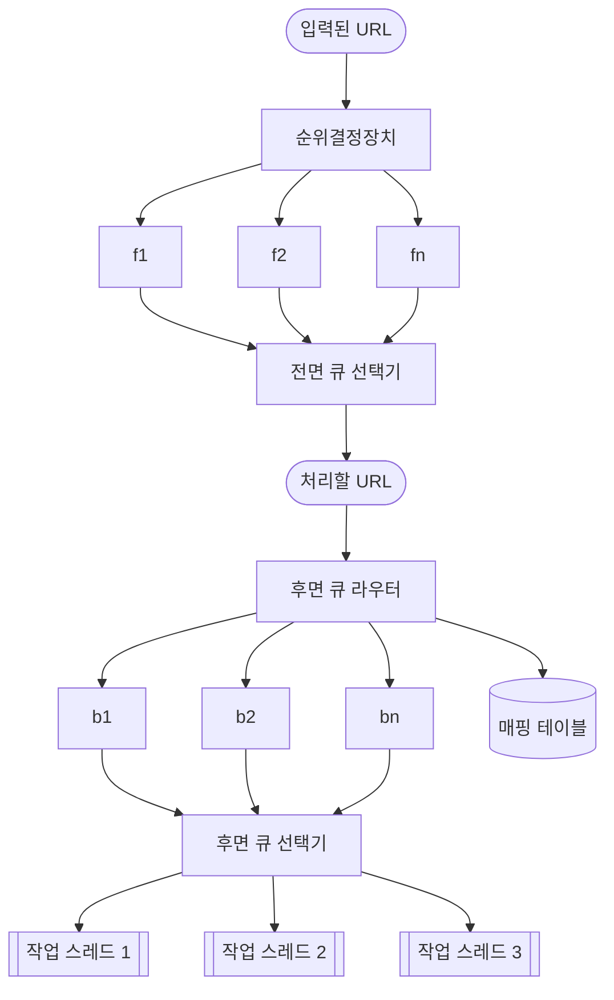
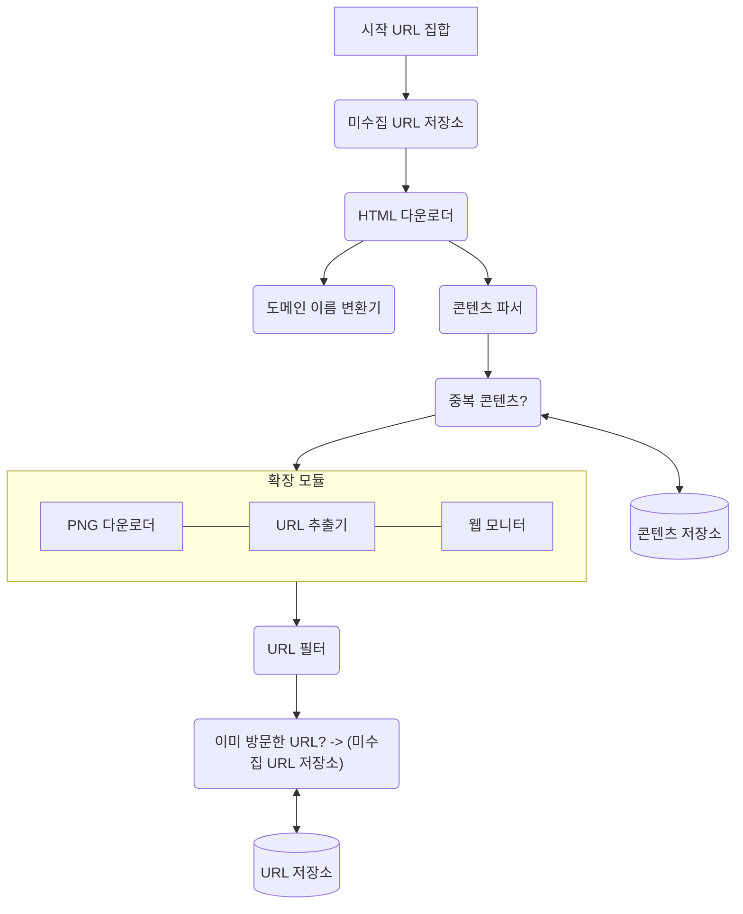

웹 크롤러는 검색 엔진에서 널리 쓰는 기술로, 웹에 새로 올라오거나 갱신된 콘텐츠를 찾아내는 것이 주된 목적이다.

웹 크롤러는 몇 개 웹 페이지에서 시작하여 그 링크를 따라 나가면서 새로운 콘텐츠를 수집한다.

크롤러는 아래와 같이 다양하게 이용된다.
* 검색 엔진 인덱싱
* 웹 아카이빙
* 웹 마이닝
* 웹 모니터링

## 1단계. 문제 이해 및 설계 범위 확정
웹 크롤러의 기본 알고리즘은 간단한다.
1. URL 집합이 입력으로 주어지면, 해당 URL들이 가리키는 모든 웹 페이지를 다운로드한다.
2. 다운받은 웹 페이지에서 URL들을 추출한다.
3. 추출된 URL들을 다운로드할 URL 목록에 추가하고 위의 과정을 처음부터 반복한다.

규모 확장성을 갖는 웹 크롤러를 설계하는 것은 엄청나게 어려운 작업이다.

주어진 인터뷰 시간 동안 완성하기는 거의 불가능할 것이다.   
그러니 설계를 진행하기 전에 질문을 던져서 요구사항을 알아내고 설계 범위를 좁히자.

### 개략적 규모 추정
* 매달 10억 개의 웹 페이지를 다운로드한다.
* QPS = 10억(1billion) / 30dlf / 24시간 / 3600초 = 대략 400페이지/초
* 최대(Peak) QPS = 2 X QPS = 800
* 웹 페이지의 크기 평균은 500k라고 가정
* 10억 페이지 X 500k = 500TB/월
* 1개월치 데이터를 보관하는 데는 500TB
  * 5년간 보관한다고 가정하면 500TB X 12개월 X 5년 = 30PB

## 2단계. 개략적 설계안 제시 및 동의 구하기

1. 시작 URL들을 미수집 URL 저장소에 저장한다.
2. HTML 다운로더는 미수집 URL 저장소에서 URL 목록을 가져온다.
3. HTML 다운로더는 도메인 이름 변환기를 사용하여 URL의 IP 주소를 알아내고, 해당 IP 주소로 접속하여 웹 페이지를 다운받는다.
4. 콘텐츠 파서는 다운된 HTML 페이지를 파싱하여 올바른 형식을 갖춘 페이지인지 검증한다.
5. 콘텐츠 파싱과 검증이 끝나면 중복 콘텐츠인지 확인하는 절차를 개시한다.
6. 중복 콘텐츠인지 확인하기 위해서, 해당 페이지가 이미 저장소에 있는지 본다.
   * 이미 저장소에 있는 콘텐츠인 경우에는 처리하지 않고 버린다.
   * 저장소에 없는 콘텐츠인 경우에는 저장소에 저장한 뒤 URL 추출기로 전달한다.
7. URL 추출기는 해당 HTML 페이지에서 링크를 골라낸다.
8. 골라낸 링크를 URL 필터로 전달한다.
9. 필터링이 끝나고 남은 URL만 중복 ULR 판별 달계로 전달한다.
10. 이미 처리한 URL인지 확인하기 위하여, URL 저장소에 보관된 URL인지 살핀다. 이미 저장소에 있는 URL은 버린다.
11. 저장소에 없는 URL은 URL 저장소에 저장할 뿐 아니라 미수집 URL 저장소에도 전달한다.

### 1. 시작 URL 집합
웹 크롤러가 크롤링을 시작하는 출발점이다.

크롤러가 가능한 한 많은 링크를 탐색할 수 있도록 하는 URL을 고르는 것이 바람직하다.

일반적으로 전체 URL 공간을 작은 부분집합으로 나누는 전략을 쓴다.   
예를 들어 URL 공간을 쇼핑, 스포츠, 건강 등등의 주제별로 세분화하고 그 각각에 다른 시작 URL을 쓴다.

### 2. 미수집 URL 저장소
다운로드할 URL, 다운로드된 URL 두 크롤링 상태 중 '다운로드할 URL'을 저장 관리하는 컴포넌트를 미수집 URL 저장소라고 부르며,   
FIFO queue라고 생각하면 된다.

### 3. HTML 다운로더
인터넷에서 웹 페이지를 다운로드하는 컴포넌트다.

### 4. 도메인 이름 변환기
URL을 IP 주소로 변환한다.

### 5. 콘텐츠 파서
웹 페이지를 다운로드하면 parsing과 validation 절차를 거쳐야 한다.

크롤링 서버 안에 콘텐츠 파서를 구현하면 크롤링 과정이 느려지게 될 수 있으므로, 독립된 컴포넌트로 만든다.

### 6. 중복 콘텐츠인가?
웹에 공개된 연구 결과에 따르면, 29% 가량의 웹페이지 콘텐츠는 중복이다.

중복을 피하기위한 효과적인 방법은 웹 페이지의 해시 값을 비교하는 것이다.

### 7. 콘텐츠 저장소
HTML을 보관하는 시스템이다.

본 설계안의 경우 아래와 같은 전략을 세운다.
* 데이터 양이 너무 많으므로 대부분의 콘텐츠는 디스크에 저장한다.
* 인기 있는 콘텐츠는 메모리에 두어 접근 지연시간을 줄일 것이다.

### 8. URL 추출기
HTML 페이지를 파싱하여 링크들을 골라내는 역할을 한다.

예를 들어 상대 경로에는 전부 도메인을 붙여 절대 경로로 변환한다.

### 9. URL 필터
아래와 같은 클롤링 대상은 배제하는 역할을 한다.
* 특정한 콘텐츠 타입이나 파일 확장자를 갖는 URL
* 접속 시 오류가 발생하는 URL
* 접근 제외 목록(deny list)에 포함된 URL

### 10. 이미 방문한 URL?
이미 방문한 URL이나 미수집 URL 저장소에 보관된 URL을 추적할 수 있도록 하는 자료 구조를 사용하여,   
서버 부하를 줄이고 시스템이 무한 루프에 빠지는 일을 방지한다.

해당 자료 구조로는 **bloom filter**나 **hash table**이 널리 쓰인다.

### 11. URL 저장소
이미 방문한 URL을 보관하는 저장소다.

## 3단계. 상세 설계
개략적 설계안을 살펴 본 후, 가장 중요한 컴포넌트와 그 구현 기술을 심도 있게 살펴 보자.

1. DFS vs BFS
2. 미수집 URL 저장소
3. HTML 다운로더 
4. 안정성 확보 전략 
5. 확장성 확보 전략 
6. 문제 있는 콘텐츠 감지 및 회피 전략

### 1. DFS vs BFS
그래프 크기가 클 경우 어느 정도로 깊숙이 가게 될지 가늠하기 어려워서   
웹 크롤러는 보통 DFS 보다 FIFO 큐를 사용하는 BFS를 사용한다.

하지만 이 구현법에는 두 가지 문제점이 있다.
* 한 페이지에서 나오는 링크의 상당수는 같은 서버로 되돌아간다.
  * 링크들을 병렬로 처리하게 된다면
  * 위키피디아 서버는 수많은 요청으로 과부하에 걸리게 될 것이다.
  * 예의 없는(impolite) 크롤러로 간주된다.
* 표준적 BFS 알고리즘은 URL 간에 우선순위를 두지 않는다.
  * 처리 순서에 있어 모든 페이지를 공평하게 대우한다.
  * 하지만 모든 웹 페이지가 같은 수준의 품질, 같은 수준의 중요성을 갖지는 않는다.

### 2. 미수집 URL 저장소
이 저장소를 잘 구현하면 '예의(politeness)'를 갖춘 크롤러, URL 사이의 우선순위와 신선도를 구별하는 크롤러를 구현할 수 있다.

**[예의]**   
웹 크롤러는 수집 대상 서버로 짧은 시간 안에 너무 많은 요청을 보내는 것을 삼가야 한다.

요구사항을 만족시키려면 웹사이트의 호스트명과 다운로드를 수행하는 작업 스레드 사이의 관계를 유지하면 된다.   
즉, 각 다운로드 스레드는 별도 FIFO 큐를 가지고 있어서, 해당 큐에서 꺼낸 URL만 다운로드한다.

* 큐 라우터
  * 같은 호스트에 속한 URL은 언제나 같은 큐로 가도록 보장하는 역할을 한다.
* 매핑 테이블
  * 호스트명과 큐 사이의 관계를 보관하는 테이블이다.
* FIFO 큐
  * 같은 호스트에 속한 URL은 언제나 같은 큐에 보관된다.

* 큐 선택기
  * 큐들을 순회하면서 큐에서 URL을 꺼내서 해당 큐에서 나온 URL을 다운로드하도록 지정된 작업 스레드에 전달하는 역할을 한다.
* 작업 스레드
  * 전달된 URL을 다운로드하는 작업을 수행한다.
  * 전달된 URL은 순차적으로 처리될 것이며, 작업들 사이에는 일정한 delay를 둘 수 있다.

**[우선순위]**   
유용성에 따라 URL의 우선순위를 나눌 때는 페이지 랭크, 트래픽 양, 갱신 빈도 등 다양한 척도를 사용할 수 있을 것이다.

* 순위결정장치
  * URL을 입력으로 받아 운선순위를 계산한다.
* 큐(f1, f2, ..., fn)
  * 우선순위별로 큐가 하나씩 할당된다.
* 큐 선택기
  * 임의 큐에서 처리할 URL을 꺼내는 역할을 담당한다.
* 전면 큐
  * 우선순위 결정 과정을 처리한다.
* 후면 큐
  * 크롤러가 예의 바르게 동작하도록 보증한다.

**[신선도]**   
웹 페이지는 수시로 추가/삭제/변경된다.   
따라서 이미 다운로드한 페이지라고 해도 주기적으로 재수집할 필요가 있다.

그러나 모든 URL을 재수집하는 것은 많은 리소스가 필요한 작업이므로, 최적화하기 위해 아래와 같은 전략들이 있다.
* 웹 페이지의 변경 이력 활용
* 우선순위를 활용하여, 중요한 페이지는 좀 더 자주 재수집

**[미수집 URL 저장소를 위한 지속성 저장장치]**   
대부분의 URL은 디스크에 두지만 IO 비용을 줄이기 위해 메모리 버퍼에 큐를 두어, 버퍼에 있는 데이터는 주기적으로 디스크에 기록한다.

### 3. HTML 다운로더
HTTP 프로토콜을 통해 웹 페이지를 내려 받는다.

**[Robots.txt]**   
웹사이트가 크롤러와 소통하는 표준적 방법이다.

이 파일에는 크롤러가 수집해도 되는 페이지 목록이 들어 있다.   
따라서 웹 사이트를 긁어 가기 전에 크롤러는 해당 파일에 나열된 규칙을 먼저 확인해야 한다.

Robots.txt도 중요하지만 HTML 다운로더를 설계할 때는 성능최적화도 아주 중요하다.

**[성능 최적화]**
1. 분산 크롤링
2. 도메인 이름 변환 결과 캐시
   * DNS Resolver는 동기적 특성 때문에 크롤러 성능의 병목 중 하나이다.
   * DNS 요청이 처리되는 데는 보통 10~200ms가 소요된다.
   * DNS 조회 결과로 얻어진 도메인 이름과 IP 주소 사이의 관계를 캐시에 보관해 놓고 cron job 등을 돌려 주기적으로 갱신하도록 해 놓으면 성능을 효과적으로 높일 수 있다.
3. 지역성
   * 크롤링 작업을 수행하는 서버를 지역별로 분산하는 방법이다.
4. 짧은 타임아웃

### 4. 안정성   
* 안정 해시
* 크롤링 상태 및 수집 데이터 저장
* 예외 처리
* 데이터 검증

### 5. 확장성

### 6. 문제 있는 콘텐츠 감지 및 회피
1. 중복 콘텐츠
   * 웹 콘텐츠의 30% 가량은 중복이므로, 해시나 체크섬을 사용하여 보다 쉽게 탐지할 수 있다.
2. 거미 덫
   * 크롤러를 무한 루프에 빠뜨리도록 설계한 웹 페이지다.
   * 덫을 자동으로 피해가는 알고리즘을 만들어내는 것은 까다롭다.
   * 수작업으로 제외시키거나, URL 필터 목록에 걸어둔다.
3. 데이터 노이즈
   * 가치가 없는 콘텐츠는 크롤러에게 도움이 되지 않으므로, 가능하다면 제외해야 한다.

## 4단계. 마무리
아래와 같은 추가 논의가 있으면 좋을 수 있다.
* 서버 측 렌더링
  * 동적으로 생성되는 링크는 발견할 수 없다.
  * 페이지를 파싱하기 전에 서버 측 렌더링(동적 렌더링)을 적용하면 해결할 수 있다.
* 원치 않는 페이지 필터링
  * 스팸 방지 컴포넌트를 둔다.
* 데이터베이스 다중화 및 샤딩
  * 데이터 계층의 가용성, 규모 확장성, 안정성이 향상된다.
* 수평적 규모 확장성
* 가용성, 일관성, 안정성
* 데이터 분석 솔루션
