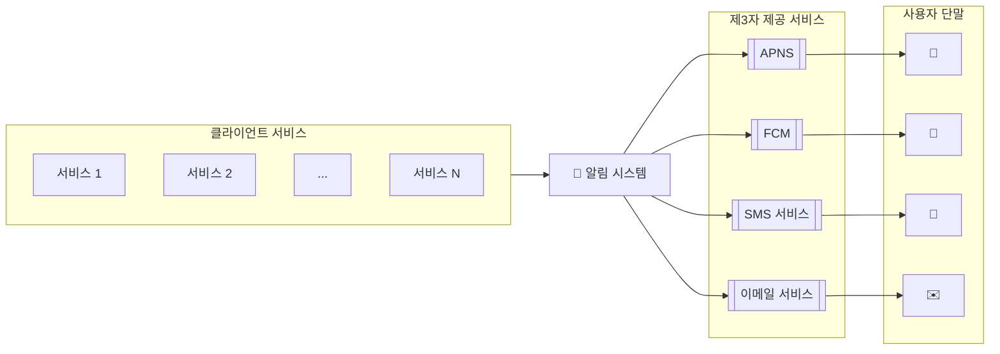

<div class="message-box">
  알림 시스템은 단순히 모바일 푸시 알림에 한정되지 않습니다. 모바일 푸시 알림, SMS 메시지, 이메일의 세 가지 주요 유형으로 나눌 수 있으며, 각기 다른 특성과 전달 방식을 가집니다.
</div>

---

## 📝 1단계: 문제 이해 및 설계 범위 확정

성공적인 시스템 설계를 위해서는 요구사항을 명확히 하는 것이 가장 중요합니다. 다음과 같은 질문을 통해 설계 범위를 구체화할 수 있습니다.

| 질문 (Question) | 답변 (Answer) |
|---|---|
| **어떤 종류의 알림을 지원해야 하나요?** | 푸시 알림, SMS 메시지, 이메일을 모두 지원해야 합니다. |
| **실시간 시스템이어야 하나요?** | 연성 실시간(soft real-time) 시스템으로, 빠른 전달을 지향하되 약간의 지연은 허용됩니다. |
| **어떤 단말을 지원해야 하나요?** | iOS, Android, 그리고 웹 브라우저(데스크톱/랩톱)를 지원합니다. |
| **알림은 누가 생성하나요?** | 클라이언트 앱 또는 서버 측 스케줄링 작업에 의해 생성될 수 있습니다. |
| **사용자가 알림 수신을 거부할 수 있나요?** | 네, 사용자는 알림 종류별로 수신 여부를 제어할 수 있어야 합니다. |
| **하루 처리량은 어느 정도인가요?** | 대규모 트래픽을 가정하여, 일일 푸시 천만 건, SMS 백만 건, 이메일 5백만 건을 목표로 합니다. |

---

## 🏗️ 2단계: 개략적 설계안 제시

### 📡 알림 유형별 지원 방안

각 알림 유형은 외부 제3자 서비스(3rd-party Service)를 통해 전달됩니다.

*   **iOS 푸시 알림:** Apple Push Notification Service (APNS) 사용
    ```mermaid
    flowchart LR
        classDef provider fill:#A6E3A1,stroke:#333,stroke-width:2px;
        classDef service fill:#89B4FA,stroke:#333,stroke-width:2px;
        classDef device fill:#F9E2AF,stroke:#333,stroke-width:2px;

        Provider((알림 제공자)):::provider --> APNS[[APNS]]:::service --> iOSDevice[📱 iOS 단말]:::device
    ```
*   **안드로이드 푸시 알림:** Firebase Cloud Messaging (FCM) 사용
    ```mermaid
    flowchart LR
        classDef provider fill:#A6E3A1,stroke:#333,stroke-width:2px;
        classDef service fill:#89B4FA,stroke:#333,stroke-width:2px;
        classDef device fill:#F9E2AF,stroke:#333,stroke-width:2px;

        Provider((알림 제공자)):::provider --> FCM[[FCM]]:::service --> AndroidDevice[🤖 안드로이드 단말]:::device
    ```
*   **SMS 메시지:** Twilio, Nexmo와 같은 상용 SMS 서비스 이용
    ```mermaid
    flowchart LR
        classDef provider fill:#A6E3A1,stroke:#333,stroke-width:2px;
        classDef service fill:#89B4FA,stroke:#333,stroke-width:2px;
        classDef device fill:#F9E2AF,stroke:#333,stroke-width:2px;

        Provider((알림 제공자)):::provider --> SMSService[[SMS 서비스]]:::service --> Phone[💬 SMS 수신 단말]:::device
    ```
*   **이메일:** SendGrid, Mailchimp와 같은 상용 이메일 서비스 이용
    ```mermaid
    flowchart LR
        classDef provider fill:#A6E3A1,stroke:#333,stroke-width:2px;
        classDef service fill:#89B4FA,stroke:#333,stroke-width:2px;
        classDef device fill:#F9E2AF,stroke:#333,stroke-width:2px;

        Provider((알림 제공자)):::provider --> EmailService[[이메일 서비스]]:::service --> Laptop[✉️ 이메일 클라이언트]:::device
    ```

### 👎 초기 설계안 및 문제점

초기 설계는 모든 알림 요청을 단일 '알림 시스템'이 처리하는 중앙 집중형 구조입니다.



이 설계는 다음과 같은 명백한 문제점을 가집니다.

- ❌ **단일 장애점 (SPOF):** 알림 시스템 서버 장애 시 전체 시스템이 마비됩니다.
- ❌ **확장성 한계:** DB, 캐시 등 주요 컴포넌트의 개별적인 확장이 어렵습니다.
- ❌ **성능 병목:** 트래픽 급증 시 알림 시스템이 과부하에 빠질 수 있습니다.

### 👍 개선된 설계안

위 문제들을 해결하기 위해 **메시지 큐(Message Queue)**를 도입하여 컴포넌트 간의 결합을 끊고, 시스템을 여러 독립적인 부분으로 분리합니다.


1.  **알림 서버 (Notification Servers):** API를 통해 알림 요청을 받고, 메타데이터를 조회한 뒤, 알림 종류에 맞는 메시지 큐에 이벤트를 추가합니다.
2.  **메시지 큐 (Message Queues):** 각 알림 유형별(iOS, Android 등)로 별도의 큐를 두어 시스템의 버퍼 역할을 합니다.
3.  **작업 서버 (Workers):** 각 큐에서 알림 이벤트를 꺼내와 제3자 서비스로 알림을 전달하는 역할을 수행합니다.

---

## ⚙️ 3단계: 상세 설계

### 🛡️ 안정성 (Reliability)

*   **데이터 손실 방지:** 처리할 알림은 DB에 상태(e.g., `대기중`, `전송완료`)와 함께 저장하고, 실패 시 재시도 로직을 구현합니다.
*   **알림 중복 전송 방지:** 각 알림 요청에 고유한 이벤트 ID를 부여하고, 처리 전 캐시(e.g., Redis)를 통해 중복 여부를 확인합니다.

### ✨ 추가 컴포넌트 및 고려사항

*   **알림 템플릿:** `지금 [상품명]을 주문하세요!` 와 같이 동적 템플릿을 관리합니다.
*   **알림 설정:** 사용자가 알림 종류별 수신 여부를 상세히 설정할 수 있는 기능을 제공합니다.
*   **전송률 제한 (Rate Limiting):** 사용자에게 단시간에 너무 많은 알림이 가지 않도록 제어합니다.
*   **재시도 메커니즘:** 전송 실패 시, 알림을 '재시도 큐'에 넣어 일정 시간 후 다시 시도합니다.
*   **보안:** `appKey`와 `appSecret` 같은 인증 메커니즘으로 API를 보호합니다.
*   **모니터링과 이벤트 추적:** 큐 메시지 수, 처리량, 성공/실패율 등을 모니터링하고, 클릭률과 같은 사용자 행동 데이터를 수집합니다.

### 🎨 최종 설계안


---

# 💡 실제 적용 사례
*   **소셜 미디어 (Facebook, Instagram, X):** 친구 요청, 새 게시물, 댓글, 좋아요, 멘션 등에 대한 실시간 알림.
*   **이커머스 (Amazon, Coupang):** 주문 확인, 배송 상태 변경, 프로모션 및 할인 정보, 장바구니에 담아둔 상품 알림.
*   **금융 서비스 (은행, 증권사):** 입출금 내역, 카드 사용 내역, 주가 변동, 투자 관련 뉴스 알림.
*   **구독 기반 서비스 (Netflix, YouTube):** 새로운 콘텐츠 추천, 구독 만료 알림, 라이브 스트리밍 시작 알림.

# 🤔 토론 주제
*   **알림 개인화:** 어떻게 사용자의 행동과 선호도에 맞춰 개인화된 알림을 제공할 수 있을까? (e.g., 머신러닝 모델 활용)
*   **A/B 테스팅:** 다양한 알림 문구, 이미지, 발송 시간을 테스트하여 가장 효과적인 알림 전략을 찾기 위한 시스템 설계 방안은?
*   **알림 피로도 관리:** 사용자가 너무 많은 알림으로 인해 피로감을 느끼지 않도록 하기 위한 전략은? (e.g., 전송률 제한, 알림 요약, 중요도 기반 필터링)
*   **실시간 vs 배치 처리:** 어떤 종류의 알림을 실시간으로 처리하고, 어떤 종류를 배치로 처리하는 것이 효율적일까? 그 기준은 무엇인가?
*   **메시지 큐 선택:** RabbitMQ, Kafka, SQS 등 다양한 메시지 큐 중에서 어떤 것을 선택해야 할까? 각 선택지의 장단점은?


---

## 🏆️ 4단계. 마무리
알림은 중요 정보를 계속 알려준다는 점에서 필요불가결한 기능이다.

시스템 컴포넌트 사이의 결합도를 낮추기 위해 메시지 큐를 적극적으로 사용하였다.

각 컴포넌트의 구현 방법과 최적화 기법에 대해서 아래 주제에 집중하였다.
* 안정성(reliability)
  * 메시지 전송 실패율을 낮추기 위해 안정적인 재시도 메커니즘 도입
* 보안(security)
  * 인증된 클라이언트만이 알림을 보낼 수 있도록 appKey, appSecret 등의 메커니즘 이용
* 이벤트 추적 및 모니터링
  * 알림이 만들어진 후 성공적으로 전송되기까지의 과정을 추적하고 시스템 상태를 모니터링하기 위해 
  * 알림 전송의 각 단계마다 이벤트를 추적하고 모니터링할 수 있는 시스템을 통합
* 사용자 설정
  * 사용자가 알림 수신 설정을 조정할 수 있도록 설계
* 전송률 제한
  * 사용자에게 알림을 보내는 빈도를 제한

---

# 🎤 면접 핵심 질문 (Q&A)

<details>
<summary><strong>Q1: 알림 시스템 설계 시 가장 중요하게 고려해야 할 점은 무엇인가요?</strong></summary>
<div markdown="1">

> **A:** 크게 세 가지를 고려해야 합니다.
> 1.  **안정성 (Reliability):** 알림은 중요한 정보를 전달하므로 유실되어서는 안 됩니다. 이를 위해 데이터베이스에 상태를 저장하고, 실패 시 재시도하는 메커니즘이 필수적입니다.
> 2.  **확장성 (Scalability):** 수천만 사용자에게 동시에 알림을 보내야 하므로, 시스템은 수평적으로 확장 가능해야 합니다. 메시지 큐를 도입하여 각 컴포넌트가 독립적으로 확장될 수 있도록 설계하는 것이 좋습니다.
> 3.  **사용자 경험:** 중복 발송을 방지하고, 사용자가 알림 수신 여부를 직접 설정할 수 있는 기능을 제공하며, 전송률 제한을 통해 사용자가 알림 피로감을 느끼지 않도록 해야 합니다.

</div>
</details>

<details>
<summary><strong>Q2: 메시지 큐를 사용하는 이유는 무엇이며, 어떤 이점이 있나요?</strong></summary>
<div markdown="1">

> **A:** 메시지 큐는 시스템 컴포넌트 간의 **결합도를 낮추는(decoupling)** 핵심적인 역할을 합니다. 알림을 생성하는 서비스(Producer)와 실제 알림을 발송하는 작업 서버(Consumer) 사이에 큐를 둠으로써, 서로의 상태에 의존하지 않고 비동기적으로 동작할 수 있습니다. 이는 전체 시스템의 응답성을 높이고, 트래픽 급증 시 큐가 **버퍼 역할**을 하여 시스템 과부하를 막아줍니다. 또한, 각 컴포넌트가 독립적으로 **확장**될 수 있는 기반을 마련해줍니다.

</div>
</details>

<details>
<summary><strong>Q3: 알림이 중복으로 발송되는 것을 어떻게 방지할 수 있을까요?</strong></summary>
<div markdown="1">

> **A:** 완벽한 중복 방지는 어렵지만, 여러 전략을 통해 빈도를 크게 줄일 수 있습니다. 각 알림 요청에 대해 고유한 **이벤트 ID**를 부여하는 것이 시작입니다. 작업 서버는 알림을 처리하기 전에 이 이벤트 ID를 캐시(e.g., Redis)에서 확인하여 이전에 처리된 적이 있는지 검사합니다. 만약 ID가 이미 존재한다면, 해당 요청은 무시하여 중복 발송을 막습니다. 이 때, 이벤트 ID를 얼마 동안 보관할지(TTL 설정)를 적절히 결정하는 것도 중요합니다.

</div>
</details>
