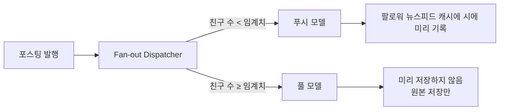
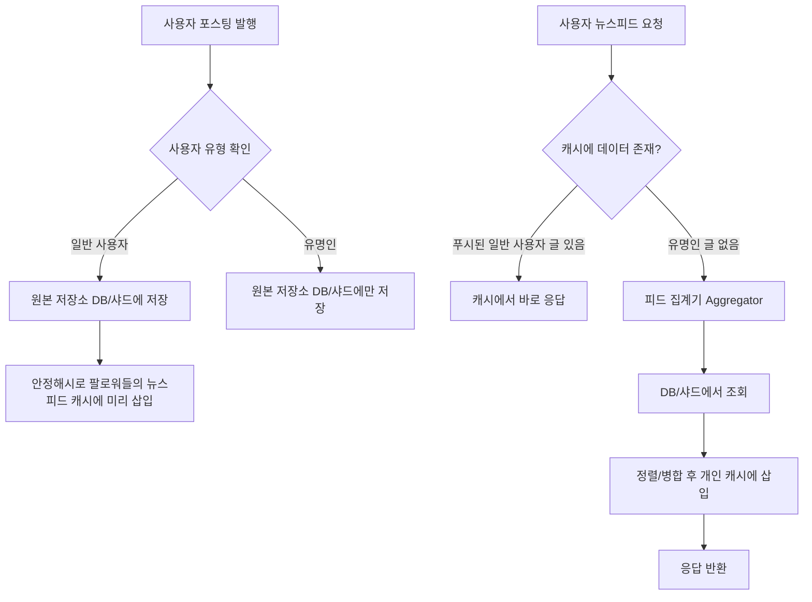

# 뉴스 피드 시스템
사용자가 팔로우 하거나 친구로 등록한 사람들의 최신 활동을 시간순 또는 추천 방식을 보여주는 기능으로   
대표적인 서비스로 인스타, 페이스북 등이 있다. 11장은 뉴스 피드 시스템의 설계 방법을 이야기한다.

## 뉴스피드 시스템의 주요 기능과 요구사항 정리
1. 웹 및 모바일 지원
2. 피드 발행
3. 피드 읽기
4. 최신순으로 표시
5. 한명의 사용자는 최대 5천명의 친구를 가질수 있고 매일 천만 명이 방문
6. 이미지, 비디오 등의 미디어 파일도 포함

## 두 가지 핵심 부분
1. 피드 발행: 사용자가 스토리를 포스팅하면 데이터를 캐시와 DB에 기록하고 새 포스팅은 친구의 뉴스 피드에도 전송한다.
2. 뉴스 피드 생성: 사용자가 뉴스 피드 화면을 요청했을 때 사용자가 최신 포스팅 목록을 보여주는 작업을 처리한다.

## 포스팅 전송(팬 아웃) 서비스
- 사용자의 새 포스팅을 친구 관계에 있는 모든 사용자에게 전달하는 과정으로 팬 아웃에는 2가지 모델이 있다.
- 쓰기 시점에 팬아웃과 읽기 시점에 팬아웃

### 쓰기 시 팬아웃(푸시 모델)
새로운 포스팅을 발행할 때 친구들의 뉴스 피드 캐시에 미리 저장한다. 친구들이 뉴스 피드를 가져오는 응답시간이 짧아진다.  
하지만 친구가 많은 사용자인 경우 사용자의 모두의 뉴스 피드를 갱신하는데 많은 시간이 소요될 수 있어 특정 서버에 부하를 초래된다.(핫키 문제)  
그리고 서비스를 자주 이용하지 않은 사용자의 피드까지 갱신하기에 자원이 낭비된다.

### 읽기 시 팬아웃(풀 모델)
사용자가 뉴스 피드를 요청할 때 친구들의 포스팅을 DB나 캐시에서 실시간으로 가져와 취합한다.  
데이터를 미리 친구에 푸시하는 작업이 필요 없어 핫키 문제도 발생하지 않고 비활성화한 사용자에는 미리 데이터를 저장할 필요가 없다.(저장 공간 절약)  
하지만 요청 시마다 복잡한 조회 및 정렬 작업으로 인해 응답 시간이 길어질 수 있다.

## 절충안
책에서는 두 가지 방법을 결합하여 장점은 취하고 단점은 버리는 전략을 사용한다.  
먼저 대부분의 일반 사용자에 대해서는 푸시 모델을 사용하고 팔로워 수가 매우 많은 사용자(연예인)의 경우에는 풀 모델을 사용해 시스템 과부하를 방지한다.  
그리고 안정 해시를 통해 요청과 데이터를 보다 고르게 분산하여 핫키 문제를 줄여준다.

- Dispatcher:글을 누가 썼는지 보고 푸시 방식으로 뿌릴지, 그냥 저장만 할지 결정하는 역할
- Aggregator: 캐시에 없으면 DB/샤드에서 글을 가져와서 정렬해서 보여주는 역할

### 비유 설명) 인스타 사용자 유형 Dispatcher 판단 처리 방식
| 사용자 유형            | Dispatcher 판단  | 처리 방식 |
|-------------------|----------------|-------|
| 일반 사용자 (팔로워 100명) | "바로 팬들에게 저장하자" | 푸시 모델 |
| 유명인 (팔로워 300만 명)  | "미리 저장하지 말고 요청 | 풀 모델  |

---
## 핫키 문제
특정 데이터나 서버에 트래픽이 비정상적으로 집중되어 해당 서버가 과부하로 느려지거나 다운되는 현상을 말한다.  
예시로 팔로워가 수백만 명인 유명인이 포스팅을 올린다. 이 포스팅 데이터를 서버 1에 저장 후   
수백만 명의 팔로워들이 동시에 이 포스팅을 보려고 서버 1에 요청을 보내며 다른 서버들은 한가한데 서버 1만 갑자기 엄청난 부하를 받아 시스템 전체의 병목 현상이 발생한다.  
이때 유명인의 데이터가 핫키가 된다.