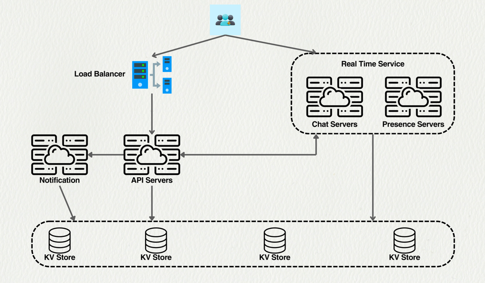
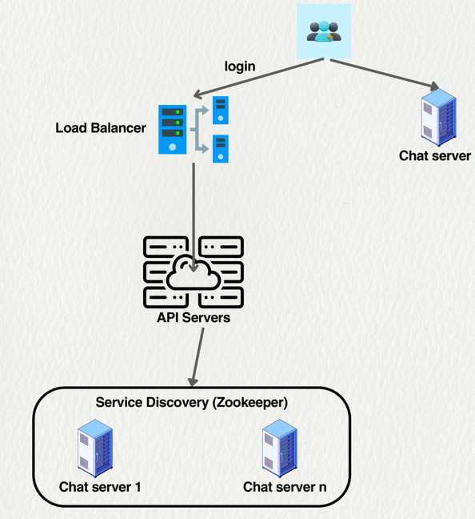
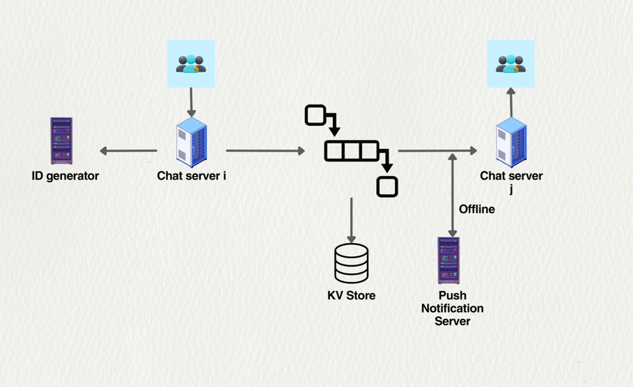
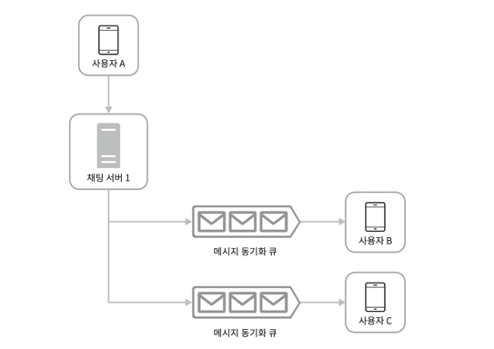
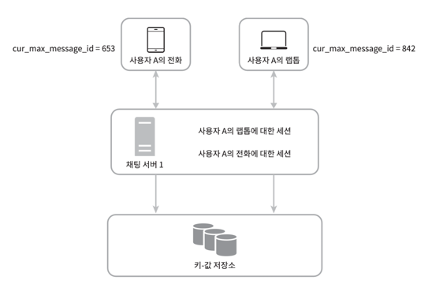

# 채팅 시스템 설계 (Design a Chat System)

본 문서는 5,000만 DAU(일일 활성 사용자)를 지원하는 채팅 시스템 설계를 다룹니다.

---

## 1. 요구 사항 (Requirements)

본 시스템 설계의 핵심 요구 사항은 다음과 같습니다.

### 핵심 기능
- **1:1 채팅**: 1:1 채팅 기능을 지원합니다.
- **소규모 그룹 채팅**: 최대 100명까지 참여 가능한 소규모 그룹 채팅을 지원합니다.
- **온라인 상태 표시**: 사용자의 현재 접속 상태(Online/Offline)를 표시합니다.
- **다중 기기 지원**: 여러 기기에서 동시에 동일 계정으로 로그인할 수 있어야 합니다.
- **푸시 알림**: 오프라인 상태일 때 메시지 수신을 알리는 푸시 알림을 지원합니다.

### 제한 사항
- 메시지는 텍스트만 가능하며 100k 크기 제한이 있습니다.
- 종단 간 암호화(End-to-end encryption)는 지원하지 않습니다.

---

## 2. 기본 메커니즘 (Chat System Basics)

클라이언트(모바일 또는 웹 앱)는 다른 클라이언트와 직접 통신하지 않습니다. 모든 통신은 중앙의 채팅 서비스를 통해 이루어집니다. 채팅 서비스는 메시지를 수신하고, 수신자가 온라인 상태가 될 때까지 메시지를 서버에 보관했다가 중계합니다.

###  통신 방식

메시지를 받는 방식은 여러 가지가 있으나, 본 설계에서는 **웹소켓(WebSocket)**을 채택합니다.

- **폴링(Polling)**: 클라이언트가 주기적으로 서버에 새 메시지가 있는지 묻는 방식입니다. 폴링 주기가 너무 짧으면 서버 오버헤드가 큽니다.
- **롱 폴링(Long Polling)**: 클라이언트가 요청을 보내면 서버는 새 메시지가 생기거나 타임아웃될 때까지 응답을 보류합니다. 하지만 서버는 클라이언트의 연결이 끊어졌는지 알기 어렵습니다.
- **웹소켓(WebSocket)**: 서버와 클라이언트 간의 비동기 업데이트를 위한 가장 일반적인 해결책입니다. HTTP 핸드셰이크 후, 양방향 영구 연결을 유지하여 발신자와 수신자 모두에게 적합합니다.

---

## 3. 상위 수준 설계 (High-Level Design)

시스템은 크게 세 가지 유형의 서비스로 구성되며, 로드 밸런서가 앞단에 위치합니다.

### 서비스 구성

**무상태 서비스 (Stateless services)**
- 로그인, 회원가입, 사용자 프로필 관리 등을 처리합니다.
- 다이어그램의 API Servers에 해당합니다.

**상태 서비스 (Stateful services)**
- 핵심 채팅 서비스입니다.
- 다이어그램의 Real Time Service에 해당합니다.
    - **채팅 서버 (Chat Servers)**: 실시간 메시징을 담당합니다.
    - **상태 서버 (Presence Servers)**: 사용자의 온라인 상태를 관리합니다.

**타사 연동 (Third-party integration)**
- 푸시 알림 등을 처리합니다.
- 다이어그램의 Notification에 해당합니다.



---

## 4. 스토리지 설계 (Storage)

### 🗃️ 데이터 유형별 저장소

**일반 데이터 (Generic Data)**
- 사용자 프로필, 설정, 친구 목록 등입니다.
- **저장소**: 안정적인 관계형 데이터베이스(Relational DB)를 사용합니다.
- **확장**: 복제(Replication) 및 샤딩(Sharding)을 통해 가용성과 확장성을 확보합니다.

**채팅 기록 (Chat History)**
- **특징**: 하루 600억 개의 메시지가 발생하는 거대한 데이터입니다. 1:1 채팅의 경우 읽기/쓰기 비율은 약 1:1입니다.
- **저장소**: 수평적 확장과 빠른 데이터 접근(low latency)을 위해 **키-값 저장소(Key-value storage)**를 사용합니다.

###  데이터 모델 (Data Model)

**1:1 채팅**
```
mesage_id: message_from, message_to, content, created_at
```

**그룹 채팅**
```
channel_id|message_id: user_id, content, created_at
```

---

## 5. 상세 설계 (Design Deep Dive)

###  서비스 디스커버리 (Service Discovery)

클라이언트가 어떤 채팅 서버에 연결해야 할지 결정하는 메커니즘입니다.

1. 사용자가 로그인을 시도합니다 (Load Balancer → API Servers).
2. API 서버는 **서비스 디스커버리(예: Apache Zookeeper)**에 클라이언트를 위한 최적의 채팅 서버를 요청합니다.
3. Zookeeper는 등록된 채팅 서버 목록 중에서 지리적 위치, 서버 용량 등의 기준에 따라 가장 적합한 서버를 추천합니다.

###  1:1 메시지 흐름 (1:1 Message Flow)

1. 사용자 A가 Chat Server i로 메시지를 보냅니다.
2. Chat Server i는 ID 생성기에서 새 message_id를 받습니다.
3. 메시지를 KV Store에 저장합니다.
4. 메시지는 사용자 B가 연결된 Chat Server j로 전달됩니다.
5. **(수신자 온라인 시)**: Chat Server j가 사용자 B에게 메시지를 즉시 전송합니다.
6. **(수신자 오프라인 시)**: 메시지가 푸시 알림 서버로 전송되어 사용자 B에게 알림을 보냅니다.

###  그룹 채팅 흐름 (Small Group Chat Flow)


그룹 채팅은 각 사용자별 **메시지 동기화 큐(Message Sync Queue)**를 활용하는 간단한 방식을 사용합니다.

- 각 클라이언트는 자신의 수신함(큐)만 확인하면 됩니다.
- **(참고)**: 이 방식은 대규모 그룹에서는 각 멤버에게 메시지를 저장해야 하므로 비용이 매우 비쌀 수 있습니다.

###  온라인 상태 관리 (Presence)

**1. 로그인 / 로그아웃**
- 사용자가 로그인하면, **상태 서버(Presence Server)**와 웹소켓(ws) 연결을 맺습니다.
- 상태 서버는 사용자의 온라인 상태를 KV Store에 저장합니다.
- 사용자가 로그아웃하면 API 서버를 통해 연결을 종료합니다.

**2. 연결 끊김 처리 (Heartbeat)**

네트워크 문제 등으로 일시적 연결이 끊길 때마다 '오프라인'으로 처리하면 사용자 경험이 나쁩니다.

- **하트비트(Heartbeat) 메커니즘**을 사용합니다: 클라이언트는 주기적으로 (예: 5초마다) 상태 서버에 "살아있음" 신호(하트비트 이벤트)를 보냅니다.
- 이 신호가 일정 시간 동안 오지 않으면 서버는 해당 클라이언트를 '오프라인'으로 처리합니다.

**3. 상태 팬아웃 (Online Status Fanout)**
- 사용자 A의 친구들은 상태 서버에 사용자 A의 상태를 **구독(subscribe)**합니다.
- 사용자 A의 상태가 변경되면(온라인 → 오프라인), 상태 서버는 이를 구독 중인 모든 친구에게 알립니다.
- **(참고)**: 그룹이 클 경우 모든 멤버에게 상태를 알리는 것은 비용이 비쌉니다. 이때는 사용자가 그룹에 입장하거나 수동으로 친구 목록을 새로 고칠 때만 상태를 가져오도록 할 수 있습니다.

###  다중 기기 동기화 (Message Synchronization)


여러 기기 간의 메시지 동기화는 각 기기에 `cur_max_message_id` (현재 기기가 가진 마지막 메시지 ID) 변수를 유지함으로써 관리됩니다. (slack은 아닌거 같기도...? 폰으로 본 내용 노트북에도 본걸로 되어있음)

- 새 기기로 로그인하거나 앱을 켤 때, 기기는 자신의 `cur_max_message_id`보다 큰 `message_id`를 가진 메시지를 KV 저장소에서 가져와 동기화합니다.

---

## 6. 검토 및 향후 논의 (Design Review)

### 향후 논의 사항
1. 미디어 파일을 채팅 서버에서 직접 처리할 것인가, 별도 미디어 서버를 둘 것인가?
2. 업로드 플로우: 채팅 메시지와 함께? 아니면 선업로드 후 URL만 전송?
3. 저장소 선택: S3 같은 객체 스토리지 vs CDN 직접 연동
4. 썸네일 생성, 미디어 메타데이터 추출은 어느 시점에?
5. 대용량 파일(예: 2GB 영상)은 어떻게 처리? 분할 업로드? 토렌트 방식?
