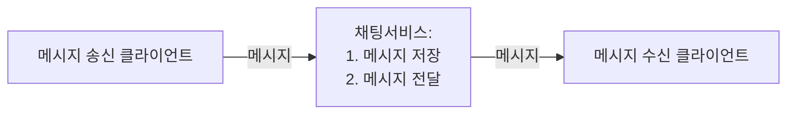
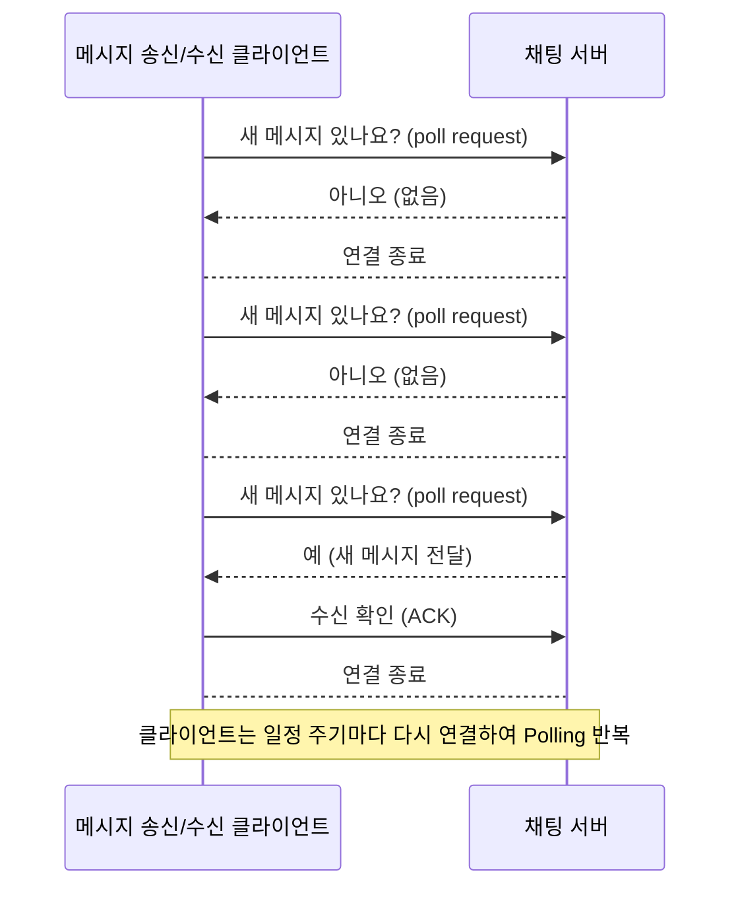
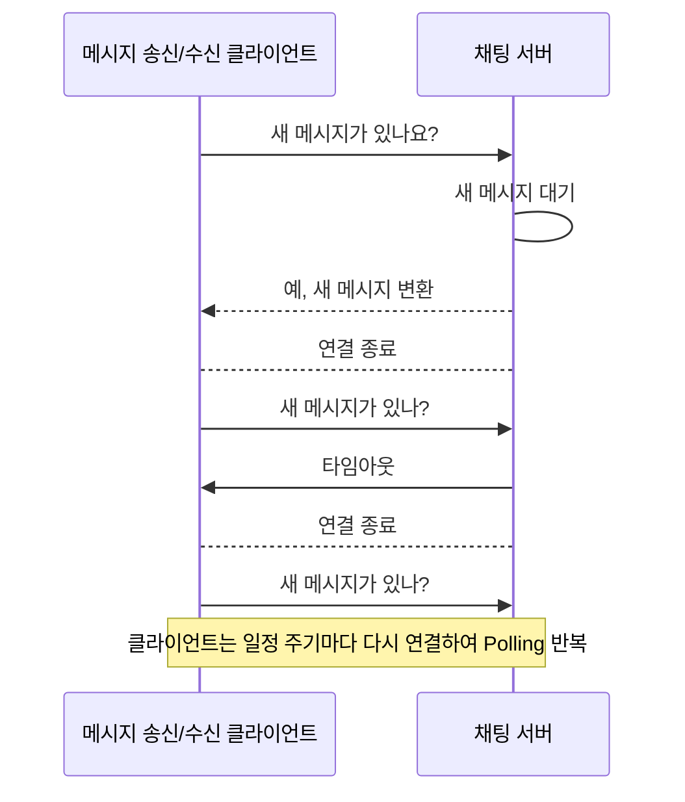
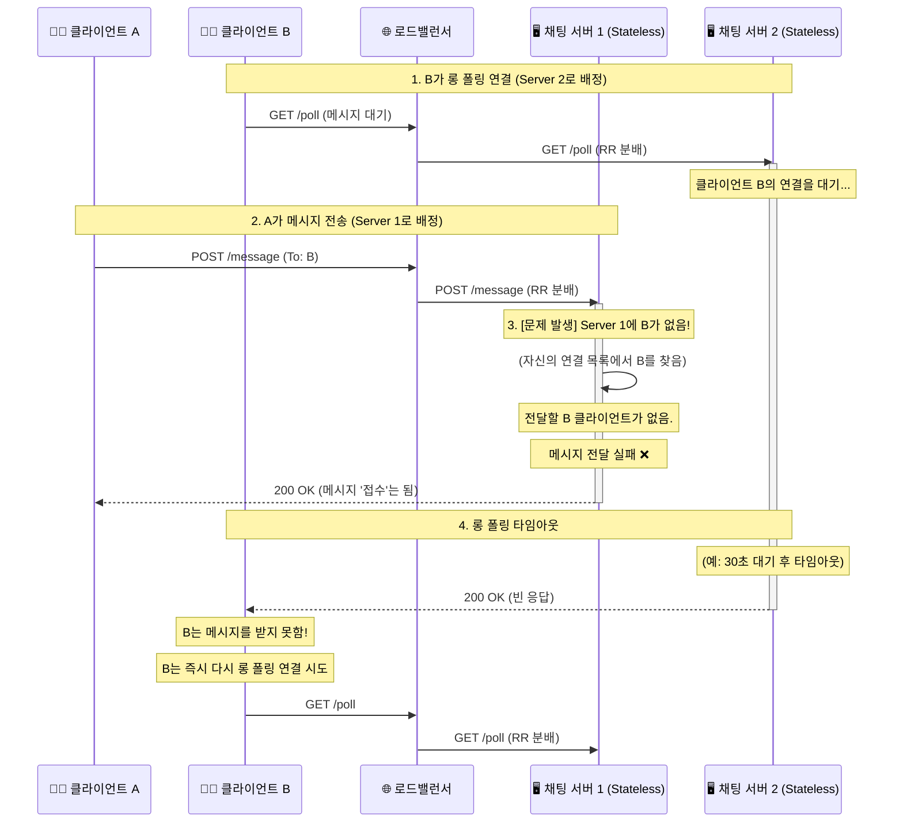
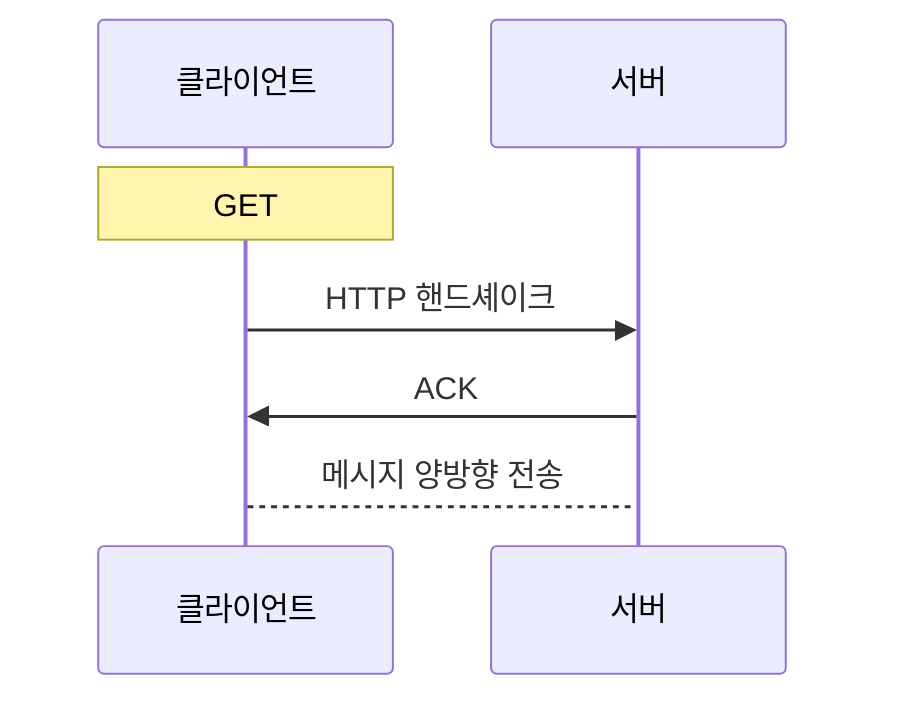
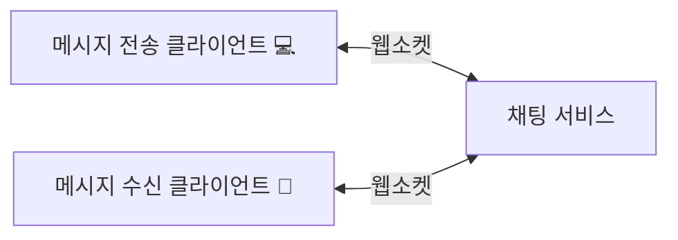
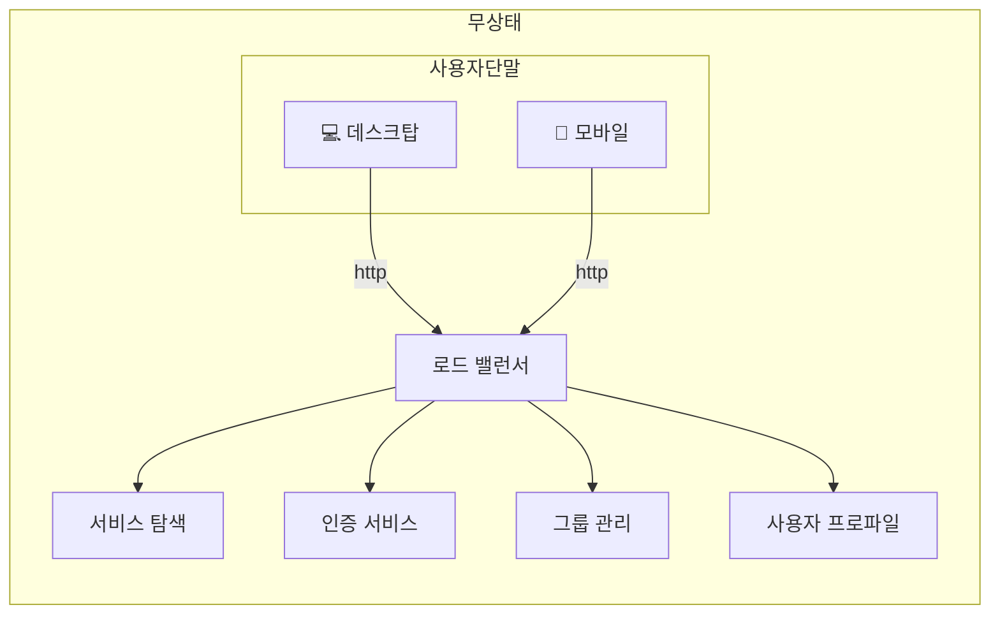
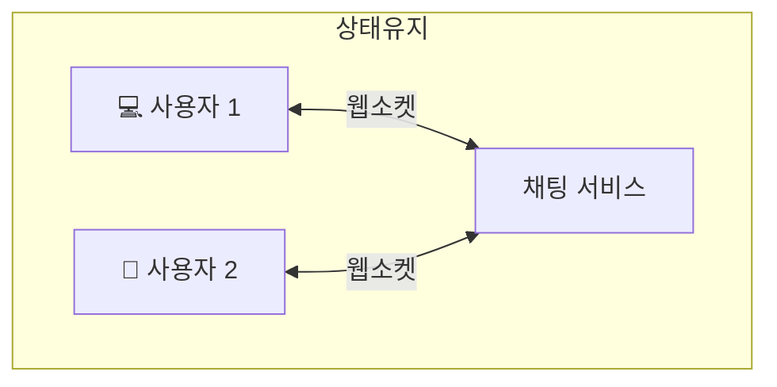
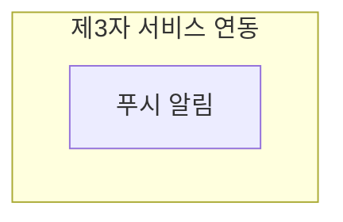
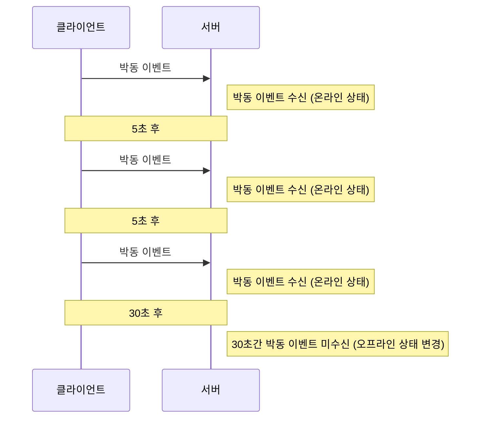

채팅 앱이라고 했을 때 일대일 채팅 앱일 수도, 그룹 채팅 앱일 수도 있으니 설계할 때 기능 요구사항을 확실히 알아두도록 하자.

# 1단계. 문제 이해 및 설계 범위 확정

* 1:1 채팅
  * Facebook messenger
  * WeChat
  * WhatsApp
* 그룹 채팅
  * Slack
* 대규모 그룹의 소통과 latency가 낮음 음성 채팅
  * Discord

```
질문 >> 적어도 1:1 채팅 앱인지 그룹 채팅 앱인지 정도는 알아내야 한다.

* 어떤 앱 설치? > 1:1 채팅 앱? 그룹 채팅 앱?
* 모바일 앱? 웹 앱?
* 트래픽 규모?
* 그룹 채팅의 경우 인원 제한은?
* 중요 기능은? 첨부파일도 지원해야 하는지?
* 메시지 길이 제한은?
* 종단 간 암호화 지원은?
* 채팅 이력 보관 기한은?
```

페이스북 메신저와 유사한 채팅 앱을 아래 기능들을 갖도록 설계해 보자.
* 응답지연이 낮은 1:1 채팅 기능
* 최대 100명까지 참여할 수 있는 그룹 채팅 기능
* 사용자의 접속상태 표시 기능
* 다양한 단말 지원. 하나의 계정으로 여러 단말에 동시 접속 지원
* 푸시 알림
* 5천만 DAU 처리

# 2단계. 개략적 설계안 제시 및 동의 구하기
* 클라이언트와 서버의 통신 방법에 대한 기본적 지식
  * 채팅 시스템의 경우
    * 클라이언튼느 모바일 앱 or 웹 애플리케이션
  * 클라이언트는 서로 직접 통신 X
  * 각 클라이언트는 위에 나열한 모든 기능을 지원하는 채팅 서비스와 통신
  * 기능 제공
    * 클라이언트들로부터 메시지 수신
    * 메시지 수신자 결정 및 전달
    * 수신자가 접속 상태가 아닌 경우에는 접속할 때까지 해당 메시지 보관

클라이언트(메시지 송신 클라이언트와 수신 클라이언트)와 채팅 서비스 사이의 관계를 요약해 보자.

* 채팅 서비스와의 접속으로 HTTP 프로토콜 사용
  * keep-alive 헤더를 사용하면 효율적이다.
    * 클라이언트와 서버 사이의 연결을 끊지 않고 계속 유지할 수 있다. 
    * TCP 접속 과정에서 발생하는 handshake 횟수를 줄일 수 있다.

* 메시지 수신 시나리오
  * 서버가 연결을 만드는 것처럼 동작할 수 있도록 하는 기법
    * **polling**
    * **long polling**
    * **WebSocket**
  > HTTP는 클라이언트가 연결을 만드는 프로토콜이며, 서버에서 클라이언트로 임의 시점에 메시지를 보내는 데는 쉽게 쓰일 수 없다.

## polling
폴링은 클라이언트가 주기적으로 서버에게 새 메시지가 있냐고 물어보는 방법이다.

폴링 비용은 폴링을 자주하면 할수록 올라간다.   
즉, 서버 자원이 불필요하게 낭비될 수 있다.



## long polling


롱 폴링의 경우 클라이언트는 새 메시지가 반환된거나 타임아웃 될 때까지 연결을 유지한다.

클라이언트는 새 메시지를 받으면 기존 연결을 종료하고 서버에 새로운 요청을 보내어 모든 절차를 다시 시작한다.

### 약점
* 송/수신 클라이언트의 채팅 서버가 서로 다를 수 있다.
    * HTTP 서버들은 보통 stateless 서버
    * 로드밸런싱을 위한 RR 알고리즘을 사용하는 경우
        * 메시지를 받은 서버는 해당 메시지를 수신할 클라이언트와의 롱 폴링 연결을 가지고 있지 않은 서버일 수 있다.
* 서버 입장에서는 클라이언트가 연결을 해제했는지 아닌지 알 좋은 방법이 없다.



## WebSocket
웹소켓은 서버가 클라이언트에게 비동기 메시지를 보낼 때 가장 널리 사용하는 기술이다.



웹 소켓 연결은 클라이언트가 시작한다.   
한번 맺어진 연결은 항구적이며 양방향이다.

웹소켓은 일반적으로 방화벽이 있는 환경에서도 잘 동작한다.   
80이나 3332처럼 HTTP 혹은 HTTPS 프로토콜이 사용하는 기본 포트번호를 그대로 쓰기 때문이다.



웹소켓을 이용하면 메시지를 보낼 때나 받을 때 동일한 프로토콜을 사용할 수 있으므로 설계뿐 아니라 구현도 **단순하고 직관적**이다.

웹소켓 연결은 항구적으로 유지되어야 하기 때문에 **서버 측에서 연결 관리**를 효율적으로 해야 한다는 것을 유의하자.

## 개략적 설계안
클라이언트와 서버 사이에 굳이 웹소켓을 쓸 필요가 없는 부분으로 회원가입, 로그인, 사용자 프로파일 등은 일반적인 HTTP상에서 구현해도 된다.

### 무상태 서비스
무상태 서비스는 로그인, 회원가입, 사용자 프로파일 표시 등을 처리하는 전통적인 요청/응답 서비스다.

무상태 서비스는 로드밸런서 뒤에 위치한다.   
이 로드밸런서가 하는 일은 요청을 그 경로에 맞는 서비스로 정확하게 전달하는 것이다.



서비스 탐색(service discovery) 서비스는 클라이언트가 접속할 채팅 서버의 DNS 호스트명을 클라이언트에게 알려주는 역할을 한다.

### 상태유지(stateful) 서비스
각 클라이언트가 채팅 서버와 독립적인 네트워크 연결을 유지해야 하기 때문에 채팅 서비스에 상태 유지가 필요하다.



### 제3자 서비스 연동


채팅 앱에서 가장 중요한 제3자 서비스는 푸시 알림이다.

새 메시지를 받았다면 설사 앱이 실행 중이지 않더라도 알림을 받아야 한다.

### 규모 확장성
서버 한대로 얼마나 많은 접속을 동시에 허용할 수 있느냐를 따져봐야 한다.

지금까지 설명한 모든 것을 하나로 묶어보자.


유의할 것은 실시간으로 메시지를 주고받기 위해 클라이언트는 채팅 서버와 웹소켓 연결을 끊지 않고 유지한다는 것이다.
* 채팅 서버는 클라이언트 사이에 메시지를 중계하는 역할을 담당한다.
* 접속상태 서버(presence server)는 사용자의 접속 여부를 관리한다.
* API 서버는 로그인, 회원가입, 프로파일 변경 등 그 외 나머지 전부를 처리한다.
* 알림 서버는 푸시 알림을 보낸다.
* key-value 저장소에는 채팅 이력을 보관한다.

### 저장소
RDB를 쓸 지, NoSQL을 쓸 지, 어떤 데이터베이스를 쓰느냐가 중요하다.   
따져야 할 것은, 데이터의 유형과 read/write 연산의 패턴이다.

채팅 시스템이 다루는 데이터는 보통 두 가지다.
1. 일반적인 데이터
   * 사용자 프로파일
   * 설정
   * 친구 목록
   > 안정성을 보장하는 RDB에 보관
2. 채팅 시스템에 고유한 데이터
   * 채팅 이력
     * 채팅 이력 데이터는 대규모
       > 페이스북 메시저나 왓츠앱은 매일 600억 개의 메시지를 처리
     * 빈번하게 사용되는 것은 주로 최근에 주고받은 메시지
     * 검색 기능, 특정 사용자가 mention된 메시지, 특정 메시지로 jump로 인한 무작위적인 데이터 접근
     * 1:1 채팅 앱의 경우 read:write 비율은 대략 1:1

이 모두를 지원할 데이터베이스를 고르는 것은 아주 중요한 일이다.   
**key-value 저장소**를 추천할 이유는 아래와 같다.
* 수평적 규모확장이 쉽다.
* 데이터 접근 latency가 낮다.
* RDB는 데이터 가운데 long tail에 해당하는 부분을 잘 처리하지 못하는 경향이 있다.
  * 인덱스가 커지면 데이터에 대한 무작위적 접근을 처리하는 비용이 늘어난다.
* 페이스북 메신저는 HBase, 디스코드는 Cassandra를 이용하고 있다.

## 데이터 모델
### 1:1 채팅을 위한 메시지 테이블

|                |            | |
|----------------|------------|---|
| **message_id** | **bigint** |**PK**|
| message_from   | bigint     |
| message_to     | bitint     |
| content        | text       |
| created_at     | timestamp  |

서로 다른 두 메시지가 동시에 만들어질 수도 있기 때문에 created_at을 사용하여 메시지 순서를 정할 수는 없다.

### 그룹 채팅을 위한 메시지 테이블

|                |        | |
|----------------|--------|---|
| **channel_id** | bigint | PK |
| **message_id** | bigint | PK |
| message_to     | bitint |
| content        | text   |
| created_at     | timestamp  |

channel은 채팅 그룹과 같은 뜻이다.   
channel_id는 partition key로도 사용할 것인데, 그룹 채팅에 적용될 모든 질의는 특정 채널을 대상으로 할 것이기 때문이다.

### 메시지 ID
message_id는 메시지들의 순서도 표현할 수 있어야 하므로, 아래와 같은 속성을 만족해야 한다.
* message_id의 값은 고유해야 한다. (uniqueness)
* ID 값은 정렬 가능해야 하며 시간 순서와 일치해야 한다.

* RDBMS
  * auto_increment
* NoSQL
  * Snowflake 같은 전역적 64-bit 순서 번호(sequence number) 생성기 이용
* 지역적 순서 번호 생성기(local sequence number generator)
  * 지역적: ID의 유일성은 같은 그룹 안에서만 보증하면 충분
    * 메시지 사이의 순서는 같은 채널, 혹은 같은 1:1 채팅 세션 안에서만 유지되면 충분
  * 전역적 ID 생성기에 비해 구현하기 쉬운 접근법

# 3단계. 상세 설게
## 서비스 탐색
서비스 탐색 기능의 주된 역할은 클라이언트에게 가장 적합한 채팅 서버를 추천하는 것이다.   
이때 사용되는 기준으로는 클라이언트의 위치, 서버의 용량 등이 있다.   

서비스 탐색 기능을 구현하기 위한 오픈 소스로 Zookeeper같은 것이 있다.   
사용 가능한 모든 채팅 서버를 여기 등록시켜 두고, 클라이언트가 접속을 시도하면 사전에 정한 기준에 따라 최적의 채팅 서버를 골라 주면 된다.

주키퍼로 구현한 서비스 탐색 기능이 어떻게 동작하는지 보자.


1. 사용자 A가 시스템에 로그인을 시도한다.
2. 로드밸런서가 로그인 요청을 API 서버들 가운데 하나로 보낸다.
3. API 서버가 사용자 인증을 처리하고 나면 서비스 탐색 기능이 동작하여 해당 사용자를 서비스할 최적의 채팅 서버를 찾는다.
4. 사용자 A는 (선택된) 채팅 서버 2와 웹소켓 연결을 맺는다.

## 메시지 흐름
### 1:1 채팅 메시지 처리 흐름


1. 사용자 A가 채팅 서버 1로 메시지 전송
2. 채팅 서버 1은 ID 생성기를 사용해 해당 메시지의 ID 결정
3. 채팅 서버 1은 해당 메시지를 메시지 동기화 큐로 전송
4. 메시지가 키-값 저장소에 보관됨
5. (a) 사용자 B가 접속 중인 경우 메시지는 사용자 B가 접속 중인 채팅 서버로 전송됨   
   (b) 사용자 B가 접속 중이 아니라면 푸시 알림 메시지를 푸시 알림 서버로 보냄
6. 채팅 서버 2는 메시지를 사용자 B에게 전송 (사용자 B와 채팅 서버 2 사이에는 웹소켓 연결이 있는 상태이므로 그것을 이용)

### 여러 단말 사이의 메시지 동기화


사용자 A가 전화기에서 채팅 앱에 로그인한 결과로 채팅 서버 1과 해당 단말 사이에 웹소켓 연결이 만들어져 있고,   
랩톱에서 로그인한 결과로 역시 별도 웹소켓이 채팅 서버 1에 연결되어 있는 상황이다.

해당 단말에서 관측된 가장 최신 메시지의 ID를 추적하는 용도로 단말마다 별도로 유지 관리하는 cur_max_message_id 변수를 사용한다.   
아래 두 조건을 만족하는 메시지는 새 메시지로 간주한다.
* 수신자 ID가 현재 로그인한 사용자 ID와 같다.
* 키-값 저장소에 보관된 메시지로서, 그 ID가 cur_max_message_id보다 크다.

### 소규모 그룹 채팅에서의 메시지 흐름
1:1 채팅에 비해 그룹 채팅에서의 메시지 흐름은 조금 더 복잡하다.


위 설계안은 소규모 그룹 채팅에 적합하며, 이유는 아래와 같다.
* 새로운 메시지가 왔는지 확인하려면 자기 큐만 보면 되니까 메시지 동기화 플로가 단순하다.
* 그룹이 크지 않으면 메시지를 수신자별로 복사해서 큐에 넣는 작업의 비용이 문제가 되지 않는다.
> WeChat이 이런 접근법을 쓰고 있으며, 그룹의 크기는 500명으로 제한하고 있다.

<br />

많은 사용자를 지원해야 하는 경우라면 똑같은 메시지를 모든 사용자의 큐에 복사하는 게 바람직하지 않을 것이다.   
따라서 한 수신자는 여러 사용자로부터 오는 메시지를 수신할 수 있어야 한다.


## 접속상태 표시
접속상태 서버를 통해 사용자의 상태를 관리한다.   
접속상태 서버는 클라이언트와 웹소켓으로 통신하는 실시간 서비스의 일부라는 점에 유의하자.

### 사용자 로그인


클라이언트와 실시간 서비스 사이에 웹소켓 연결이 맺어지고 나면,   
접속상태 서버는 A의 상태와 last_active_at 타입스탬프 값을 키-값 저장소에 보관한다.   
이 절차가 끝나고 나면 해당 사용자는 접속 중인 것으로 표시될 것이다.

### 로그아웃


키-값 저장소에 보관된 사용자 상태가 online에서 offline으로 바뀌게 된다는 점에 유의하자.

### 접속 장애
사용자의 인터넷이 끊어진 장애에 대응하는 간단한 방법은 사용자를 오프라인 상태로 표시하고 연결이 복구되면 온라인 상태로 변경하는 것이다.   
하지만 짧은 시간 동안 인터넷 연결이 끊어졌다 복구되는 일이 벌어질 때마다 사용자의 접속 상태를 변경한다면, 리소스를 낭비하게 될 것이다.

박동(heartbeat) 검사를 통해 이 문제를 해결하자.   

즉, 온라인 상태의 클라이언트로 하여금 주기적으로 박동 이벤트를 접속상태 서버로 보내도록 하고,   
마지막 이벤트를 받은 지 x초 이내에 또 다른 박동 이벤트 메시지를 받으면 해당 사용자의 접속상태를 계속 온라인으로 유지하는 것이다.



### 상태 정보의 전송
그렇다면 사용자 A와 친구 관계에 있는 사용자들은 어떻게 해당 사용자의 상태 변화를 알게 될까?

상태정보 서버는 발행-구독(publish-subscribe) 모델을 사용하는데,   
즉 각각의 친구관계마다 채널을 하나씩 두는 것이다.

* A의 접속상태 변경
  * A-B 채널 사용
  * A-C 채널 사용
  * A-D 채널 사용
  > 클라이언트와 서버 사이의 통신에는 실시간 웹소켓을 사용   

이 방안은 그룹 크기가 작을 때는 효과적이다.

WeChat은 그룹 크기 상한을 500으로 제한하고 있어서 이와 유사한 접근법을 사용할 수 있었다.

그룹 크기가 더 커지면 이런 식으로 접속상태 변화를 알려서는 비용이나 시간이 많이 들게 되므로 좋지 않다.


이런 성능 문제를 해소하는 한 가지 방법은 사용자가 그룹 ㅐ팅에 입장하는 순간에만 상태 정보를 읽어가게 하거나,   
친구 리스트에 있는 사용자의 접속상태를 갱신하고 싶으면 수동으로 하도록 유도하는 것이다.

# 4단계. 마무리
1:1 채팅과 그룹 채팅을 전부 지원하는 채팅 시스템의 아키텍처를 살펴보았다.
* 주요 컴포넌트
  * 웹소켓
    * 클라이언트와 서버 사이의 실시간 통신 가능
  * 실시간 메시징 지원
    * 채팅 서버
    * 접속 상태 서버
    * 푸시 알림 서버
  * 키-값 저장소
    * 채팅 이력 보관
  * API 서버 등

아래와 같은 면접 내용을 논의해도 좋다.
* 채팅 앱을 확장하여 사진이나 비디오 등의 미디어를 지원하도록 하는 방법
  * 미디어 파일은 텍스트에 비해 크기가 크다.
  * 그와 관련하여 압축 방식, 클라우드 저장소, 썸네일 생성 등이 있다.
* 종단 간 암호화
  * 왓츠앱은 메시지 전송에 있어 종단 간 암호화를 지원한다.
* 캐시
  * 클라이언트에 이미 읽은 메시지를 캐시해 두면 서버와 주고받는 데이터 양을 줄일 수 있다.
* 로딩 속도 개선
  * 슬랙은 사용자의 데이터, 채널 등을 지역적으로 분산하는 네트워크를 구축하여 앱 로딩 속도를 개선했다.
* 오류 처리
  * 채팅 서버 하나에 수십만 사용자가 접속해 있는 상황
    1. 서버 하나가 죽으면 주키퍼 같은 서비스 탐색 기능이 동작
    2. 클라이언트에게 새로운 서버를 배정
    3. 다시 접속할 수 있도록 지원
  * 메시지 재전송
    * retry나 queue는 메시지의 안정적 전송을 보장하기 위해 흔히 사용되는 기법이다.

---

# 📚 실제 적용 사례 (Real-World Applications)

<details>
<summary><b>1️⃣ Facebook Messenger</b></summary>

- **특징:** 1:1 및 그룹 채팅, 멀티 디바이스 동기화  
- **기술 포인트:** WebSocket, Cassandra, HBase, Push Notification  
- **핵심 설계:** 실시간 양방향 통신 + 오프라인 메시지 저장  
</details>

<details>
<summary><b>2️⃣ Slack</b></summary>

- **특징:** 대규모 그룹 채팅, 메시지 검색/히스토리  
- **기술 포인트:** Pub/Sub, Presence Server, Redis Cache  
- **핵심 설계:** 실시간 메시징 + 사용자 상태 동기화  
</details>

<details>
<summary><b>3️⃣ WhatsApp</b></summary>

- **특징:** 종단 간 암호화, 전 세계 20억 사용자  
- **기술 포인트:** Signal Protocol, Persistent TCP Connection  
- **핵심 설계:** 보안 중심, 네트워크 품질 낮은 환경에서도 안정적 동작  
</details>

<details>
<summary><b>4️⃣ Discord</b></summary>

- **특징:** 텍스트/음성 채팅, 대규모 실시간 동시성  
- **기술 포인트:** Sharding, Gateway Architecture, WebSocket  
- **핵심 설계:** 수평 확장 가능한 연결 관리  
</details>

<details>
<summary><b>5️⃣ LINE</b></summary>

- **특징:** 다양한 알림 및 콘텐츠 전달 지원  
- **기술 포인트:** Kafka 기반 메시지 큐, 서버 분산 처리  
- **핵심 설계:** 대용량 트래픽 처리와 메시지 내구성 보장  
</details>

---

# 💬 토론 주제 (Discussion Topics)

<details>
<summary><b>1️⃣ Polling, Long Polling, WebSocket 중 어떤 것이 적합할까?</b></summary>

- **Polling:** 주기적 요청, 서버 부하 증가  
- **Long Polling:** 응답 지연 기반 실시간 유사 통신  
- **WebSocket:** 연결 유지 기반 양방향 통신  
> 대규모 실시간 채팅에서는 WebSocket이 가장 효율적
</details>

<details>
<summary><b>2️⃣ 상태유지 vs 무상태 아키텍처</b></summary>

- 채팅 서버는 연결 상태를 유지해야 하므로 **상태유지(Stateful)**  
- 인증/프로필 서버는 요청 단위로 처리되므로 **무상태(Stateless)**  
> 서비스별로 성격에 따라 혼합 설계 필요
</details>

<details>
<summary><b>3️⃣ RDB vs NoSQL 선택 기준</b></summary>

- **RDB:** 트랜잭션, 관계형 데이터, 복잡한 질의에 강함  
- **NoSQL:** 대규모 쓰기, 빠른 조회, 수평 확장에 강함  
> 채팅 시스템은 메시지 로그 중심이라 NoSQL이 일반적
</details>

<details>
<summary><b>4️⃣ 그룹 채팅에서 메시지 전달 효율화 방법</b></summary>

- 소규모 그룹: 모든 사용자에게 즉시 fan-out  
- 대규모 그룹: 메시지 스토리지에 저장 후 각 사용자가 pull  
> Slack 등은 hybrid 방식으로 fan-out 부담을 줄임
</details>

<details>
<summary><b>5️⃣ Presence(접속 상태) 관리 전략</b></summary>

- Heartbeat(박동) 기반 상태 확인  
- Redis/Zookeeper로 상태 공유  
- 구독 기반으로 상태 변경 알림(Pub/Sub)
</details>

<details>
<summary><b>6️⃣ 장애 대응 전략</b></summary>

- 메시지 큐 기반 재전송 (Kafka, RabbitMQ)  
- ACK 메커니즘으로 수신 확인  
- 장애 시 큐에서 복구하여 재처리  
> “At least once delivery” 보장이 핵심
</details>

<details>
<summary><b>7️⃣ 보안과 암호화(E2EE) 적용 시 고려사항</b></summary>

- 서버는 메시지 내용을 알 수 없음 → 검색, 신고 기능 제약  
- 클라이언트 단에서 암호화/복호화 수행  
- 키 관리 프로토콜: **Signal Protocol**
</details>

---

# 🎯 면접 핵심 내용 (Key Interview Q&A)

<details>
<summary><b>1️⃣ WebSocket이 Long Polling보다 효율적인 이유는?</b></summary>

- 지속적인 연결로 네트워크 오버헤드 최소화  
- 서버가 클라이언트로 직접 푸시 가능  
- 초당 메시지 수가 많을수록 효율 증가  
</details>

<details>
<summary><b>2️⃣ 메시지 순서를 보장하는 방법은?</b></summary>

- 각 대화방 단위 **Monotonic Sequence ID** 생성  
- 서버 간 시간 동기화(NTP) 필수  
- 장애 시 전역 시퀀스보다 로컬 단위 시퀀스가 효율적  
</details>

<details>
<summary><b>3️⃣ 서버 장애 시 메시지 유실을 막는 방법은?</b></summary>

- Kafka, RabbitMQ로 메시지 내구성 확보  
- ACK, Retry, Dead Letter Queue 사용  
- 메시지 상태(`SENT`, `DELIVERED`, `READ`)로 추적 가능  
</details>

<details>
<summary><b>4️⃣ Push 알림은 앱이 꺼져 있을 때 어떻게 전달하나?</b></summary>

- iOS: APNs, Android: FCM 사용  
- 서버 → OS Push Gateway → 클라이언트 순서로 전달  
- 실시간 소켓 연결이 없는 상황을 보완  
</details>

<details>
<summary><b>5️⃣ 멀티 디바이스 동기화는 어떻게 처리하나요?</b></summary>

- 각 디바이스별 `last_read_message_id` 관리  
- 새 기기 로그인 시 Sync Queue로 미수신 메시지 동기화  
- WhatsApp은 Primary Device 복제 구조 사용  
</details>

<details>
<summary><b>6️⃣ 대규모 연결(WebSocket 수백만 개)을 어떻게 관리하나요?</b></summary>

- 연결을 여러 게이트웨이 서버로 Sharding  
- Sticky Session + L4/L7 Load Balancer  
- Zookeeper로 서비스 탐색 및 연결 재조정  
</details>

<details>
<summary><b>7️⃣ E2EE 환경에서 메시지 검색이나 신고 기능은?</b></summary>

- 클라이언트 단 로컬 검색만 가능  
- 신고 시 암호문 제출 + 키 제공 동의 필요  
> 보안과 기능성의 균형을 설계 수준에서 고민해야 함
</details>

---

# 🧠 핵심 요약

- **핵심 기술:** WebSocket, Kafka, Redis, Zookeeper, NoSQL  
- **핵심 포인트:**  
  - 실시간성 & 확장성  
  - 메시지 순서/중복 보장  
  - Presence 및 Push 통합 설계  
  - 장애 복구와 데이터 일관성  
  - 보안(E2EE) 및 멀티 디바이스 동기화

> 💡 면접 팁:  
> 채팅 시스템은 실시간 통신, 분산 시스템, 확장성, 장애 대응 능력을 종합적으로 평가하는 주제입니다.  
> “WebSocket 구조 + 메시지 보장 + Presence + 복구 전략”을 자신 있게 설명하면 강한 인상을 줄 수 있습니다.
