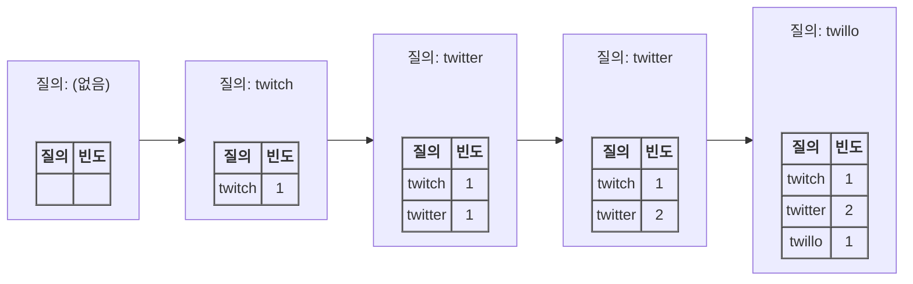
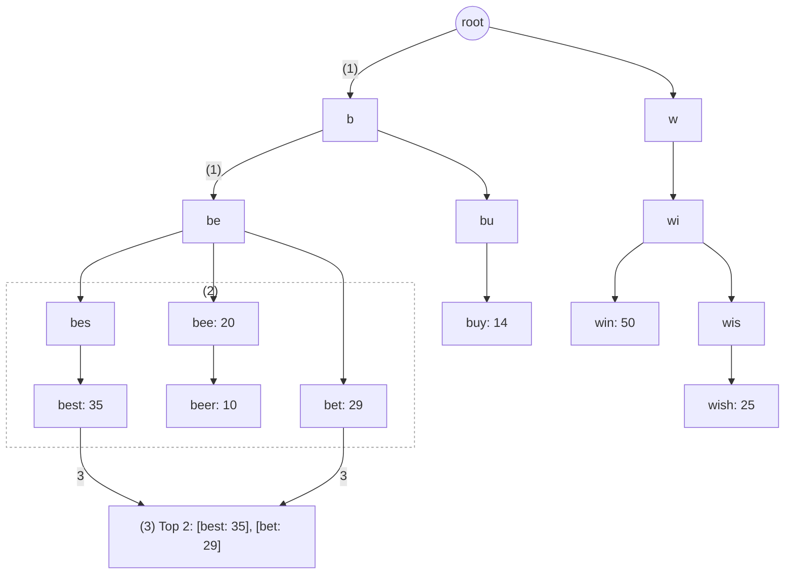
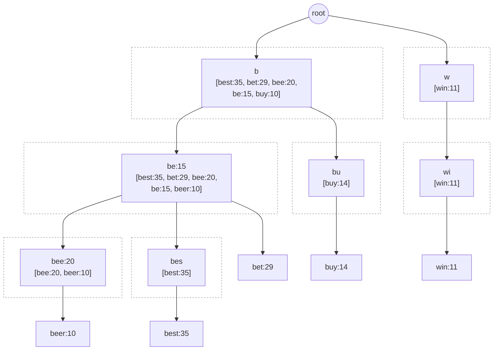
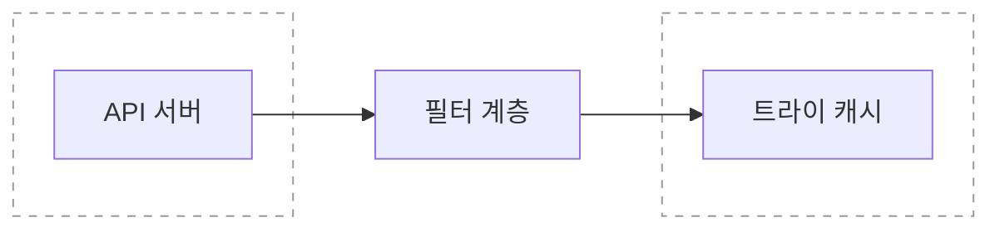
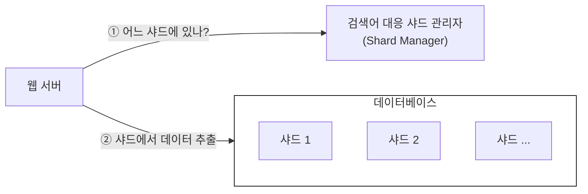

# 1단계. 문제 이해 및 설계 범위 확정
```
질문
* 사용자가 입력하는 단어가 자동완성될 검색어의 첫 부분인가? 중간 부분인가?
* 자동완성 검색어 n개 표시?
* 자동완성 검색어 n개를 고르는 기준은?
* 맞춤법 검사 기능도 제공?
* 질의는 영어?
* 대문자나 특수 문자 처리?
* DAU는?
```

## 요구사항
* 빠른 응답 속도
  * 페이스북 검색어 자동완성 시스템에 관한 문서를 보면 시스템 응답속도는 100밀리초 이내여야 한다.
* 연관성
  * 자동완성되어 출력되는 검색어는 사용자가 입력한 단어와 연관된 것이어야 한다.
* 정렬
  * 시스템의 계산 결과는 인기도 등의 순위 모델에 의해 정렬되어 있어야 한다.
* 규모 확장성
  * 시스템은 많은 트래픽을 감당할 수 있도록 확장 가능해야 한다.
* 고가용성
  * 시스템의 일부에 장애가 발생하거나, 느려지거나, 예상치 못한 네트워크 문제가 생겨도 시스템은 계속 사용 가능해야 한다.

## 개략적 규모 추정
* 일간 능동 사용자(DAU)는 천만 명으로 가정
* 평균적으로 한 사용자는 매일 10건의 검색을 수행한다고 가정
* 질의할 때마다 평균적으로 20바이트의 데이터를 입력한다고 가정
  * 문자 인코딩 방법으로는 아스키를 사용한다고 가정
    * 1문자 = 1바이트
  * 질의문은 평균적으로 4개 단어로 이루어진다고 가정
    * 각 단어는 평균적으로 다섯 글자로 구성된다고 가정
    * 질의당 평균 4 X 5 = 20바이트
* 검색창에 글자를 입력할 때마다 클라이언트는 검색어 자동완성 백엔드에 요청
  * 평균적으로 1회 검색당 20건의 요청이 백엔드로 전달됨
  ```
  예시) dinner 입력 시 순차적으로 백엔드에 전송되는 요청
  
  1. search?q=d
  2. search?q=di
  3. search?q=din
  4. search?q=dinn
  5. search?q=dinne
  6. search?q=dinner
  ```
* 대략 초당 24,000건의 질의(QPS)가 발생
  * 24,000건의 질의(QPS) = `10,000,000사용자 X 10질의 / 일 X 20자 / 24시간 / 3600초`
* 질의 가운데 20% 정도는 신규 검색어라고 가정
  * 대략 0.4GB
    * 0.4GB = `10,000,000사용자 X 10질의 / 일 X 20자 X 20%`

# 2단계. 개략적 설계안 제시 및 동의 구하기
개략적으로 보면 시스템은 두 부분으로 나뉜다.
* 데이터 수집 서비스
  * 사용자가 입력한 질의를 실시간으로 수집하는 시스템
  * 데이터가 많은 애플리케이션에 실시간 시스템은 그다지 바람직하지 않으므로, 상세 설계안에서 보다 현실적인 안으로 교체
* 질의 서비스
  * 주어진 질의에 다섯 개의 인기 검색어를 정렬해 내놓는 서비스

## 데이터 수집 서비스


## 질의 서비스
| query           | frequency |
|-----------------|------------|
| twitter         | 35         |
| twitch          | 29         |
| twilight        | 25         |
| twin peak       | 21         |
| twitch prime    | 18         |
| twitter search  | 14         |
| twillo          | 10         |
| twin peak sf    | 8          |

이 상태에서 사용자가 "tw"를 검색창에 입력하면 아래의 top5 자동완성 검색어가 표시되어야 한다.

| 검색어 입력: tw     |
|----------------|
| twitter        |
| twitch         |
| twilight       |
| twin peak      |
| twitch prime   |

데이터의 양이 적을 때는 나쁘지 않은 설계안이다.   
하지만 데이터가 아주 많아지면 **데이터베이스가 병목**이 될 수 있다.

# 3단계. 상세 설계
아래 컴포넌트를 참고하여 상세히 설계하고, 최적화 방안을 논의하자.

* 트라이(trie) 자료구조
* 데이터 수집 서비스
* 질의 서비스
* 규모 확장이 가능한 저장소
* 트라이(trie) 연산

## 트라이(trie) 자료구조
트라이(trie) = 접두어 트리(prefix tree)
> trie는 retrieval 검색이라는 단어에서 옴

<br />

트라이 자료구조의 핵심 아이디어
* 트라이는 트리 형태의 자료구조다.
* 이 트리의 루트 노드는 빈 문자열을 나타낸다.
* 각 노드는 글자 하나를 저장하며, 26개의 자식 노드를 가질 수 있다.
* 각 트리 노드는 하나의 단어, 또는 접두어 문자열을 나타낸다.

트라이로 검색어 자동완성은 어떻게 구현할 수 있을까?

가장 많이 사용된 질의어 k개는 아래와 같이 찾을 수 있다.
* 해당 접두어를 표현하는 노드를 찾는다.
  * 시간 복잡도는 O(p)이다. (p: prefix의 길이)
* 해당 노드부터 시작하는 하위 트리를 탐색하여 모든 유효 노드를 찾는다.
  * 유효 노드는 유효한 검색 문자열을 구성하는 노드다.
  * 시간 복잡도는 O(c)이다. (c: 주어진 노드의 자식 노드 개수)
* 유효 노드들은 정렬하여 가장 인기 있는 검색어 k개를 찾는다.
  * 시간 복잡도는 O(clogc)이다.



1. 접두어 노드 'be'를 찾는다.
2. 해당 노드부터 시작하는 하위 트리를 탐색하여 모든 유효 노드를 찾는다.
   * [beer: 10], [best: 35], [bet: 29]
3. 유효 노드를 정렬하여 2개만 골라낸다.
   * [best: 35]와 [bet: 29]가 접두어 "tr"에 대해 검색된 2개의 인기 건색어다.
   * 이용 빈도 수는 각각 35, 39

이 알고리즘의 시간 복잡도는 위의 각 단계에 소용된 시간의 합이다.   
즉, O(p) + O(c) + O(clogc)이다.

이 알고리즘은 직관적이지만 최악의 경우에는 k개 결과를 얻으려고 전체 트라이를 다 검색해야 하는 일이 생길 수 있다.   
해결 방법으로는 다음 두 가지가 있다.
1. 점두어의 최대 길이 제한
2. 각 노드에 인기 검색어 캐시

### 접두어 최대 길이 제한
사용자가 검색창에 긴 검색어를 입력하는 일은 거의 없으므로 p값은 작은 정숫값이라고 가정해도 안전하다.

검색어의 최대 길이를 제한할 수 있다면 "접두어 노드를 찾는" 단계의 시간 복잡도는 O(p)에서 O(작은 상숫값)=O(1)로 바뀔 것이다.

### 노드에 인기 검색어 캐시
각 노드에 k개의 인기 검색어를 저장해 두면 전체 트라이를 검색하는 일을 방지할 수 있다.

5~10개 정도의 장동완성 제안을 표시하면 충분하므로, k는 작은 값이다.

각 노드에 인기 질의어를 캐시하면 'top 5' 검색어를 질의하는 시간 복잡도를 엄청나게 낮출 수 있다.   
하지만 각 노드에 질의어를 저장할 공간이 많이 필요하게 된다는 단점도 있다.   
그러나 빠른 응답속도가 아주 중요할 때는 이정도 저장공간을 희생할 만한 가치는 있다.



앞의 두 가지 최적화 기법을 적용하면 아래와 같이 시간 복잡도가 달라진다.
1. 접두어 노드를 찾는 시간 복잡도는 O(1)로 바뀐다.
2. 최고 인기 검색어 5개를 찾는 질의의 시간 복잡도도 O(1)로 바뀐다.
   * 검색 결과가 이미 캐시되어 있어서다.

## 데이터 수집 서비스
사용자가 검색창에 뭔가 타이핑을 할 때마다 실시간으로 데이터를 수정하는 방법은 아래 두 가지 문제로 그다지 실용적이지 못하다.
* 매일 수천만 건의 질의가 입력될 텐데 그때마다 트라이를 갱신하면 질의 서비스는 심각하게 느려질 것이다.
* 일단 트라이가 만들어지고 나면 인기 검색어는 그다지 자주 바뀌지 않을 것이다.
  * 그러니 트라이는 그렇게 자주 갱신할 필요가 없다.

데이터 분석 서비스의 수정된 설계안과 각 컴포넌트를 살펴보자.


### 데이터 분석 서비스 로그
데이터 분석 서비스 로그에는 검색창에 입력된 질의에 관한 원본 데이터가 보관된다.

새로운 데이터가 time과 함께 추가될 뿐 수정은 이루어지지 않으며 로그 데이터에는 인덱스를 걸지 않는다.

### 로그 취합 서버
데이터 취합의 실시간성이 얼마나 중요한지 확인하여 취합 주기를 결정한다.

### 작업 서버
worker는 주기적으로 비동기적 job을 실행하는 서버 집합이다.

트라이 자료구조를 만들고 트라이 데이터베이스에 저장하는 역할을 담당한다.

### 트라이 캐시
트라이 캐시는 분산 캐시 시스템으로 트라이 데이터를 메모리에 유지하여 읽기 연산 성능을 높이는 구실을 한다.

매주 트라이 데이터베이스의 스냅샷을 떠서 갱신한다.

### 트라이 데이터베이스
트라이 데이터베이스는 지속성 저장소다.

1. 문서 저장소
   * 새 트라이를 매주 만들 것이므로, 주기적으로 트라이를 직렬화하여 데이터베이스에 저장할 수 있다.
   * MongoDB 같은 문서 저장소를 활용하면 이런 데이터를 편리하게 저장할 수 있다.
2. 키-값 저장소
   * 트라이는 아래 조직을 적용하면 해시 테이블 형태로 변환 가능하다.
     * 트라이에 보관된 모든 접두어를 해시 테이블 키로 변환
     * 각 트라이 노드에 보관된 모든 데이터를 해시 테이블 값으로 변환

     
     * 트라이 노드는 하나의 <키, 값> 쌍으로 변환된다.

### 질의 서비스


1. 검색 질의가 로드 밸런서로 전송된다.
2. 로드밸런서는 해당 질의를 API 서버로 보낸다.
3. API 서버는 트라이 캐시에서 데이터를 가져와 해당 요청에 대한 자동완성 검색어 제안 응답을 구성한다.
4. 데이터가 트라이 캐시에 없는 경우에는 데이터를 데이터베이스에서 가져와 캐시에 채운다.
   * 그래야 다음에 같은 접두어에 대한 질의가 오면 캐시에 보관된 데이터를 사용해 처리할 수 있다.
   * cache miss는 캐시 서버의 메모리가 부족하거나 캐시 서버에 장애가 있어도 발생할 수 있다.

* 최적화 방안
  * AJAX request
    * 요청을 보내고 받기 위해 페이지를 새로고침 할 필요가 없다.
  * browser caching
    * 제안된 검색어들을 브라우저 캐시에 넣어두면 후속 질의의 결과는 해당 캐시에서 바로 가져갈 수 있다.
    * cache-control 헤더 값은 private이다.
  * data sampling
    * N개 요청 가운데 1개만 로깅하도록 하여 CPU 자원과 저장공간을 아낀다.

## 트라이 연산
트라이는 검색어 자동완성 시스템의 핵심 컴포넌트다.

트라이 관련 연산들이 어떻게 동작하는지 살펴보자.

### 트라이 생성
트라이 생성은 작업 서버가 담당하며, 데이터 분석 서비스의 로그나 데이터베이스로부터 취합된 데이터를 이용한다.

### 트라이 갱신
1. 매주 한 번 갱신하는 방법
2. 트라이의 각 노드를 개별적으로 갱신하는 방법

### 검색어 삭제
트라이 캐시 앞에 filter layer를 두고 부적절한 질의어가 반환되지 않도록 한다.

filter layer를 두면 필터 규칙에 따라 검색 결과를 자유롭게 변경할 수 있다는 장접이 있다.

데이터베이스에서 해당 검색어를 물리적으로 삭제한느 것은 다음번 업데이트 사이클에 비동기적으로 진행하면 된다.



## 저장소 규모 확장
트라이의 크기가 한 서버에 넣기엔 너무 큰 경우에도 대응할 수 있도록 규모 확장성 문제를 해결해보자.

영어만 지원하면 되기 때문에, 간단하게는 첫 글자를 기준으로 sharding하는 방법을 생각해 볼 수 있다.

* 검색어를 보관하기 위해 두 대 서버가 필요하다면 'a'부터 'm'까지 글자로 시작하는 검색어는 첫 번째 서버에 저장하고, 나머지는 두 번째 서버에 저장한다.
* 세 대 서버가 필요하다면 'a'부터 'i'까지는 첫 번째 서버에, 'j'부터 'r'까지는 두 번째 서버에, 나머지는 세 번째 서버에 저장한다.

> 이 방법을 쓰는 경우 사용 가능한 서버는 알파벳의 수만큼 최대 26대로 제한된다.
> 이 이상으로 서버 대수를 늘리려면 샤딩을 계층적으로 해야 한다.

<br />



검색어 대응 샤드 관리자는 어떤 검색어가 어느 저장소 서버에 저장되는지에 대한 정보를 관리한다.

예를 들어 's'로 시작하는 검색어의 양이 'u', 'v', 'w', 'x', 'y', 'z'로 시작하는 검색어를 전부 합친 것과 비슷하다면, 's'에 대한 샤드 하나와 'u'부터 'z'까지의 검색어를 위한 샤드 하나를 두어도 충분할 것이다.

# 4단계. 마무리

```
Q: 다국어 지원 가능하도록 시스템을 확장하려면?
A: 트라이에 unicode 데이터를 저장

Q: 국가별로 인기 검색어 순위가 다르다면?
A: 국가별로 다른 트라이를 사용, 트라이를 CDN에 저장하여 응답속도를 높이는 방법도 가능

Q: 실시간으로 변하는 검색어의 추이를 반영하려면?
A: 현 설계안은 그런 새로운 뉴스 이벤트 같은 특정 검색어를 지원하기에 적합 X (이유는 아래와 같다ㅏ.)
    * 작업 서버가 매주 한 번씩만 돌도록 되어 있어서 시의 적절하게 트라이를 갱신할 수 없다.
    * 설사 때맞춰 서버가 실행된다 해도, 트라이를 구성하 데 너무 많은 시간이 소요된다.
```

실시간 검색어 자동완성 시스템을 구축하기 위한 도움될 만한 아이디어가 있다.
* 샤딩을 통해 작업 대상 데이터의 양을 줄인다.
* ranking model을 바꾸어 최근 검색어에 보다 높은 가중치를 주도록한다.
* 데이터 스트림 형태로 올 수 있기에 MapReduce, Spark, Storm, Kafka 등의 스트림 프로세싱에 적합한 시스템을 고려해야 한다.

---

# 📚 실제 적용 사례 (Real-World Applications)

<details>
<summary><b>1️⃣ Google Search Autocomplete</b></summary>

- **특징:** 실시간 검색어 추천, 전 세계 트래픽 처리  
- **기술 포인트:** Trie, 캐시 기반 조회, 분산 데이터 저장  
- **핵심 설계:** 인기 검색어 캐시 + 실시간 데이터 수집 + 빠른 응답(100ms 이하)
</details>

<details>
<summary><b>2️⃣ Bing Search Suggestions</b></summary>

- **특징:** 연관 검색어 제안, 맞춤형 추천  
- **기술 포인트:** Trie 구조, 해시 테이블 매핑, 랭킹 모델  
- **핵심 설계:** 접두어 기반 탐색 + 인기 검색어 캐시 + 분산 처리
</details>

<details>
<summary><b>3️⃣ Amazon Search Autocomplete</b></summary>

- **특징:** 상품 검색 시 자동완성, 실시간 인기 상품 반영  
- **기술 포인트:** 실시간 데이터 수집, 트라이 캐시, 랭킹 모델  
- **핵심 설계:** 트라이 + 인기 상품 캐시 + 주기적 트라이 갱신
</details>

---

# 💬 토론 주제 (Discussion Topics)

<details>
<summary><b>1️⃣ Trie vs Database Query 성능 비교</b></summary>

- **Trie:** 접두어 검색 O(p) + 캐시 사용 시 O(1)  
- **DB 조회:** 인덱스 사용 가능하지만 수백만 단어 처리 시 병목 발생 가능  
> 실시간 응답이 중요한 시스템에서는 Trie 기반 캐시가 유리
</details>

<details>
<summary><b>2️⃣ 캐시 전략은 어떻게 설계할까?</b></summary>

- 각 노드에 인기 검색어 top-k 캐시  
- 최신 검색어 반영 위해 주기적 갱신 (예: 매주)  
- 브라우저/서버 캐시 활용으로 불필요한 요청 감소
</details>

<details>
<summary><b>3️⃣ 대규모 트라이 확장 방법</b></summary>

- 첫 글자 기준 샤딩 (a~m, n~z 등)  
- 알파벳 수만큼 샤드 서버 제한 → 필요 시 계층적 샤딩  
- 트라이 데이터베이스를 분산 캐시와 연동
</details>

<details>
<summary><b>4️⃣ 실시간성 vs 정확도 균형</b></summary>

- 실시간 이벤트 반영 필요 시 스트림 프로세싱 (Kafka, Spark, Storm)  
- 정확도 높은 순위 산정은 주기적 batch 처리  
> 두 방식을 혼합하여 최신 인기 검색어 반영
</details>

<details>
<summary><b>5️⃣ 다국어/지역별 검색어 지원</b></summary>

- Unicode 트라이 사용  
- 국가별 트라이 캐시 분리  
- CDN 배포로 지연 최소화
</details>

---

# 🎯 면접 핵심 내용 (Key Interview Q&A)

<details>
<summary><b>1️⃣ Trie 자료구조를 선택하는 이유는?</b></summary>

- 접두어 검색에 최적화됨  
- O(p) 시간 복잡도 (p = prefix 길이)  
- 노드 캐시 사용 시 top-k 추천을 O(1)로 조회 가능
</details>

<details>
<summary><b>2️⃣ 인기 검색어 top-k를 빠르게 찾는 방법은?</b></summary>

- 각 노드에 top-k 리스트 캐시  
- 전체 하위 트리를 탐색할 필요 없음  
- 주기적 batch 갱신으로 실시간 반영
</details>

<details>
<summary><b>3️⃣ 실시간 데이터 수집은 왜 어려운가?</b></summary>

- 매 요청마다 트라이 갱신 시 연산 과부하  
- 인기 검색어는 자주 바뀌지 않아 갱신 주기를 늘려 처리 가능  
- 실시간 반영은 스트림 처리 시스템 사용
</details>

<details>
<summary><b>4️⃣ 검색어 삭제나 부적절어 필터링 전략은?</b></summary>

- 트라이 캐시 앞에 필터 계층(Filter Layer) 적용  
- 규칙 기반으로 특정 검색어 제외  
- 데이터베이스 삭제는 비동기 갱신
</details>

<details>
<summary><b>5️⃣ 트라이 캐시가 없는 경우 어떻게 처리?</b></summary>

- Cache miss 발생 → 트라이 DB에서 데이터 조회 후 캐시에 채움  
- 다음 요청부터 캐시 사용 가능  
- 분산 캐시 장애나 메모리 부족 시 발생 가능
</details>

<details>
<summary><b>6️⃣ 트라이 데이터가 너무 클 경우 확장 방법은?</b></summary>

- 서버 샤딩: 첫 글자 기준 분리  
- 계층적 샤딩으로 서버 수 확장 가능  
- 각 샤드별 트라이 캐시 유지
</details>

<details>
<summary><b>7️⃣ 실시간 인기 검색어를 반영하려면?</b></summary>

- 스트림 기반 데이터 처리 (Kafka, Spark, Storm)  
- 랭킹 모델에 최근 검색어 가중치 부여  
- batch + stream hybrid 처리로 최신성 유지
</details>

---

# 🧠 핵심 요약

- **핵심 기술:** Trie, 분산 캐시, 스트림 처리(Kafka, Spark), 데이터 샤딩  
- **핵심 포인트:**  
  - 빠른 접두어 검색 및 top-k 조회  
  - 캐시 기반 실시간 응답  
  - 데이터 수집과 batch 갱신 분리  
  - 샤딩으로 규모 확장  
  - 부적절 검색어 필터링 및 다국어 지원
