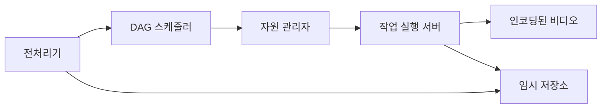

# 1단계. 문제 이해 및 설계 범위 확정
```
질문
* 어떤 기능이 가장 중요한지 
    > 비디오 업로드 및 시청 기능
* 어떤 클라이언트를 지원해야 하는지 
    > 모바일 앱, 웹 브라우저, 스마트TV
* 일간 능동 사용자 수는 몇 명인지 
    > 5백만
* 사용자가 이 제품에 평균적으로 소비하는 시간은? 
    > 30분
* 다국어 지원이 필용한지
    > 어떤 언어로도 이용 가능
* 어떤 비디오 해상도 지원?
    > 현존하는 비디오 종류와 해상도 대부분 지원
* 암호화 필요?
    > 암호화 필요
* 비디오 파일 크기 제한?
    > 작은 비디오, 혹은 중간 크기 비디오에 초점. 비디오 크기는 최대 1GB로 제한
* Public Cloud 활용 가능?
    > 활용할 수 있다면 하는 것이 바람직
```

아래와 같은 기능을 갖는 비디오 스트리밍 서비스 설계에 초점을 맞추자.
* 빠른 비디오 업로드
* 원활한 비디오 재생
* 재생 품질 선택 기능
* 낮은 인프라 비용
* 높은 가용성과 규모 확장성, 그리고 안정성
* 지원 클라이언트: 모바일 앱, 웹브라우저, 스마트TV

## 개략적 규모 추정
* 일간 능동 사용자(DAU) 수는 5백만
* 한 사용자는 하루에 평균 5개의 비디오를 시청
* 10%의 사용자가 하루에 1비디어 업로드
* 비디오 평균 크기는 300MB
* 비디오 저장을 위해 매일 새로 요구되는 저장 용량 = 5백만 X 10% X 300MB = 150TB
* CDN 비용
  * 클라우드 CDN을 통해 비디오를 서비스할 경우 CDN에서 나가는 데이터의 양에 따라 과금
  * CloudFront를 CDN 솔루션으로 사용할 경우, 100% 트래픽이 미국에서 발생한다고 가정하면 1GB당 $0.02의 요금 밠생
  * 비디오 스트리밍 비용만 따지면, 매일 발생하는 요금은 5백만 X 5비디오 X 0.3GB X $0.02 = $150,000

CDN을 통해 비디오를 서비스하면 비용이 엄청나다.   
이 비용을 줄이는 방법에 대해서는 상세 설계를 진행하면서 보다 자세히 알아보자.

# 2단계. 개략적 설계안 제시 및 동의 구하기
아래 두 영역을 개략적으로 설계해 보자.
* 비디오 업로드 절차
* 비디오 스트리밍 절차

## 비디오 업로드 절차


* 사용자
  * 컴퓨터나 모바일 폰, 혹은 스마트 TV를 통해 유튜브를 시청하는 이용자
* 로드밸런서
  * API 서버 각각으로 고르게 요청을 분산하는 역할을 담당
* API 서버
  * 비디오 스트리밍을 제외한 다른 모든 요청을 처리
* 메타데이터 데이터베이스
  * 비디오의 메타데이터를 보관
  * sharding과 replication을 적용하여 성능 및 가용성 요구사항을 충족
* 메타데이터 캐시
  * 성능을 높이기 위해 비디오 메타데이터와 사용자 객체는 캐시
* 원본 저장소
  * 원본 비디오를 보관할 대형 이진 파일 저장소(BLOB) 시스템
  > BLOB, BinaryLarge Object storage: 이진 데이터를 하나의 개체로 보관하는 데이터베이스 관리 시스템
* 트랜스코딩 서버
  * 비디오의 포맷을 변환하는 절차
  * 단말이나 대역폭 요구사항에 맞는 최적의 비디오 스트림을 제공하기 위해 필요
* 트랜스코딩 비디오 저장소
  * 트랜스코딩이 완료된 비디오를 저장하는 BLOB 저장소
* CDN
  * 비디오를 캐시하는 역할을 담당
  * 사용자가 재생 버튼을 누르면 비디오 스트리밍은 CDN을 통해 이루어짐
* 트랜스코딩 완료 큐
  * 비디오 트랜스코딩 완료 이벤트들을 보관할 메시지 큐
* 트랜스코딩 완료 핸들러
  * 트랜스코딩 완료 큐에서 이벤트 데이터를 꺼내어 메타데이터 캐시와 데이터베이스를 갱신할 작업 서버들

비디오 업로드가 어떻게 처리되는지 들여다보자.   
다음의 두 프로세스가 병렬적으로 수행된다고 보면 된다.
1. 비디오 업로드 
2. 비디오 메타데이터 갱신
    > 메타데이터에는 비디오 URL, 크기, 해상도, 포맷, 사용자 정보가 포함된다.

### 프로세스 1: 비디오 업로드


1. 비디오를 원본 저장소에 업로드
2. 트랜스코딩 서버는 원본 저장소에서 해당 비디오를 가져와 트랜스코딩을 시작
3. 트랜스코딩이 완료되면 아래 두 절차가 병렬적으로 수행
   ```
   3a. 완료된 비디오를 트랜스코딩 비디오 저장소로 업로드
   3b. 트랜스코딩 완료 이벤트를 트랜스코딩 완료 큐에 넣음
   
        3a.1. 트랜스코딩이 끝난 비디오를 CDN에 올림
        3b.1. 완료 핸들러가 이벤트 데이터를 큐에서 꺼냄
            3b.1.a, 3b.1.b. 완료 핸들러가 메타데이터 데이터베이스와 캐시를 갱신
   ```
4. API 서버가 단말에게 비디오 업로드가 끝나서 스트리밍 준비가 되었음을 알림

### 프로세스 2: 메타데이터 갱신


원본 저장소에 파일이 업로드되는 동안, 단말은 병렬적으로 비디오 메타데이터 갱신 요청을 API서버에 보낸다.   
이 요청에 포함된 메타데이터에는 파일 이름, 크기, 포맷 등의 정보가 들어 있다.

API 서버는 이 정보로 메타데이터 캐시와 데이터베이스를 업데이트한다.

## 비디오 스트리밍 절차
스트리밍은 사용자의 장치가 원격지의 비디오로부터 지속적으로 비디오 스트림을 전송 받아 영상을 재생하는 것을 말한다.


비디오는 CDN에서 바로 스트리밍된다.   
사용자의 단말에 가장 가까운 CDN edge server가 비디오 전송을 담당할 것이다.   
따라서 전송지연은 아주 낮다.

# 3단계. 상세 설계
개략적으로 설계한 비디오 업로드를 담당하는 부분과 비디오 스트리밍을 담당하는 부분을 살펴봤다.   
이제 두 부분을 최적화 방안과 함께 좀 더 상세히 다듬고 오류 처리 메커니즘에 대해 알아보자.

## 비디오 트랜스코딩
비디오를 녹화하면 단말은 해당 비디오를 특정 포맷으로 저장한다.   
이 비디오가 다른 단말에서도 순조롭게 재생되려면 다른 단말과 호환되는 비트레이트(bitrate)와 포맷으로 저장되어야 한다.

비트레이트는 비디오를 구성하는 비트가 얼마나 빨리 처리되어야 하는지를 나타내는 단위다.

비트레이트가 높은 비디오는 일반적으로 고화질 비디오다.   
비트레이트가 높은 비디오 스트림을 정상 재생하려면 보다 높은 성능의 컴퓨팅 파워가 필요하고, 인터넷 회선 속도도 빨라야 한다.

비디오 트랜스코딩은 아래와 같은 이유로 중요하다.
* 가공되지 않은 원본 비디오는 저장 공간을 많이 차지한다.
* 상당수의 단말과 브라우저는 특정 종류의 비디오 포맷만 지원한다.
  * 호환성 문제를 해결하려면 하나의 비디오를 여러 포맷으로 인코딩해 두는 것이 바람직하다.
* 사용자에게 끊김 없는 고화질 비디오 재생을 보장해야 한다.
  * 네트워크 대역폭이 충분한 사용자는 저화질, 충분하지 않으면 고화질 비디오를 보내는 것이 바람직하다.
* 모바일 단말의 경우 네트워크 상황이 수시로 달라질 수 있다.
  * 비디오가 끓김 없이 재생되도록 하기 위해서 비디오 화질을 자동으로 변경하거나 수동으로 변경할 수 있도록 하는 것이 바람직하다.

인코딩 포맷은 아주 다양하지만 대부분은 아래 두 부분으로 구성되어 있다.
* 컨테이너
  * 비디오 파일, 오디오, 메타데이터를 담는 바구니 같은 것
  * 컨테이너 포맷은 .avi, .mov, .mp4 같은 파일 확장자를 보면 확인 가능
* 코덱
  * 비디오 화질은 보존하면서 파일 크기를 줄일 목적으로 고안된 압축 및 압축 해제 알고리즘이다.
  * H.264, VP9, HEVC

## 유향 비순환 그래프(DAG) 모델
각기 다른 유형의 비디오 프로세싱 파이프라인을 지원하는 한편 처리 과정의 병렬성을 높이기 위해서는 적절한 수준의 추상화를 도입하여   
클라이언트 프로그래머로 하여금 실행할 task를 손수 정의할 수 있도록 해야 한다.

예를 들어 페이스북의 스트리밍 비디오 엔진은 유향 비순환 그래프(DAG: Directed Acyclic Graph) 프로그래밍 모델을 도입,   
작업을 단계별로 배열할 수 있도록 하여 해당 작업들이 순차적으로 또는 병렬적으로 실행될 수 있도록 하고 있다.

상세 설계에서도 DAG 모델을 도입하여 유연성과 병렬성을 달성할 수 있도록 하자.


* 검사
  * 좋은 품질의 비디오인지, 손상은 없는지 확인하는 작업
* 비디오 인코딩
  * 비디오를 다양한 해상도, 코덱, 비트레이트 조합으로 인코딩하는 작업
  ```mermaid
  flowchart LR
    A[비디오 인코딩] --> B[360p.mp4]
    A --> C[480p.mp4]
    A --> D[720p.mp4]
    A --> E[1080p.mp4]
    A --> F[4k.mp4]
  ```
* 섬네일
  * 사용자가 업로드한 이미지나 비디오에서 자동 추출된 이미지로 섬네일을 만드는 작업
* 워터마크
  * 비디오에 대한 식별정보를 이미지 위에 오버레이 형태로 띄워 표시하는 작업

## 비디오 트랜스코딩 아키텍처

클라우드 서비스를 활용한 비디오 트랜스코딩 아키텍처는 다섯 개의 주요 컴포넌트로 구성된다.
* 전처리기(preprocessor)
* DAG 스케줄러
* 자원 관리자(resource manager)
* 작업 실행 서버(resource worker)
* 임시 저장소(temporary storage)

이 아키텍처가 동작한 결과로 인코딩된 비디오가 만들어진다.

### 전처리기
1. 비디오 분할
   * 비디오 스트림을 GOP(Group of Pictures)라고 불리는 단위로 쪼갠다.
   * GOP는 특정 순서로 배열된 frame 그룹이다.
   * 하나의 GOP는 독립적으로 재생 가능하며, 길이는 보통 몇 초 정도다.
   * GOP 단위의 비디오 분할을 지원하지 않는 단말이나 브라우저의 경우, 전처리기가 비디오 분할을 대신한다.
2. DAG 생성
   * 클라이언트 프로그래머가 작성한 설정 파일에 따라 DAG를 만들어낸다.
3. 데이터 캐시
   * 전처리기는 분할된 비디오의 캐시이기도 하다.
   * 안정성을 높이기 위해 전처리기는 GOP와 메타데이터를 임시 저장소에 보관한다.
   * 비디오 인코딩이 실패하면 시스템은 보관된 데이터를 활용해 인코딩을 재개한다.

### DAG 스케줄러
DAG 스케줄러는 DAG 그래프를 몇 개 단계(stage)로 분할한 다음에 그 각각을 자원 관리자의 작업 큐에 집어넣는다.


하나의 DAG 그래프를 2개 작업 단계(stage)로 쪼갠 사례다.

### 자원 관리자
자원  관리자는 자원 배분을 효과적으로 수행하는 역할을 담당한다.


* 작업 큐(task queue)
  * 실행할 작업이 보관되어 있는 우선순위 큐(priority queue)
* 작업 서버 큐(worker queue)
  * 작업 서버의 가용 상태 정보가 보관되어 있는 우선순위 큐
* 실행 큐(running queue)
  * 현재 실행 중인 작업 및 작업 서버 정보가 보관되어 있는 큐
* 작업 스케줄러
  * 최적의 작업/서버 조합을 골라, 해당 작업 서버가 작업을 수행하도록 지시하는 역할을 담당

작업 관리자는 아래와 같이 동작한다.
* 작업 관리자는 작업 큐에서 가장 높은 우선순위의 작업을 꺼낸다.
* 작업 관리자는 해당 작업을 실행하기 적합한 작업 서버를 고른다.
* 작업 스케줄러는 해당 작업 서버에게 작업 실행을 지시한다.
* 작업 스케줄러는 해당 작업이 어떤 서버에게 할당되었는지에 관한 정보를 실행 큐에 넣는다.
* 작업 스케줄러는 작업이 완료되면 해당 작업을 실행 큐에서 제거한다.

### 작업 서버
작업 서버는 DAG에 정의된 작업을 수행하며, 작업 종류에 따라 작업 서버도 구분하여 관리한다.


### 임시 저장소
어떤 시스템을 선택할 것이냐는 것에 따라 여러 저장소 시스템을 활용할 수 있다.
* 메모리 캐시
  * 메타데이터
    * 작업 서버가 빈번히 참조하는 정보이고, 그 크기도 작은 것이 보통
* BLOB 저장소
  * 비디오/오디오 데이터 
  * 임시 저장소에 보관한 데이터는 비디오 프로세싱이 완료되면 삭제

### 인코딩된 비디오
인코딩된 비디오는 인코딩 파이프라인의 최종 결과물이다.

## 시스템 최적화
이제 속도, 안정성, 비용 측면에서 이 시스템을 최적화해 보자.

### 속도 최적화: 비디오 병렬 업로드
비디오 전부를 한 번의 업로드로 올리는 것은 비효율적이다.   
하나의 비디오는 작은 GOP들로 분할할 수 있다.


이렇게 분할한 GOP를 병렬적으로 업로드하면 설사 일부가 실패해도 빠르게 업로드를 재개할 수 있다.   
따라서 비디오를 GOP 경계에 맞춰 분할하는 작업을 단말이 수행하면 업로드 속도를 높일 수 있다.


### 속도 최적화: 업로드 센터를 사용자 근거리에 지정
본 설계안에서는 CDN을 업로드 센터로 이용한다.

### 속도 최적화: 모든 절차를 병렬화
낮은 응답지연을 위해 느슨하게 결합된 시스템을 만들어서 병렬성을 높여보자.

비디오를 원본 저장소에서 CDN으로 옮기는 절차를 조금 더 자세히 들여다보자.   
아래와 같이 의존성이 있으면 병렬성을 높이기 어렵다.


이 시스템의 결합도를 낮추기 위해 메시지 큐를 도입한다.
* 메시지 큐를 도입하기 전에 인코딩 모듈은 다운로드 모듈의 작업이 끝나기를 기다려야 했다.
* 메시지 큐를 도입한 뒤에 인코딩 모듈은 다운로드 모듈의 작업이 끝나기를 더 이상 기다릴 필요가 없다.
  * 메시지 큐에 보관된 이벤트 각각을 인코딩 모듈은 병렬적으로 처리할 수 있다.


### 안정성 최적화: 미리 사인된 업로드 URL
허가받은(authorized) 사용자만이 올바른 장소에 비디오를 업로드할 수 있도록 하기 위해, 미리 사인된(pre-signed) 업로드 URL을 이용한다.


1. 클라이언트는 HTTP 서버에 POST 요청을 하여 미리 사인된 URL을 받는다.
2. API 서버는 미리 사인된 URL을 돌려준다.
3. 클라이언트는 해당 URL이 가리키는 위치에 비디오를 업로드한다.

### 안정성 최적화: 비디오 보호
비디오의 저작권을 보호하기 위해 세가지 선택지 가운데 하나를 채택할 수 있다.
* 디지털 저작권 관리(DRM: Digital Rights Management) 시스템 도입
* AES 암호화
  * 비디오를 암호화하고 접근 권한을 설정하는 방식
  * 암호화된 비디오는 재생 시에만 복호화
* 워터마크
  * 비디오 위에 소유자 정보를 포함하는 이미지 오버레이를 올리는 것

### 비용 최적화
유튜브의 비디오 스트리밍은 long-tail 분포를 따른다.   
인기있는 비디오는 빈번히 재생되는 반면, 나머지는 거의 보는 사람이 없다는 것이다.   
이에 착안하여 몇 가지 최적화를 시도해 볼 수 있다.

1. 인기 비디오는 CDN을 통해 재생하되 다른 비디오는 비디오 서버를 통해 재생
2. 인기가 별로 없는 비디오는 인코딩 할 필요가 없을 수도 있다.
   * 짧은 비디오라면 필요할 때 인코딩하여 재생 가능
3. 어떤 비디오는 특정 지역에서만 인기
   * 다른 지역에 옮길 필요 X
4. CDN을 직접 구축하고 인터네 서비스 제공자와 제휴

## 오류 처리
시스템 오류에는 두 가지 종류가 있다.
* 회복 가능 오류
  * 특정 비디오 세그먼트를 트랜스코딩하다 실패했다든가 하는 오류
  * 몇 번 retry하면 해결됨
  * retry가 계속해서 실패하고 복구가 어렵다 판단되면 클라이언트에게 적절한 오류 코드를 반환해야 함
* 회복 불가능 오류
  * 비디오 포맷이 잘못되었다거나 하는 오류
  * 시스템은 해당 비디오에 대한 작업을 중단하고 클라이언트에게 적절한 오류 코드를 반환해야 함

시스템 컴포넌트 각각에 발생할 수 있는 오류에 대한 전형적 해결 방법에 대한 요약을 보자.
* 업로드 오류
  * 몇 회 retry
* 비디오 분할 오류
  * 낡은 버전의 클라이언트가 GOP 경계에 따라 비디오를 분할하지 못하는 경우
    * 전체 비디오를 서버로 전송하고 서버가 해당 비디오 분할을 처리
* 트랜스코딩 오류
  * retry
* 전처리 오류
  * DAG 그래프 재생성
* DAG 스케줄러 오류
  * 작업을 다시 스케줄링
* 자원 관리자 큐에 장애 발생
  * replica 이용
* 작업 서버 장애
  * 다른 서버에서 해당 작업을 retry
* API 서버 장애
  * API 서버는 무상태 서버이므로 신규 요청은 다른 API 서버로 우회될 것
* 메타데이터 캐시 서버 장애
  * 데이터는 다중화되어 있으므로 다른 노드에서 데이터를 여전히 가져올 수 있을 것
  * 장애가 난 캐시 서버는 새로운 것으로 교체
* 메타데이터 데이터베이스 서버 장애
  * 주 서버가 죽었다면 부 서버 가운데 하나를 주 서버로 교체
  * 부 서버가 죽었다면 다른 부 서버를 통해 읽기 연산을 처리하고 죽은 서버는 새것으로 교체

# 4단계. 마무리
추가 논의할만한 내용은 아래와 같다.
* API 계층의 규모 확장성 확보 방안
  * API 서버는 무상태 서버이므로 수평적 규모 확장이 가능하다는 사실을 언급하면 좋음
* 데이터베이스 계층의 규모 확장성 확보 방안
  * 데이터베이스의 다중화와 샤딩 방법
* 라이브 스트리밍
  * 응답지연이 좀 더 낮아야 한다. 따라서 스트리밍 프로토콜 선정에 유의해야 한다.
  * 병렬화 필요성은 떨어질 텐데, 작은 단위의 데이터를 실시간으로 빨리 처리해야 하기 때문이다.
  * 오류 처리 방법을 달리해야 한다. 너무 많은 시간이 걸리는 방안은 사용하기 어렵다.
* 비디오 삭제
  * 저작권을 위반한 비디오, 선정적 비디오, 불법적 행위에 관계된 비디오는 내려야 한다.

---

# 📚 실제 적용 사례 (Real-World Applications)

<details>
<summary><b>1️⃣ YouTube / 비디오 스트리밍 서비스</b></summary>

- **특징:** 비디오 업로드 및 재생, 다양한 해상도 지원, 모바일/웹/스마트TV 지원  
- **기술 포인트:** CDN, BLOB Storage, 트랜스코딩 서버, DAG 기반 처리, 메시지 큐, 캐시  
- **핵심 설계:**  
  - 비디오 업로드와 메타데이터 갱신 병렬 처리  
  - 트랜스코딩 후 여러 해상도/코덱으로 저장  
  - CDN을 통한 고속 스트리밍  
  - GOP 단위 병렬 업로드로 속도 최적화  
  - 미리 사인된 URL, DRM/암호화/워터마크로 안정성 보장

</details>

---

# 💬 토론 주제 (Discussion Topics)

<details>
<summary><b>1️⃣ 비디오 업로드 절차 최적화</b></summary>
    
- GOP 단위 분할 후 병렬 업로드  
- 미리 사인된 URL 사용  
- 트랜스코딩 완료 이벤트 큐로 병렬 처리
    
</details>

<details>
<summary><b>2️⃣ 비디오 스트리밍 효율화</b></summary>
    
- CDN Edge 서버로 사용자 근접 전송  
- 인기 비디오는 CDN, 비인기 비디오는 원본 서버 재생  
- 낮은 지연, 높은 처리량
    
</details>

<details>
<summary><b>3️⃣ 트랜스코딩 및 호환성</b></summary>
    
- 다양한 단말과 네트워크 환경 대응  
- 여러 해상도/코덱/비트레이트 생성  
- DAG 모델로 병렬/순차 작업 관리
    
</details>

<details>
<summary><b>4️⃣ 저장 및 비용 최적화</b></summary>
    
- 장기 저장과 임시 저장 분리  
- 인기 비디오 캐싱, 비인기 비디오는 필요 시 인코딩  
- 클라우드 기반 스토리지/CDN 비용 고려
    
</details>

<details>
<summary><b>5️⃣ 오류 처리 및 안정성</b></summary>
    
- 업로드/트랜스코딩 실패 시 retry  
- DAG 재생성 및 작업 재스케줄링  
- 캐시/DB 다중화로 장애 대비
    
</details>

<details>
<summary><b>6️⃣ 보안/권한 관리</b></summary>
    
- DRM, AES 암호화, 워터마크로 저작권 보호  
- 업로드 및 재생 권한 검증
    
</details>

---

# 🎯 면접 핵심 내용 (Key Interview Q&A)

<details>
<summary><b>1️⃣ 왜 GOP 단위 병렬 업로드를 사용하나?</b></summary>
    
- 큰 비디오를 작은 단위로 나눠 병렬 전송  
- 일부 업로드 실패 시 빠른 재시도 가능  
- 전체 업로드 속도 향상
    
</details>

<details>
<summary><b>2️⃣ 트랜스코딩에서 DAG 모델이 필요한 이유</b></summary>
    
- 서로 의존성이 있는 작업을 병렬/순차로 처리  
- 전처리, 인코딩, 섬네일, 워터마크 등 단계 관리
    
</details>

<details>
<summary><b>3️⃣ CDN 사용 시 비용 최적화 방법</b></summary>
    
- 인기 비디오는 CDN 캐싱, 비인기 비디오는 필요 시 전송  
- 지역별 트래픽 분산  
- 메시지 큐로 원본 저장소와 CDN 의존성 완화
    
</details>

<details>
<summary><b>4️⃣ 안정성 확보 방법</b></summary>
    
- 미리 사인된 URL로 안전한 업로드  
- 비디오 상태 추적, 장애 시 retry 및 큐 재처리  
- 트랜스코딩 실패 시 임시 저장소 활용 재시도
    
</details>

<details>
<summary><b>5️⃣ 멀티 해상도 지원 이유</b></summary>
    
- 네트워크 대역폭에 따라 자동 품질 선택  
- 모바일/웹/TV 등 다양한 단말 호환

</details>

---

# 🧠 핵심 요약

- **핵심 기술:** CDN, 트랜스코딩 서버, 메시지 큐, BLOB Storage, DAG 모델, 캐시  
- **핵심 포인트:**  
  - 빠른 업로드 및 스트리밍  
  - 다양한 해상도/단말 호환  
  - 안정적 트랜스코딩과 오류 처리  
  - 비용 최적화와 확장성  
  - DRM/암호화/워터마크로 보안 보장
